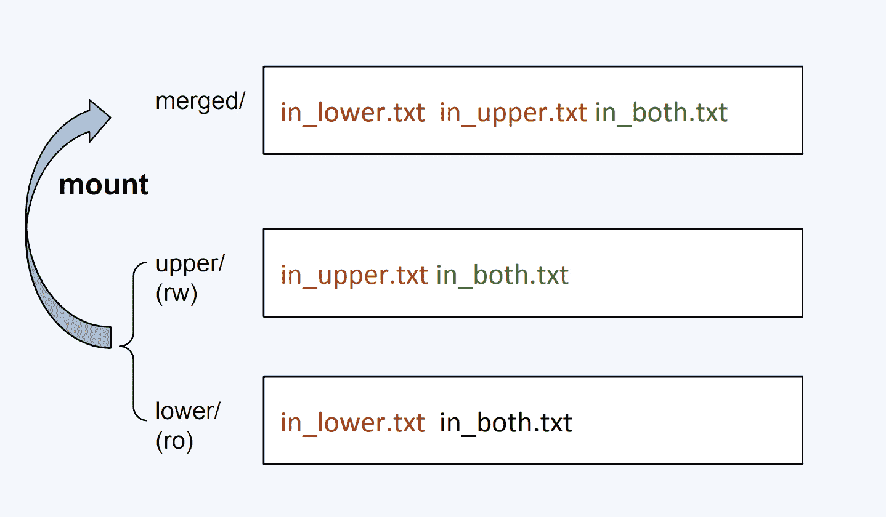

:toc:

// 保证所有的目录层级都可以正常显示图片
:path: containerd/
:imagesdir: ../image/

// 只有book调用的时候才会走到这里
ifdef::rootpath[]
:imagesdir: {rootpath}{path}{imagesdir}
endif::rootpath[]

== containerd

=== 认识containerd

Namespace和Cgroups容器里面的两大关键技术。

其实，镜像就是一个特殊的文件系统，它提供了容器中程序执行需要的所有文件。具体来说，就是应用程序想启动，需要三类文件：相关的程序可执行文件、库文件和配置文件，这三类文件都被容器打包做好了。

image::containerd/image-2025-02-13-16-21-04-695.png[]

从用户使用的角度来看，容器和一台独立的机器或者虚拟机没有什么太大的区别，但是它和虚拟机相比，却没有各种复杂的硬件虚拟层，没有独立的 Linux 内核。

==== *容器是什么*

要回答这个问题，你可以先记住这两个术语 Namespace 和 Cgroups。如果有人问你 Linux 上的容器是什么，最简单直接的回答就是 Namesapce 和 Cgroups。Namespace 和 Cgroups 可以让程序在一个资源可控的独立（隔离）环境中运行，这个就是容器了。

*Namespace*

[source, bash]
----
# docker exec c5a9ff78d9c1 ps -ef

UID        PID  PPID  C STIME TTY          TIME CMD
root         1     0  0 01:59 ?        00:00:00 /sbin/httpd -D FOREGROUND
apache       6     1  0 01:59 ?        00:00:00 /sbin/httpd -D FOREGROUND
apache       7     1  0 01:59 ?        00:00:00 /sbin/httpd -D FOREGROUND
apache       8     1  0 01:59 ?        00:00:00 /sbin/httpd -D FOREGROUND
apache       9     1  0 01:59 ?        00:00:00 /sbin/httpd -D FOREGROUND

# ps -ef | grep httpd

UID        PID  PPID  C STIME TTY          TIME CMD
root     20731 20684  0 18:59 ?        00:00:01 /sbin/httpd -D FOREGROUND
48       20787 20731  0 18:59 ?        00:00:00 /sbin/httpd -D FOREGROUND
48       20788 20731  0 18:59 ?        00:00:06 /sbin/httpd -D FOREGROUND
48       20789 20731  0 18:59 ?        00:00:05 /sbin/httpd -D FOREGROUND
48       20791 20731  0 18:59 ?        00:00:05 /sbin/httpd -D FOREGROUN
----

这两组输出结果到底有什么差别呢，你可以仔细做个对比，最大的不同就是进程的 PID 不一样。那为什么 PID 会不同呢？或者说，运行 docker exec c5a9ff78d9c1 ps -ef 和 ps -ef 实质的区别在哪里呢？ 如果理解了 PID 为何不同，我们就能搞清楚 Linux Namespace 的概念了

image::containerd/image-2025-02-13-16-25-50-304.png[]

Linux 在创建容器的时候，就会建出一个 PID Namespace，PID 其实就是进程的编号。这个 PID Namespace，就是指每建立出一个 Namespace，就会单独对进程进行 PID 编号，每个 Namespace 的 PID 编号都从 1 开始。

同时在这个 PID Namespace 中也只能看到 Namespace 中的进程，而且看不到其他 Namespace 里的进程。

这也就是说，如果有另外一个容器，那么它也有自己的一个 PID Namespace，而这两个 PID Namespace 之间是不能看到对方的进程的，这里就体现出了 Namespace 的作用：相互隔离。

而在宿主机上的 Host PID Namespace，它是其他 Namespace 的父亲 Namespace，可以看到在这台机器上的所有进程，不过进程 PID 编号不是 Container PID Namespace 里的编号了，而是把所有在宿主机运行的进程放在一起，再进行编号。

讲了 PID Namespace 之后，我们了解到 Namespace 其实就是一种隔离机制，主要目的是隔离运行在同一个宿主机上的容器，让这些容器之间不能访问彼此的资源。

这种隔离有两个作用：第一是可以充分地利用系统的资源，也就是说在同一台宿主机上可以运行多个用户的容器；第二是保证了安全性，因为不同用户之间不能访问对方的资源。

我们还可以运行 docker exec c5a9ff78d9c1 ls/ 查看容器中的根文件系统（rootfs）。然后，你会发现，它和宿主机上的根文件系统也是不一样的。容器中的根文件系统，其实就是我们做的镜像。

那容器自己的根文件系统完全独立于宿主机上的根文件系统，这一点是怎么做到的呢？其实这里依靠的是 Mount Namespace，Mount Namespace 保证了每个容器都有自己独立的文件目录结构。

image::containerd/image-2025-02-13-16-33-15-861.png[]

这些 Namespace 尽管类型不同，其实都是为了隔离容器资源：PID Namespace 负责隔离不同容器的进程，Network Namespace 又负责管理网络环境的隔离，Mount Namespace 管理文件系统的隔离。

*Cgroups*

想要定义“计算机”各种容量大小，就涉及到支撑容器的第二个技术 Cgroups （Control Groups）了。Cgroups 可以对指定的进程做各种计算机资源的限制，比如限制 CPU 的使用率，内存使用量，IO 设备的流量等等。

Cgroups 究竟有什么好处呢？要知道，在 Cgroups 出现之前，任意一个进程都可以创建出成百上千个线程，可以轻易地消耗完一台计算机的所有 CPU 资源和内存资源。

Cgroups 通过不同的子系统限制了不同的资源，每个子系统限制一种资源。每个子系统限制资源的方式都是类似的，就是把相关的一组进程分配到一个控制组里，然后通过树结构进行管理，每个控制组都设有自己的资源控制参数。

> 完整的 Cgroups 子系统的介绍，你可以查看Linux Programmer’s Manual 中 Cgroups 的定义。

以下是几种常见的 Cgroups 子系统：

- CPU 子系统，用来限制一个控制组（一组进程，你可以理解为一个容器里所有的进程）可使用的最大 CPU。
- memory 子系统，用来限制一个控制组最大的内存使用量。
- pids 子系统，用来限制一个控制组里最多可以运行多少个进程。
- cpuset 子系统， 这个子系统来限制一个控制组里的进程可以在哪几个物理 CPU 上运行。

Namespace 帮助容器来实现各种计算资源的隔离，Cgroups 主要限制的是容器能够使用的某种资源量

=== 容器的init进程

现有的linux发行版本中，/sbin/init通常指向的都是systemd。因此，在 Linux 上有了容器的概念之后，一旦容器建立了自己的 Pid Namespace（进程命名空间），这个 Namespace 里的进程号也是从 1 开始标记的。所以，容器的 init 进程也被称为 1 号进程。

[source, bash]
----
[root@k8smaster-ims cgroup]# ls -al /sbin/init
lrwxrwxrwx. 1 root root 22 Oct 17 18:31 /sbin/init -> ../lib/systemd/systemd
----

我们运行 kill 命令，其实在 Linux 里就是发送一个信号，那么信号ll到底是什么呢？用一句话来概括，信号（Signal）其实就是 Linux 进程收到的一个通知。

[source, c]
----
kernel/signal.c
static bool sig_task_ignored(struct task_struct *t, int sig, bool force)
{
        void __user *handler;
        handler = sig_handler(t, sig);

        /* SIGKILL and SIGSTOP may not be sent to the global init */
        // is_global_init(t): Checks if the task t is the global init process (PID 1).
        // sig_kernel_only(sig): Checks if the signal sig is one that can only be sent by the kernel (e.g., SIGKILL, SIGSTOP).
        if (unlikely(is_global_init(t) && sig_kernel_only(sig)))
                return true;
        // SIGNAL_UNKILLABLE: A flag indicating that the task is unkillable (e.g., kernel threads or special system tasks).
        // handler == SIG_DFL: Checks if the signal handler is the default action.
        // If the task is unkillable, the signal handler is the default, and the signal is not being forced (or is not a kernel-only signal), the signal is ignored.
        if (unlikely(t->signal->flags & SIGNAL_UNKILLABLE) &&
            handler == SIG_DFL && !(force && sig_kernel_only(sig)))
                return true;

        /* Only allow kernel generated signals to this kthread */
        // PF_KTHREAD: A flag indicating that the task is a kernel thread.
        // handler == SIG_KTHREAD_KERNEL: Checks if the signal handler is specific to kernel threads.
        // If the task is a kernel thread, the signal handler is specific to kernel threads, and the signal is not being forced, the signal is ignored.
        if (unlikely((t->flags & PF_KTHREAD) &&
                     (handler == SIG_KTHREAD_KERNEL) && !force))
                return true;

        return sig_handler_ignored(handler, sig);
}
----

==== 容器中的进程

==== 容器中的僵尸进程

自己的容器运行久了之后，运行 ps 命令会看到一些进程，进程名后面加了 <defunct> 标识。

[source, bash]
----
# ps aux
USER       PID %CPU %MEM    VSZ   RSS TTY      STAT START   TIME COMMAND
root         1  0.0  0.0   4324  1436 ?        Ss   01:23   0:00 /app-test 1000
root         6  0.0  0.0      0     0 ?        Z    01:23   0:00 [app-test] <defunct>
----

在进程“活着”的时候就只有两个状态：运行态（TASK_RUNNING）和睡眠态（TASK_INTERRUPTIBLE，TASK_UNINTERRUPTIBLE）

.《Linux Kernel Development》这本书里的 Linux 进程状态转化图
image::containerd/image-2025-02-13-18-47-52-877.png[]

运行态的意思是，无论进程是正在运行中（也就是获得了 CPU 资源），还是进程在 run queue 队列里随时可以运行，都处于这个状态。我们想要查看进程是不是处于运行态，其实也很简单，比如使用 ps 命令，可以看到处于这个状态的进程显示的是 R stat。

睡眠态是指，进程需要等待某个资源而进入的状态，要等待的资源可以是一个信号量（Semaphore）, 或者是磁盘 I/O，这个状态的进程会被放入到 wait queue 队列里。这个睡眠态具体还包括两个子状态：一个是可以被打断的（TASK_INTERRUPTIBLE），我们用 ps 查看到的进程，显示为 S stat。还有一个是不可被打断的（TASK_UNINTERRUPTIBLE），用 ps 查看进程，就显示为 D stat。

除了上面进程在活的时候的两个状态，进程在调用 do_exit() 退出的时候，还有两个状态。

一个是 EXIT_DEAD，也就是进程在真正结束退出的那一瞬间的状态；第二个是 EXIT_ZOMBIE 状态，这是进程在 EXIT_DEAD 前的一个状态，僵尸进程就是是处于这个状态中。

对于 Linux 系统而言，容器就是一组进程的集合。如果容器中的应用创建过多的进程或者出现 bug，就会产生类似 fork bomb 的行为。

这个 fork bomb 就是指在计算机中，通过不断建立新进程来消耗系统中的进程资源，它是一种黑客攻击方式。这样，容器中的进程数就会把整个节点的可用进程总数给消耗完。

这样，不但会使同一个节点上的其他容器无法工作，还会让宿主机本身也无法工作。所以对于每个容器来说，我们都需要限制它的最大进程数目，而这个功能由 pids Cgroup 这个子系统来完成。

而这个功能的实现方法是这样的：pids Cgroup 通过 Cgroup 文件系统的方式向用户提供操作接口，一般它的 Cgroup 文件系统挂载点在 /sys/fs/cgroup。

在一个容器建立之后，创建容器的服务会在 /sys/fs/cgroup 下建立一个子目录，就是一个控制组，控制组里最关键的一个文件就是 pids.max。

父进程在创建完子进程之后就不管了，这就是造成子进程变成僵尸进程的原因。

==== 为什么容器中的进程会被杀死

Containerd 在停止容器的时候，就会向容器的 init 进程发送一个 SIGTERM 信号。在 init 进程退出之后，容器内的其他进程也都立刻退出了。不过不同的是，init 进程收到的是 SIGTERM 信号，而其他进程收到的是 SIGKILL 信号。

因为在init进程收到SIGTERM之后，对于容器来说，这里调用的就是 zap_pid_ns_processes() 这个函数，而在这个函数中，如果是处于退出状态的 init 进程，它会向 Namespace 中的其他进程都发送一个 SIGKILL 信号。

前面我讲过，SIGKILL 是个特权信号（特权信号是 Linux 为 kernel 和超级用户去删除任意进程所保留的，不能被忽略也不能被捕获）。 所以进程收到这个信号后，就立刻退出了，没有机会调用一些释放资源的 handler 之后，再做退出动作。因此如果想优雅的退出容器中所有的进程，需要对init进程的SIGTERM信号处理函数进行改造。

=== 容器的CPU

==== 怎样限制容器的CPU

[source, yaml]
----
apiVersion: v1
kind: Pod
metadata:
  name: frontend
spec:
  containers:
  - name: app
    image: images.my-company.example/app:v4
    resources:
      requests:
        memory: "64Mi"
        cpu: "1"
      limits:
        memory: "128Mi"
        cpu: "2"
----

在 Pod Spec 里的"Request CPU"和"Limit CPU"的值，最后会通过 CPU Cgroup 的配置，来实现控制容器 CPU 资源的作用。

那接下来先从进程的 CPU 使用讲起，然后在看 CPU Cgroup 子系统中建立几个控制组，用这个例子为你讲解 CPU Cgroup 中的三个最重要的参数"cpu.cfs_quota_us""cpu.cfs_period_us""cpu.shares"。

我们对照下图的 Top 运行界面，在截图第三行，"%Cpu(s)"开头的这一行，你会看到一串数值，也就是"0.0 us, 0.0 sy, 0.0 ni, 99.9 id, 0.0 wa, 0.0 hi, 0.0 si, 0.0 st"

image::containerd/image-2025-02-13-20-03-23-912.png[]

下面这张图里最长的带箭头横轴，我们可以把它看成一个时间轴。同时，它的上半部分代表 Linux 用户态（User space），下半部分代表内核态（Kernel space）。

image::containerd/image-2025-02-13-20-04-07-394.png[]

假设一个用户程序开始运行了，那么就对应着第一个"us"框，"us"是"user"的缩写，代表 Linux 的用户态 CPU Usage。普通用户程序代码中，只要不是调用系统调用（System Call），这些代码的指令消耗的 CPU 就都属于"us"。

当这个用户程序代码中调用了系统调用，比如说 read() 去读取一个文件，这时候这个用户进程就会从用户态切换到内核态。

内核态 read() 系统调用在读到真正 disk 上的文件前，就会进行一些文件系统层的操作。那么这些代码指令的消耗就属于"sy"，这里就对应上面图里的第二个框。"sy"是 "system"的缩写，代表内核态 CPU 使用。

接下来，这个 read() 系统调用会向 Linux 的 Block Layer 发出一个 I/O Request，触发一个真正的磁盘读取操作。

这时候，这个进程一般会被置为 TASK_UNINTERRUPTIBLE。而 Linux 会把这段时间标示成"wa"，对应图中的第三个框。"wa"是"iowait"的缩写，代表等待 I/O 的时间，这里的 I/O 是指 Disk I/O。

紧接着，当磁盘返回数据时，进程在内核态拿到数据，这里仍旧是内核态的 CPU 使用中的"sy"，也就是图中的第四个框。

然后，进程再从内核态切换回用户态，在用户态得到文件数据，这里进程又回到用户态的 CPU 使用，"us"，对应图中第五个框。

好，这里我们假设一下，这个用户进程在读取数据之后，没事可做就休眠了。并且我们可以进一步假设，这时在这个 CPU 上也没有其他需要运行的进程了，那么系统就会进入"id"这个步骤，也就是第六个框。"id"是"idle"的缩写，代表系统处于空闲状态。

如果这时这台机器在网络收到一个网络数据包，网卡就会发出一个中断（interrupt）。相应地，CPU 会响应中断，然后进入中断服务程序。

这时，CPU 就会进入"hi"，也就是第七个框。"hi"是"hardware irq"的缩写，代表 CPU 处理硬中断的开销。由于我们的中断服务处理需要关闭中断，所以这个硬中断的时间不能太长。

但是，发生中断后的工作是必须要完成的，如果这些工作比较耗时那怎么办呢？Linux 中有一个软中断的概念（softirq），它可以完成这些耗时比较长的工作。

你可以这样理解这个软中断，从网卡收到数据包的大部分工作，都是通过软中断来处理的。那么，CPU 就会进入到第八个框，"si"。这里"si"是"softirq"的缩写，代表 CPU 处理软中断的开销。

这里你要注意，无论是"hi"还是"si"，它们的 CPU 时间都不会计入进程的 CPU 时间。*这是因为本身它们在处理的时候就不属于任何一个进程*。

不过，我们还剩两个类型的 CPU 使用没讲到，我想给你做个补充，一次性带你做个全面了解。这样以后你解决相关问题时，就不会再犹豫，这些值到底影不影响 CPU Cgroup 中的限制了。下面我给你具体讲一下。

一个是"ni"，是"nice"的缩写，这里表示如果进程的 nice 值是正值（1-19），代表优先级比较低的进程运行时所占用的 CPU。

另外一个是"st"，"st"是"steal"的缩写，是在虚拟机里用的一个 CPU 使用类型，表示有多少时间是被同一个宿主机上的其他虚拟机抢走的。

image::containerd/image-2025-02-13-20-10-29-317.png[]

*CPU Cgroup*

 Cgroups 是对指定进程做计算机资源限制的，CPU Cgroup 是 Cgroups 其中的一个 Cgroups 子系统，它是用来限制进程的 CPU 使用的。

对于进程的 CPU 使用, 通过前面的 Linux CPU 使用分类的介绍，我们知道它只包含两部分: 一个是用户态，这里的用户态包含了 us 和 ni；还有一部分是内核态，也就是 sy。 至于 wa、hi、si，这些 I/O 或者中断相关的 CPU 使用，CPU Cgroup 不会去做限制

每个进程的 CPU Usage 只包含用户态（us 或 ni）和内核态（sy）两部分，其他的系统 CPU 开销并不包含在进程的 CPU 使用中，而 CPU Cgroup 只是对进程的 CPU 使用做了限制。

==== 如何正确拿到容器CPU的消耗

我们想要精准地对运行着众多容器的云平台做监控，快速排查例如应用的处理能力下降，节点负载过高等问题，就绕不开容器 CPU 开销。因为 CPU 开销的异常，往往是程序异常最明显的一个指标。

在宿主机上我们经常使用top命令来查看CPU开销，但是如果你在容器中执行top命令，你会发现显示的是物理机的CPU开销，而不是容器的CPU开销。

我们可以去看一下 top 命令的源代码。在代码中你会看到对于每个进程，top 都会从 proc 文件系统中每个进程对应的 stat 文件中读取 2 个数值。这个 stat 文件就是 /proc/[pid]/stat ， [pid] 就是替换成具体一个进程的 PID 值。

完整的 stat 文件内容和格式在 proc 文件系统的 Linux programmer’s manual 里定义了。在这里，我们只需要重点关注这两项数值，stat 文件中的第 14 项 utime 和第 15 项 stime。

image::containerd/image-2025-02-13-20-43-41-551.png[]

utime 是表示进程的用户态部分在 Linux 调度中获得 CPU 的 ticks，stime 是表示进程的内核态部分在 Linux 调度中获得 CPU 的 ticks。

根据top源码可以得到进程的 CPU 使用率计算公式：`((utime_2 – utime_1) + (stime_2 – stime_1)) * 100.0 / (HZ * et * 1 )`

第一个 HZ 是什么意思呢？前面我们介绍 ticks 里说了，ticks 是按照固定频率发生的，在我们的 Linux 系统里 1 秒钟是 100 次，那么 HZ 就是 1 秒钟里 ticks 的次数，这里值是 100。

第二个参数 et 是我们刚才说的那个“瞬时”的时间，也就是得到 utime_1 和 utime_2 这两个值的时间间隔。

第三个“1”, 就更容易理解了，就是 1 个 CPU。那么这三个值相乘，你是不是也知道了它的意思呢？就是在这“瞬时”的时间（et）里，1 个 CPU 所包含的 ticks 数目。

我们要计算系统 CPU 使用率，首先需要拿到数据，数据源也同样可以从 proc 文件系统里得到，对于整个系统的 CPU 使用率，这个文件就是 /proc/stat。

对于系统总的 CPU 使用率，需要读取 /proc/stat 文件，但是这个文件中的各项 CPU ticks 是反映整个节点的，并且这个 /proc/stat 文件也不包含在任意一个 Namespace 里。因此、对于 top 命令来说，它只能显示整个节点中各项 CPU 的使用率，不能显示单个容器的各项 CPU 的使用率。

如果想要单个CPU使用信息，可以去对应容器中读取 /sys/fs/cgroup/cpu.stat

====  Load Average

第三行可以显示当前的 CPU 使用情况，我们可以看到整个机器的 CPU Usage 几乎为 0，因为"id"显示 99.9%，这说明 CPU 是处于空闲状态的。

但是请你注意，这里 1 分钟的"load average"的值却高达 9.09，这里的数值 9 几乎就意味着使用了 9 个 CPU 了，这样 CPU Usage 和 Load Average 的数值看上去就很矛盾了。

image::containerd/image-2025-02-13-21-02-49-807.png[]

那问题来了，我们在看一个系统里 CPU 使用情况时，到底是看 CPU Usage 还是 Load Average 呢？

这里就涉及到今天要解决的两大问题：

- Load Average 到底是什么，CPU Usage 和 Load Average 有什么差别？
- 如果 Load Average 值升高，应用的性能下降了，这背后的原因是什么呢？

===== 什么是 Load Average?

Load Average 这个概念，你可能在使用 Linux 的时候就已经注意到了，无论你是运行 uptime, 还是 top，都可以看到类似这个输出"load average：2.02, 1.83, 1.20"。那么这一串输出到底是什么意思呢？

最直接的办法当然是看手册了，如果我们用"Linux manual page"搜索 uptime 或者 top，就会看到对这个"load average"和后面三个数字的解释是"the system load averages for the past 1, 5, and 15 minutes"。

你如果再去网上找资料，就会发现 Load Average 是一个很古老的概念了。上个世纪 70 年代，早期的 Unix 系统上就已经有了这个 Load Average，IETF 还有一个RFC546定义了 Load Average，这里定义的 Load Average 是一种 CPU 资源需求的度量。

举个例子，对于一个单个 CPU 的系统，如果在 1 分钟的时间里，处理器上始终有一个进程在运行，同时操作系统的进程可运行队列中始终都有 9 个进程在等待获取 CPU 资源。那么对于这 1 分钟的时间来说，系统的"load average"就是 1+9=10，这个定义对绝大部分的 Unix 系统都适用。

对于 Linux 来说，如果只考虑 CPU 的资源，Load Averag 等于单位时间内正在运行的进程加上可运行队列的进程，这个定义也是成立的。通过这个定义和我自己的观察，我给你归纳了下面三点对 Load Average 的理解。

第一，不论计算机 CPU 是空闲还是满负载，Load Average 都是 Linux 进程调度器中可运行队列（Running Queue）里的一段时间的平均进程数目。

第二，计算机上的 CPU 还有空闲的情况下，CPU Usage 可以直接反映到"load average"上，什么是 CPU 还有空闲呢？具体来说就是可运行队列中的进程数目小于 CPU 个数，这种情况下，单位时间进程 CPU Usage 相加的平均值应该就是"load average"的值。

第三，计算机上的 CPU 满负载的情况下，计算机上的 CPU 已经是满负载了，同时还有更多的进程在排队需要 CPU 资源。这时"load average"就不能和 CPU Usage 等同了。

比如对于单个 CPU 的系统，CPU Usage 最大只是有 100%，也就 1 个 CPU；而"load average"的值可以远远大于 1，因为"load average"看的是操作系统中可运行队列中进程的个数。

我们是不是就可以认定 Load Average 就代表一段时间里运行队列中需要被调度的进程或者线程平均数目了呢? 或许对其他的 Unix 系统来说，这个理解已经够了，但是对于 Linux 系统还不能这么认定。

为什么这么说呢？故事还要从 Linux 早期的历史说起，那时开发者 Matthias 有这么一个发现，比如把快速的磁盘换成了慢速的磁盘，运行同样的负载，系统的性能是下降的，但是 Load Average 却没有反映出来。

他发现这是因为 Load Average 只考虑运行态的进程数目，而没有考虑等待 I/O 的进程。所以，他认为 Load Average 如果只是考虑进程运行队列中需要被调度的进程或线程平均数目是不够的，因为对于处于 I/O 资源等待的进程都是处于 TASK_UNINTERRUPTIBLE 状态的。

那他是怎么处理这件事的呢？估计你也猜到了，他给内核加一个 patch（补丁），把处于 TASK_UNINTERRUPTIBLE 状态的进程数目也计入了 Load Average 中。

在这里我们又提到了 TASK_UNINTERRUPTIBLE 状态的进程，在前面的章节中我们介绍过，我再给你强调一下，TASK_UNINTERRUPTIBLE 是 Linux 进程状态的一种，是进程为等待某个系统资源而进入了睡眠的状态，并且这种睡眠的状态是不能被信号打断的。

下面就是 1993 年 Matthias 的 kernel patch，你有兴趣的话，可以读一下。

[source, text]
----
From: Matthias Urlichs <urlichs@smurf.sub.org>
Subject: Load average broken ?
Date: Fri, 29 Oct 1993 11:37:23 +0200

The kernel only counts "runnable" processes when computing the load average.
I don't like that; the problem is that processes which are swapping or
waiting on "fast", i.e. noninterruptible, I/O, also consume resources.

It seems somewhat nonintuitive that the load average goes down when you
replace your fast swap disk with a slow swap disk...

Anyway, the following patch seems to make the load average much more
consistent WRT the subjective speed of the system. And, most important, the
load is still zero when nobody is doing anything. ;-)

--- kernel/sched.c.orig Fri Oct 29 10:31:11 1993
+++ kernel/sched.c Fri Oct 29 10:32:51 1993
@@ -414,7 +414,9 @@
unsigned long nr = 0;

    for(p = &LAST_TASK; p > &FIRST_TASK; --p)
-       if (*p && (*p)->state == TASK_RUNNING)
+       if (*p && ((*p)->state == TASK_RUNNING) ||
+                  (*p)->state == TASK_UNINTERRUPTIBLE) ||
+                  (*p)->state == TASK_SWAPPING))
            nr += FIXED_1;
    return nr;
 }
----

那么对于 Linux 的 Load Average 来说，除了可运行队列中的进程数目，等待队列中的 UNINTERRUPTIBLE 进程数目也会增加 Load Average。

到这里我们就可以准确定义 Linux 系统里的 Load Average 了，其实也很简单，你只需要记住，平均负载统计了这两种情况的进程：

第一种是 Linux 进程调度器中可运行队列（Running Queue）一段时间（1 分钟，5 分钟，15 分钟）的进程平均数。

第二种是 Linux 进程调度器中休眠队列（Sleeping Queue）里的一段时间的 TASK_UNINTERRUPTIBLE 状态下的进程平均数。

所以，最后的公式就是：Load Average= 可运行队列进程平均数 + 休眠队列中不可打断的进程平均数

如果打个比方来说明 Load Average 的统计原理。你可以想象每个 CPU 就是一条道路，每个进程都是一辆车，怎么科学统计道路的平均负载呢？就是看单位时间通过的车辆，一条道上的车越多，那么这条道路的负载也就越高。

此外，Linux 计算系统负载的时候，还额外做了个补丁把 TASK_UNINTERRUPTIBLE 状态的进程也考虑了，这个就像道路中要把红绿灯情况也考虑进去。一旦有了红灯，汽车就要停下来排队，那么即使道路很空，但是红灯多了，汽车也要排队等待，也开不快。

*现象解释：为什么 Load Average 会升高？*

解释了 Load Average 这个概念，我们再回到这一讲最开始的问题，为什么对容器已经用 CPU Cgroup 限制了它的 CPU Usage，容器里的进程还是可以造成整个系统很高的 Load Average。

我们理解了 Load Average 这个概念之后，就能区分出 Load Averge 和 CPU 使用率的区别了。那么这个看似矛盾的问题也就很好回答了，因为 Linux 下的 Load Averge 不仅仅计算了 CPU Usage 的部分，它还计算了系统中 TASK_UNINTERRUPTIBLE 状态的进程数目。

讲到这里为止，我们找到了第一个问题的答案，那么现在我们再看第二个问题：如果 Load Average 值升高，应用的性能已经下降了，真正的原因是什么？问题就出在 TASK_UNINTERRUPTIBLE 状态的进程上了。

怎么验证这个判断呢？这时候我们只要运行 ps aux | grep “ D ” ，就可以看到容器中有多少 TASK_UNINTERRUPTIBLE 状态（在 ps 命令中这个状态的进程标示为"D"状态）的进程，为了方便理解，后面我们简称为 D 状态进程。而正是这些 D 状态进程引起了 Load Average 的升高。

找到了 Load Average 升高的问题出在 D 状态进程了，我们想要真正解决问题，还有必要了解 D 状态进程产生的本质是什么？

在 Linux 内核中有数百处调用点，它们会把进程设置为 D 状态，主要集中在 disk I/O 的访问和信号量（Semaphore）锁的访问上，因此 D 状态的进程在 Linux 里是很常见的。

无论是对 disk I/O 的访问还是对信号量的访问，都是对 Linux 系统里的资源的一种竞争。当进程处于 D 状态时，就说明进程还没获得资源，这会在应用程序的最终性能上体现出来，也就是说用户会发觉应用的性能下降了。

那么 D 状态进程导致了性能下降，我们肯定是想方设法去做调试的。但目前 D 状态进程引起的容器中进程性能下降问题，Cgroups 还不能解决，这也就是为什么我们用 Cgroups 做了配置，即使保证了容器的 CPU 资源， 容器中的进程还是运行很慢的根本原因。

这里我们进一步做分析，为什么 CPU Cgroups 不能解决这个问题呢？就是因为 Cgroups 更多的是以进程为单位进行隔离，而 D 状态进程是内核中系统全局资源引入的，所以 Cgroups 影响不了它。

#所以我们可以做的是，在生产环境中监控容器的宿主机节点里 D 状态的进程数量，然后对 D 状态进程数目异常的节点进行分析，比如磁盘硬件出现问题引起 D 状态进程数目增加，这时就需要更换硬盘。#

image::containerd/image-2025-02-13-21-36-10-865.png[]

因为 TASK_UNINTERRUPTIBLE 状态的进程同样也会竞争系统资源，所以它会影响到应用程序的性能。我们可以在容器宿主机的节点对 D 状态进程做监控，定向分析解决。

=== 容器内存

==== 我的容器为什么被杀了？

不知道你在使用容器时，有没有过这样的经历？一个容器在系统中运行一段时间后，突然消失了，看看自己程序的 log 文件，也没发现什么错误，不像是自己程序 Crash，但是容器就是消失了。

容器在系统中被杀掉，其实只有一种情况，那就是容器中的进程使用了太多的内存。具体来说，就是容器里所有进程使用的内存量，超过了容器所在 Memory Cgroup 里的内存限制。这时 Linux 系统就会主动杀死容器中的一个进程，往往这会导致整个容器的退出。

*如何理解 OOM Killer？*

OOM 是 Out of Memory 的缩写，顾名思义就是内存不足的意思，而 Killer 在这里指需要杀死某个进程。那么 OOM Killer 就是在 Linux 系统里如果内存不足时，就需要杀死一个正在运行的进程来释放一些内存。

在 Linux 内核里有一个 oom_badness() 函数，就是它定义了选择进程的标准。

- 第一，进程已经使用的物理内存页面数。
- 第二，每个进程的 OOM 校准值 oom_score_adj。在 /proc 文件系统中，每个进程都有一个 /proc/[pid]/oom_score_adj 的接口文件。我们可以在这个文件中输入 -1000 到 1000 之间的任意一个数值，调整进程被 OOM Kill 的几率。

[source,bash]
----
adj = (long)p->signal->oom_score_adj;

points = get_mm_rss(p->mm) + get_mm_counter(p->mm, MM_SWAPENTS) +mm_pgtables_bytes(p->mm) / PAGE_SIZE;

adj *= totalpages / 1000;
points += adj;
----

函数 oom_badness() 里的最终计算方法是这样的：用系统总的可用页面数，去乘以 OOM 校准值 oom_score_adj，再加上进程已经使用的物理页面数，计算出来的值越大，那么这个进程被 OOM Kill 的几率也就越大。

*如何理解 Memory Cgroup？*

前面我们介绍了 OOM Killer，容器发生 OOM Kill 大多是因为 Memory Cgroup 的限制所导致的，所以在我们还需要理解 Memory Cgroup 的运行机制。

Memory Cgroup 也是 Linux Cgroups 子系统之一，它的作用是对一组进程的 Memory 使用做限制。Memory Cgroup 的虚拟文件系统的挂载点一般在"/sys/fs/cgroup/memory"这个目录下

==== Linux 内存类型

Linux 的各个模块都需要内存，比如内核需要分配内存给页表，内核栈，还有 slab，也就是内核各种数据结构的 Cache Pool；用户态进程里的堆内存和栈的内存，共享库的内存，还有文件读写的 Page Cache。

我们讨论的 Memory Cgroup 里都不会对内核的内存做限制（比如页表，slab 等）。所以我们今天主要讨论与用户态相关的两个内存类型，RSS 和 Page Cache。

*RSS*

RSS 是 Resident Set Size 的缩写，简单来说它就是指进程真正申请到物理页面的内存大小。这是什么意思呢？

应用程序在申请内存的时候，比如说，调用 malloc() 来申请 100MB 的内存大小，malloc() 返回成功了，这时候系统其实只是把 100MB 的虚拟地址空间分配给了进程，但是并没有把实际的物理内存页面分配给进程。

上一讲中，我给你讲过，当进程对这块内存地址开始做真正读写操作的时候，系统才会把实际需要的物理内存分配给进程。而这个过程中，进程真正得到的物理内存，就是这个 RSS 了

比如下面的这段代码，我们先用 malloc 申请 100MB 的内存。

[source,c]
----
#include <stdio.h>
#include <stdlib.h>

int main()
{
    char *p = (char *)malloc(100 * 1024 * 1024);
    printf("p = %p\n", p);
    return 0;
}
----

通过top命令查看malloc之后，对应进程的虚拟地址空间(VIRT)已经有100MB，但是实际物理内存RSS（TOP命令显示的是RES，就是Resident的简写，和RSS是一个意思）在这里只有688KB。

在上面程序的基础之上，等待30s我们对申请的内存中写入20M的数据，然后哦再使用top命令查看

[source, c]
----
sleep(30);
memset(p, 0x00, 20 * MB)
----

这时候可以看到虚拟地址空间（VIRT）还是 106728，不过物理内存 RSS（RES）的值变成了 21432（大小约为 20MB）， 这里的单位都是 KB。

RSS 就是进程里真正获得的物理内存大小。

对于进程来说，RSS 内存包含了进程的代码段内存，栈内存，堆内存，共享库的内存, 这些内存是进程运行所必须的。刚才我们通过 malloc/memset 得到的内存，就是属于堆内存。

具体的每一部分的 RSS 内存的大小，你可以查看 /proc/[pid]/smaps 文件。

*Page Cache*

每个进程除了各自独立分配到的 RSS 内存外，如果进程对磁盘上的文件做了读写操作，Linux 还会分配内存，把磁盘上读写到的页面存放在内存中，这部分的内存就是 Page Cache。

Page Cache 的主要作用是提高磁盘文件的读写性能，因为系统调用 read() 和 write() 的缺省行为都会把读过或者写过的页面存放在 Page Cache 里。

代码程序去读取 100MB 的文件，在读取文件前，系统中 Page Cache 的大小是 388MB，读取后 Page Cache 的大小是 506MB，增长了大约 100MB 左右，多出来的这 100MB，正是我们读取文件的大小。

image::containerd/image-2025-02-14-13-59-12-242.png[]

在 Linux 系统里只要有空闲的内存，系统就会自动地把读写过的磁盘文件页面放入到 Page Cache 里。那么这些内存都被 Page Cache 占用了，一旦进程需要用到更多的物理内存，执行 malloc() 调用做申请时，就会发现剩余的物理内存不够了，那该怎么办呢？

这就要提到 Linux 的内存管理机制了。 Linux 的内存管理有一种内存页面回收机制（page frame reclaim），会根据系统里空闲物理内存是否低于某个阈值（wartermark），来决定是否启动内存的回收。

内存回收的算法会根据不同类型的内存以及内存的最近最少用原则，就是 LRU（Least Recently Used）算法决定哪些内存页面先被释放。因为 Page Cache 的内存页面只是起到 Cache 作用，自然是会被优先释放的。

所以，Page Cache 是一种为了提高磁盘文件读写性能而利用空闲物理内存的机制。同时，内存管理中的页面回收机制，又能保证 Cache 所占用的页面可以及时释放，这样一来就不会影响程序对内存的真正需求了。

===== RSS & Page Cache in Memory Cgroup

学习了 RSS 和 Page Cache 的基本概念之后，我们下面来看不同类型的内存，特别是 RSS 和 Page Cache 是如何影响 Memory Cgroup 的工作的。

我们先从 Linux 的内核代码看一下，从 mem_cgroup_charge_statistics() 这个函数里，我们可以看到 Memory Cgroup 也的确只是统计了 RSS 和 Page Cache 这两部分的内存。

RSS 的内存，就是在当前 Memory Cgroup 控制组里所有进程的 RSS 的总和；而 Page Cache 这部分内存是控制组里的进程读写磁盘文件后，被放入到 Page Cache 里的物理内存。

image::containerd/image-2025-02-14-16-32-15-070.png[]

Memory Cgroup 控制组里 RSS 内存和 Page Cache 内存的和，正好是 memory.usage_in_bytes 的值。

当控制组里的进程需要申请新的物理内存，而且 memory.usage_in_bytes 里的值超过控制组里的内存上限值 memory.limit_in_bytes，这时我们前面说的 Linux 的内存回收（page frame reclaim）就会被调用起来。

那么在这个控制组里的 page cache 的内存会根据新申请的内存大小释放一部分，这样我们还是能成功申请到新的物理内存，整个控制组里总的物理内存开销 memory.usage_in_bytes 还是不会超过上限值 memory.limit_in_bytes。

image::containerd/image-2025-02-14-16-47-00-686.png[]

`20211300 - 7222656 = 12988644` 在free命令中，total-free=available,也就是说linux计算真实可用内存时并没有考虑Page Cache，因为在需要时会对page cache进行回收，所以free命令中看到的可用内存会比实际可用内存少。

=== 容器磁盘

==== Swap：容器可以使用Swap空间吗？

用过 Linux 的同学应该都很熟悉 Swap 空间了，简单来说它就是就是一块磁盘空间。

当内存写满的时候，就可以把内存中不常用的数据暂时写到这个 Swap 空间上。这样一来，内存空间就可以释放出来，用来满足新的内存申请的需求。

它的好处是可以应对一些瞬时突发的内存增大需求，不至于因为内存一时不够而触发 OOM Killer，导致进程被杀死。

那么对于一个容器，特别是容器被设置了 Memory Cgroup 之后，它还可以使用 Swap 空间吗？会不会出现什么问题呢？

为没有swap的节点添加swap

image::containerd/image-2025-02-14-16-58-59-791.png[]

因为有了 Swap 空间，本来会被 OOM Kill 的容器，可以好好地运行了。初看这样似乎也挺好的，不过你仔细想想，这样一来，Memory Cgroup 对内存的限制不就失去了作用么？

我们再进一步分析，如果一个容器中的程序发生了内存泄漏（Memory leak），那么本来 Memory Cgroup 可以及时杀死这个进程，让它不影响整个节点中的其他应用程序。结果现在这个内存泄漏的进程没被杀死，还会不断地读写 Swap 磁盘，反而影响了整个节点的性能。

*如何正确理解 swappiness 参数？*

在普通 Linux 系统上，如果你使用过 Swap 空间，那么你可能配置过 proc 文件系统下的 swappiness 这个参数 (/proc/sys/vm/swappiness)。swappiness 的定义在Linux 内核文档中可以找到，就是下面这段话。

> swappiness
This control is used to define how aggressive the kernel will swap memory pages. Higher values will increase aggressiveness, lower values decrease the amount of swap. A value of 0 instructs the kernel not to initiate swap until the amount of free and file-backed pages is less than the high water mark in a zone.
The default value is 60.

前面两句话大致翻译过来，意思就是 swappiness 可以决定系统将会有多频繁地使用交换分区。

在有磁盘文件访问的时候，Linux 会尽量把系统的空闲内存用作 Page Cache 来提高文件的读写性能。在没有打开 Swap 空间的情况下，一旦内存不够，这种情况下就只能把 Page Cache 释放了，而 RSS 内存是不能释放的。

在 RSS 里的内存，大部分都是没有对应磁盘文件的内存，比如用 malloc() 申请得到的内存，这种内存也被称为匿名内存（Anonymous memory）。那么当 Swap 空间打开后，可以写入 Swap 空间的，就是这些匿名内存。

所以在 Swap 空间打开的时候，问题也就来了，在内存紧张的时候，Linux 系统怎么决定是先释放 Page Cache，还是先把匿名内存释放并写入到 Swap 空间里呢？

我们一起来分析分析，都可能发生怎样的情况。最可能发生的是下面两种情况：

第一种情况是，如果系统先把 Page Cache 都释放了，那么一旦节点里有频繁的文件读写操作，系统的性能就会下降。

还有另一种情况，如果 Linux 系统先把匿名内存都释放并写入到 Swap，那么一旦这些被释放的匿名内存马上需要使用，又需要从 Swap 空间读回到内存中，这样又会让 Swap（其实也是磁盘）的读写频繁，导致系统性能下降。

显然，我们在释放内存的时候，需要平衡 Page Cache 的释放和匿名内存的释放，而 swappiness，就是用来定义这个平衡的参数。

那么 swappiness 具体是怎么来控制这个平衡的？我们看一下在 Linux 内核代码里是怎么用这个 swappiness 参数。

我们前面说了 swappiness 的这个值的范围是 0 到 100，但是请你一定要注意，它不是一个百分比，更像是一个权重。它是用来定义 Page Cache 内存和匿名内存的释放的一个比例。

我们可以看到，这个比例是 anon_prio: file_prio，这里 anon_prio 的值就等于 swappiness。下面我们分三个情况做讨论：

第一种情况，当 swappiness 的值是 100 的时候，匿名内存和 Page Cache 内存的释放比例就是 100: 100，也就是等比例释放了。

第二种情况，就是 swappiness 缺省值是 60 的时候，匿名内存和 Page Cache 内存的释放比例就是 60 : 140，Page Cache 内存的释放要优先于匿名内存。

[source, c]
----
/*
 * With swappiness at 100, anonymous and file have the same priority.
 * This scanning priority is essentially the inverse of IO cost.
 */

anon_prio = swappiness;
file_prio = 200 - anon_prio;
----

再看一下那段 swappiness 的英文定义，里面特别强调了 swappiness 为 0 的情况。

当空闲内存少于内存一个 zone (/proc/zoneinfo 中的normal zone)的"high water mark"中的值的时候，Linux 还是会做内存交换，也就是把匿名内存写入到 Swap 空间后释放内存。

在这里 zone 是 Linux 划分物理内存的一个区域，里面有 3 个水位线（water mark），水位线可以用来警示空闲内存的紧张程度。

swappiness 的取值范围在 0 到 100，值为 100 的时候系统平等回收匿名内存和 Page Cache 内存；一般缺省值为 60，就是优先回收 Page Cache；即使 swappiness 为 0，也不能完全禁止 Swap 分区的使用，就是说在内存紧张的时候，也会使用 Swap 来回收匿名内存。

swappiness 的取值范围在 0 到 100，值为 100 的时候系统平等回收匿名内存和 Page Cache 内存；一般缺省值为 60，就是优先回收 Page Cache；即使 swappiness 为 0，也不能完全禁止 Swap 分区的使用，就是说在内存紧张的时候，也会使用 Swap 来回收匿名内存。

有了"memory.swappiness = 0"的配置和功能，就可以对控制指定容器不能使用swap空间了。

==== 容器文件系统：在容器中读写文件怎么变慢了

> 使用到开源磁盘I/O测试工具fio。

[source, bash]
----
# fio -direct=1 -iodepth=64 -rw=read -ioengine=libaio -bs=4k -size=10G -numjobs=1  -name=./fio.test
----

第一个参数是"-direct=1"，代表采用非 buffered I/O 文件读写的方式，避免文件读写过程中内存缓冲对性能的影响。

接着我们来看这"-iodepth=64"和"-ioengine=libaio"这两个参数，这里指文件读写采用异步 I/O（Async I/O）的方式，也就是进程可以发起多个 I/O 请求，并且不用阻塞地等待 I/O 的完成。稍后等 I/O 完成之后，进程会收到通知。

这种异步 I/O 很重要，因为它可以极大地提高文件读写的性能。在这里我们设置了同时发出 64 个 I/O 请求。

然后是"-rw=read，-bs=4k，-size=10G"，这几个参数指这个测试是个读文件测试，每次读 4KB 大小数块，总共读 10GB 的数据。

最后一个参数是"-numjobs=1"，指只有一个进程 / 线程在运行。

[source, bash]
----
grafana-8465555dc4-q7r8h:~# df
Filesystem           1K-blocks      Used Available Use% Mounted on
overlay              1060941856  93000964 913974252   9% /
----

===== 如何理解容器文件系统？

我们在容器里，运行 df 命令，你可以看到在容器中根目录 (/) 的文件系统类型是"overlay"，它不是我们在普通 Linux 节点上看到的 Ext4 或者 XFS 之类常见的文件系统。

为了有效地减少磁盘上冗余的镜像数据，同时减少冗余的镜像数据在网络上的传输，选择一种针对于容器的文件系统是很有必要的，而这类的文件系统被称为 UnionFS。

UnionFS 这类文件系统实现的主要功能是把多个目录（处于不同的分区）一起挂载（mount）在一个目录下。这种多目录挂载的方式，正好可以解决我们刚才说的容器镜像的问题。

image::containerd/image-2025-02-14-18-01-58-343.png[]

===== OverlayFS

UnionFS 类似的有很多种实现，包括在 Docker 里最早使用的 AUFS，还有目前我们使用的 OverlayFS。前面我们在运行df的时候，看到的文件系统类型"overlay"指的就是 OverlayFS。

在 Linux 内核 3.18 版本中，OverlayFS 代码正式合入 Linux 内核的主分支。在这之后，OverlayFS 也就逐渐成为各个主流 Linux 发行版本里缺省使用的容器文件系统了。

先，最下面的"lower/"，也就是被 mount 两层目录中底下的这层（lowerdir）。

在 OverlayFS 中，最底下这一层里的文件是不会被修改的，你可以认为它是只读的。我还想提醒你一点，在这个例子里我们只有一个 lower/ 目录，不过 OverlayFS 是支持多个 lowerdir 的。

然后我们看"uppder/"，它是被 mount 两层目录中上面的这层 （upperdir）。在 OverlayFS 中，如果有文件的创建，修改，删除操作，那么都会在这一层反映出来，它是可读写的。

接着是最上面的"merged" ，它是挂载点（mount point）目录，也是用户看到的目录，用户的实际文件操作在这里进行。

其实还有一个"work/"，这个目录没有在这个图里，它只是一个存放临时文件的目录，OverlayFS 中如果有文件修改，就会在中间过程中临时存放文件到这里。

从这个例子我们可以看到，OverlayFS 会 mount 两层目录，分别是 lower 层和 upper 层，这两层目录中的文件都会映射到挂载点上。

从挂载点的视角看，upper 层的文件会覆盖 lower 层的文件，比如"in_both.txt"这个文件，在 lower 层和 upper 层都有，但是挂载点 merged/ 里看到的只是 upper 层里的 in_both.txt.

如果我们在 merged/ 目录里做文件操作，具体包括这三种。

第一种，新建文件，这个文件会出现在 upper/ 目录中。

第二种是删除文件，如果我们删除"in_upper.txt"，那么这个文件会在 upper/ 目录中消失。如果删除"in_lower.txt", 在 lower/ 目录里的"in_lower.txt"文件不会有变化，只是在 upper/ 目录中增加了一个特殊文件来告诉 OverlayFS，"in_lower.txt'这个文件不能出现在 merged/ 里了，这就表示它已经被删除了。

image::containerd/image-2025-02-14-18-15-13-311.png[]

还有一种操作是修改文件，类似如果修改"in_lower.txt"，那么就会在 upper/ 目录中新建一个"in_lower.txt"文件，包含更新的内容，而在 lower/ 中的原来的实际文件"in_lower.txt"不会改变。

OverlayFS 也是把多个目录合并挂载，被挂载的目录分为两大类：lowerdir 和 upperdir。

lowerdir 允许有多个目录，在被挂载后，这些目录里的文件都是不会被修改或者删除的，也就是只读的；upperdir 只有一个，不过这个目录是可读写的，挂载点目录中的所有文件修改都会在 upperdir 中反映出来。

容器的镜像文件中各层正好作为 OverlayFS 的 lowerdir 的目录，然后加上一个空的 upperdir 一起挂载好后，就组成了容器的文件系统。

==== 容器为什么把宿主机的磁盘写满了？

文件系统 OverlayFS，这个 OverlayFS 有两层，分别是 lowerdir 和 upperdir。lowerdir 里是容器镜像中的文件，对于容器来说是只读的；upperdir 存放的是容器对文件系统里的所有改动，它是可读写的。

从宿主机的角度看，upperdir 就是一个目录，如果容器不断往容器文件系统中写入数据，实际上就是往宿主机的磁盘上写数据，这些数据也就存在于宿主机的磁盘目录中。

[source, bash]
----
# 生成一个1024M大小的文件
dd if=/dev/zero of=/tmp/test.log bs=1M count=1024
----

我们还是继续看宿主机，看看 OverlayFS 里 upperdir 目录中有什么文件？

这里我们仍然可以通过 /proc/mounts 这个路径，找到容器 OverlayFS 对应的 lowerdir 和 upperdir。因为写入的数据都在 upperdir 里，我们就只要看 upperdir 对应的那个目录就行了。果然，里面存放着容器写入的文件 test.log，它的大小是 10GB。

image::containerd/image-2025-02-14-18-34-32-437.png[]

通过这个例子，我们已经验证了在容器中对于 OverlayFS 中写入数据，其实就是往宿主机的一个目录（upperdir）里写数据。

==== 容器磁盘限速：我的容器里磁盘读写为什么不稳定?

不过容器文件系统并不适合频繁地读写。对于频繁读写的数据，容器需要把他们到放到"volume"中。这里的 volume 可以是一个本地的磁盘，也可以是一个网络磁盘。

通过上节我们知道容器的文件其实也是存储在宿主机的磁盘上，所以容器的文件读写其实也是对宿主机磁盘的读写。那么理论上，容器的文件读写应该和宿主机的磁盘读写是平级的。但是实际上，容器的文件读写会比宿主机的磁盘读写慢一点，问题也是出在OverlayFS 上。

- 如果写的文件是在lowerdir上，那么写文件时需要先将lowerdir中的文件复制到upperdir上
- 文件是分层的，每次查找文件需要再不同层找，索引时间慢，特别是处理大量小文件时，性能会严重下降

