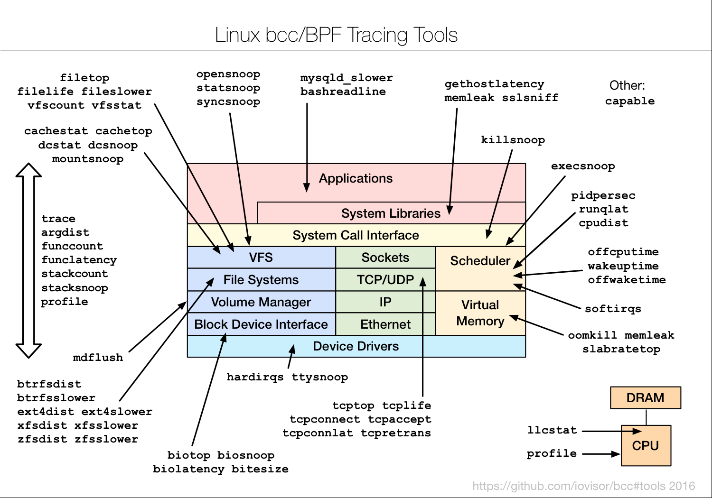

:toc:

// 保证所有的目录层级都可以正常显示图片
:path: eBPF/
:imagesdir: ../image/

// 只有book调用的时候才会走到这里
ifdef::rootpath[]
:imagesdir: {rootpath}{path}{imagesdir}
endif::rootpath[]

== bcc



=== 命令

安装bcc之后在目录/usr/share/bcc/tools下有各种命令

==== argdist

argdist 是一个强大的性能分析和调试工具，它允许用户探测指定的函数，并收集参数值到直方图或频率计数中。这使得开发者无需附加调试器即可理解特定参数值的分布情况、过滤并打印出感兴趣的参数值，以及获取关于各种函数的一般执行统计信息。这种功能特别适用于那些希望在不中断程序正常运行的情况下监控函数调用及其参数的应用场景。

[source,bash]
----
# ./argdist -c -H 'p:c:write(int fd, void *buf, size_t len):size_t:len'
[01:45:22]
p:c:write(int fd, void *buf, size_t len):size_t:len
     len                 : count     distribution
         0 -> 1          : 0        |                                        |
         2 -> 3          : 2        |*************                           |
         4 -> 7          : 0        |                                        |
         8 -> 15         : 2        |*************                           |
        16 -> 31         : 0        |                                        |
        32 -> 63         : 6        |****************************************|
[01:45:23]
----

能以直方图的形式将函数的返回值进行统计

==== bashreadline

用于从系统上所有正在运行的 Bash shell 中读取命令。这对于调试、审计或学习如何使用这些技术非常有用。运行之后系统任何地方调用bash这里都能收到执行的命令。

[source,bash]
----
# ./bashreadline
TIME      PID    COMMAND
05:28:25  21176  ls -l
05:28:28  21176  date
----

==== bindsnoop

监听系统上哪些端口被绑定了

==== biolatency

用于显示块设备I/O的延迟，结果以直方图的形式展示

[source,bash]
----
# ./biolatency
Tracing block device I/O... Hit Ctrl-C to end.
^C
     usecs           : count     distribution
       0 -> 1        : 0        |                                      |
       2 -> 3        : 0        |                                      |
       4 -> 7        : 0        |                                      |
       8 -> 15       : 0        |                                      |
      16 -> 31       : 0        |                                      |
      32 -> 63       : 0        |                                      |
      64 -> 127      : 1        |                                      |
----

==== biolatpcts

追踪块设备 I/O（即磁盘 I/O），并按 I/O 类型打印延迟百分位数。这对于分析磁盘性能瓶颈、了解不同类型的 I/O 操作（如读、写等）的延迟分布非常有用。

[source,bash]
----
# ./biolatpcts.py /dev/nvme0n1
nvme0n1    p1    p5   p10   p16   p25   p50   p75   p84   p90   p95   p99  p100
read     95us 175us 305us 515us 895us 985us 995us 1.5ms 2.5ms 3.5ms 4.5ms  10ms
write     5us   5us   5us  15us  25us 135us 765us 855us 885us 895us 965us 1.5ms
discard   5us   5us   5us   5us 135us 145us 165us 205us 385us 875us 1.5ms 2.5ms
flush     5us   5us   5us   5us   5us   5us   5us   5us   5us 1.5ms 4.5ms 5.5ms
----

==== biopattern

用于识别磁盘访问模式（如随机访问和顺序访问）。这对于理解应用程序如何与存储交互、优化数据库或文件系统性能特别有用。通过分析 I/O 模式，可以做出更好的决策来提高系统的整体性能。

[source,bash]
----
# ./biopattern.py
TIME      DISK     %RND  %SEQ    COUNT     KBYTES
22:03:51  vdb         0    99      788       3184
22:03:51  Unknown     0   100        4          0
----

特别是开发数据库或者消息队列这种需要经常进行存储的产品

==== biosnoop

用于追踪块设备 I/O（即磁盘 I/O），并为每次 I/O 操作打印一行输出。这对于分析磁盘性能、识别慢速 I/O 操作以及了解系统中磁盘活动的具体细节非常有用。

==== biotop

用于实时显示哪些进程正在进行磁盘 I/O 操作。它类似于 top 命令，但专门针对磁盘 I/O 进行了优化，能够帮助用户识别出系统中占用大量磁盘资源的进程。

==== bitesize

旨在显示按进程名称划分的请求块大小的 I/O 分布。这对于理解不同应用程序如何执行磁盘 I/O 操作以及这些操作的块大小分布非常有用。通过分析块大小分布，可以帮助优化存储系统配置或应用程序性能。

[source,bash]
----
# ./bitesize.py
Tracing... Hit Ctrl-C to end.
^C

Process Name = 'kworker/u128:1'
     Kbytes              : count     distribution
         0 -> 1          : 1        |********************                    |
         2 -> 3          : 0        |                                        |
         4 -> 7          : 2        |****************************************|
----

能够通过直方图清晰的看到对应进程使用磁盘块的大小情况，如果有io性能问题可以作为参考依据

==== bpflist

bpflist 是一个用于显示当前在系统上运行的 BPF（Berkeley Packet Filter）程序信息的工具。它可以帮助你了解哪些 BPF 程序正在运行，并且还可以选择性地列出已打开的 kprobes 和 uprobes。这对于调试和监控基于 eBPF 的工具非常有用。

[source,bash]
----
# bpflist
PID    COMM             TYPE     COUNT
4058   fileslower       prog     4
4058   fileslower       map      2
----

==== btrfsdist

btrfsdist 是一个基于 eBPF 和 bcc（BPF Compiler Collection）的工具，用于追踪 Btrfs 文件系统上的读取、写入、打开和同步（fsync）操作，并将其延迟汇总为2的幂次方直方图。这对于分析 Btrfs 文件系统的性能瓶颈特别有用，因为它可以帮助你了解这些操作的延迟分布情况。

[source,bash]
----
# ./btrfsdist
Tracing btrfs operation latency... Hit Ctrl-C to end.
^C

operation = 'read'
     usecs               : count     distribution
         0 -> 1          : 15       |                                        |
         2 -> 3          : 1308     |*******                                 |
         4 -> 7          : 198      |*                                       |
         8 -> 15         : 0        |                                        |
        16 -> 31         : 11       |                                        |
        32 -> 63         : 361      |*                                       |
        64 -> 127        : 55       |                                        |
       128 -> 255        : 104      |                                        |
       256 -> 511        : 7312     |****************************************|
       512 -> 1023       : 387      |**                                      |
      1024 -> 2047       : 10       |                                        |
      2048 -> 4095       : 4        |                                        |

operation = 'write'
     usecs               : count     distribution
         0 -> 1          : 0        |                                        |
         2 -> 3          : 0        |                                        |
         4 -> 7          : 0        |                                        |
         8 -> 15         : 4        |****************************************|

operation = 'open'
     usecs               : count     distribution
         0 -> 1          : 1        |**********                              |
         2 -> 3          : 4        |****************************************|
----

==== cachestat

用于捕获系统上缓存命中情况的信息统计，page cache的 hits和misses的情况

[source,bash]
----
# cachestat
    HITS   MISSES  DIRTIES HITRATIO   BUFFERS_MB  CACHED_MB
    1132        0        4  100.00%          277       4367
     161        0       36  100.00%          277       4372
      16        0       28  100.00%          277       4372
   17154    13750       15   55.51%          277       4422
      19        0        1  100.00%          277       4422
      83        0       83  100.00%          277       4421
      16        0        1  100.00%          277       4423
^C       0      -19      360    0.00%          277       4423
Detaching...
----

==== cachetop

cachetop 是一个非常有用的工具，它基于 eBPF 和 bcc（BPF Compiler Collection），可以实时显示 Linux 系统中每个进程的页面缓存（page cache）命中和未命中情况。它提供了一个类似 top 的界面，让你能够直观地看到各个进程的缓存性能，包括读取和写入操作的命中率。

[source,bash]
----
# ./cachetop.py
13:01:01 Buffers MB: 76 / Cached MB: 115 / Sort: HITS / Order: ascending
PID      UID      CMD              HITS     MISSES   DIRTIES  READ_HIT%  WRITE_HIT%
     544 messageb dbus-daemon             2        2        1      25.0%      50.0%
     680 root     vminfo                  2        2        1      25.0%      50.0%
     243 root     jbd2/dm-0-8             3        2        1      40.0%      40.0%
----

==== capable

capable 是一个基于 eBPF 和 bcc（BPF Compiler Collection）的工具，用于追踪对内核 cap_capable() 函数的调用。这个函数负责执行安全权限检查，以确定某个进程是否具备执行特定操作所需的能力（capabilities）。通过使用 capable 工具，可以深入了解系统中哪些进程正在请求哪些权限，并且这些请求的结果是什么。

[source,bash]
----
# ./capable.py
TIME      UID    PID    COMM             CAP  NAME                 AUDIT
22:11:23  114    2676   snmpd            12   CAP_NET_ADMIN        1
22:11:23  0      6990   run              24   CAP_SYS_RESOURCE     1
22:11:23  0      7003   chmod            3    CAP_FOWNER           1
22:11:23  0      7003   chmod            4    CAP_FSETID           1
22:11:23  0      7005   chmod            4    CAP_FSETID           1
----

==== compactsnoop

compactsnoop 是一个基于 eBPF 和 bcc（BPF Compiler Collection）的工具，用于追踪整个系统的内存紧凑（compact zone）操作，并打印相关的详细信息。内存紧凑是 Linux 内核中的一种机制，旨在减少外部碎片并提高内存分配的效率。

[source,bash]
----
# ./compactsnoop
COMM           PID    NODE ZONE         ORDER MODE      LAT(ms)           STATUS
zsh            23685  0    ZONE_DMA     -1    SYNC        0.025         complete
zsh            23685  0    ZONE_DMA32   -1    SYNC        3.925         complete
zsh            23685  0    ZONE_NORMAL  -1    SYNC      113.975         complete
----

==== cpudist

cpudist 是一个基于 eBPF 和 BCC（BPF Compiler Collection）的工具，用于汇总任务在 CPU 上的时间，并以直方图的形式展示任务在被调度出 CPU 之前花费的时间长度。这有助于识别系统中的问题，如处理器过载、过多的上下文切换开销、工作负载分布不均等。

[source,bash]
----
[root@k8smaster-ims tools]# ./cpudist
Tracing on-CPU time... Hit Ctrl-C to end.
^C
     usecs               : count     distribution
         0 -> 1          : 7        |                                        |
         2 -> 3          : 30596    |******                                  |
         4 -> 7          : 20443    |****                                    |
         8 -> 15         : 184665   |****************************************|
        16 -> 31         : 141411   |******************************          |
        32 -> 63         : 43491    |*********                               |
        64 -> 127        : 18057    |***                                     |
       128 -> 255        : 6590     |*                                       |
       256 -> 511        : 3002     |                                        |
       512 -> 1023       : 1317     |                                        |
      1024 -> 2047       : 833      |                                        |
      2048 -> 4095       : 409      |                                        |
      4096 -> 8191       : 71       |                                        |
      8192 -> 16383      : 10       |                                        |
     16384 -> 32767      : 4        |                                        |
     32768 -> 65535      : 1        |                                        |
     65536 -> 131071     : 1        |                                        |
    131072 -> 262143     : 2        |                                        |
    262144 -> 524287     : 1        |                                        |
----

usecs：微秒，表示时间区间，比如 0-1微秒区间调度的个数

> 可以试验一下死锁的情况，(可能只有自旋锁才能一直占着CPU不丢)

==== cpuunclaimed

cpuunclaimed.py 是一个用于监控系统中 CPU 利用率的脚本，特别关注那些在有可用 CPU 时仍处于等待状态的线程。该工具通过采样 CPU 运行队列的长度来确定系统中是否存在空闲 CPU 同时又有线程在排队等待执行的情况，并报告未被利用的 CPU 百分比（即系统范围内空闲但未被排队线程使用的 CPU 的百分比）。

[source,bash]
----
# ./cpuunclaimed.py
Sampling run queues... Output every 1 seconds. Hit Ctrl-C to end.
%CPU  83.00%, unclaimed idle 0.12%
%CPU  87.25%, unclaimed idle 0.38%
%CPU  85.00%, unclaimed idle 0.25%
%CPU  85.00%, unclaimed idle 0.25%
%CPU  80.88%, unclaimed idle 0.00%
%CPU  82.25%, unclaimed idle 0.00%
%CPU  83.50%, unclaimed idle 0.12%
%CPU  81.50%, unclaimed idle 0.00%
%CPU  81.38%, unclaimed idle 0.00%
----

系统运行在超过 80% 的 CPU 利用率下，且未被利用的空闲 CPU 小于 0.5%

- %CPU：显示了当前时刻的 CPU 使用率。
- unclaimed idle：显示了当前时刻未被利用的空闲 CPU 百分比。这表示有部分 CPU 核心处于空闲状态，但是由于某些原因（如 CPU 亲和性设置），这些核心没有被排队的任务使用。

==== criticalstat

criticalstat 是一个用于追踪和报告 Linux 内核中出现的原子临界区的工具，它通过有用的堆栈跟踪来展示这些临界区的来源。临界区通常由于使用自旋锁（spinlocks）、显式禁用中断或抢占（由驱动程序执行）而发生。在 Linux 中，IRQ 例程也执行时禁用中断。这些临界区是实时系统中导致长时间延迟或响应问题的一个常见原因。

[source,bash]
----
# ./criticalstat
Finding critical section with IRQ disabled for > 100us
===================================
TASK: kworker/u16:5 (pid  5903 tid  5903) Total Time: 194.427  us

Section start: __schedule -> schedule
Section end:   _raw_spin_unlock_irq -> finish_task_switch
  trace_hardirqs_on+0xdc
  trace_hardirqs_on+0xdc
  _raw_spin_unlock_irq+0x18
  finish_task_switch+0xf0
  __schedule+0x8c8
  preempt_schedule_irq+0x38
  el1_preempt+0x8
===================================
----

==== dbslower

dbslower 是一个基于 eBPF 和 BCC（BPF Compiler Collection）的工具，用于追踪由 MySQL 或 PostgreSQL 数据库服务器处理的查询，并打印那些超过指定延迟（查询时间）阈值的查询。默认情况下，它使用的阈值是 1 毫秒。这个工具对于识别慢查询非常有用，可以帮助优化数据库性能。


==== dbstat

dbstat traces queries performed by a MySQL or PostgreSQL database process, and displays a histogram of query latencies. For example:

[source,bash]
----
# dbstat mysql
Tracing database queries for pids 25776 slower than 0 ms...
     query latency (ms)  : count     distribution
         0 -> 1          : 990      |****************************************|
         2 -> 3          : 7        |                                        |
         4 -> 7          : 0        |                                        |
         8 -> 15         : 0        |                                        |
        16 -> 31         : 0        |                                        |
        32 -> 63         : 0        |                                        |
        64 -> 127        : 0        |                                        |
       128 -> 255        : 0        |                                        |
       256 -> 511        : 0        |                                        |
       512 -> 1023       : 0        |                                        |
      1024 -> 2047       : 2        |                                        |
^C
----

It's immediately evident that the vast majority of queries finish very quickly,
in under 1ms, but there are some super-slow queries occasionally, in the 1-2
seconds bucket.

==== dcsnoop

dcsnoop 是一个基于 eBPF 和 BCC（BPF Compiler Collection）的工具，用于追踪目录项缓存（dcache）查找。它可以帮助你进行比 dcstat(8) 更深入的调查，尤其是当需要了解文件系统元数据操作的具体行为时。由于 dcache 查找通常非常频繁，dcsnoop 的输出可能会比较冗长。默认情况下，它只显示失败的查找

[source,bash]
----
# ("T" column: M == miss, R == reference),
# ./dcsnoop.py
TIME(s)     PID    COMM             T FILE
0.002837    1643   snmpd            M net/dev
0.002852    1643   snmpd            M 1643
0.002856    1643   snmpd            M net
0.002863    1643   snmpd            M dev
0.002952    1643   snmpd            M net/if_inet6
----

==== dcstat

dcstat 是一个用于显示目录项缓存（dcache）统计信息的工具。它提供了每秒引用次数（REFS/s）、使用较慢代码路径处理的请求数量（SLOW/s）、dcache 未命中次数（MISS/s）以及命中率百分比（HIT%）。默认情况下，该工具每秒输出一次统计数据。

并不是目录不存在，而是对使用目录缓存时，是否命中目录缓存的统计心系 。

[source,bash]
----
# ./dcstat
TIME         REFS/s   SLOW/s   MISS/s     HIT%
08:11:47:      2059      141       97    95.29
08:11:48:     79974      151      106    99.87
08:11:49:    192874      146      102    99.95
08:11:50:      2051      144      100    95.12
08:11:51:     73373    17239    17194    76.57
08:11:52:     54685    25431    25387    53.58
08:11:53:     18127     8182     8137    55.12
08:11:54:     22517    10345    10301    54.25
08:11:55:      7524     2881     2836    62.31
08:11:56:      2067      141       97    95.31
08:11:57:      2115      145      101    95.22
----

- TIME：时间戳，表示数据收集的时间点。
- REFS/s：每秒对 dcache 的引用次数。
- SLOW/s：每秒中需要走较慢代码路径处理的请求次数。
- MISS/s：每秒中 dcache 未命中的次数。
- HIT%：缓存命中率的百分比。

==== deadlock

用于检测运行中进程潜在死锁的工具。它通过在 pthread_mutex_lock 和 pthread_mutex_unlock 上附加 uprobes 来构建一个互斥等待有向图，并查找该图中的循环。如果存在循环，则表明存在锁顺序反转（即潜在的死锁）。以下是关于该工具的工作原理及其使用方法的详细说明。


==== dirtop

用于显示按目录划分的读写操作的工具。它可以帮助用户实时监控文件系统中各个目录的 I/O 活动情况，包括读取和写入的数量或频率。这对于识别哪些目录正在产生大量的磁盘 I/O 操作特别有用，有助于性能调优和故障排查。

[source,bash]
----
# ./dirtop.py -d '/hdfs/uuid/*/yarn'
Tracing... Output every 1 secs. Hit Ctrl-C to end

14:28:12 loadavg: 25.00 22.85 21.22 31/2921 66450

READS  WRITES R_Kb     W_Kb     PATH
1030   2852   8        147341   /hdfs/uuid/c11da291-28de-4a77-873e-44bb452d238b/yarn
3308   2459   10980    24893    /hdfs/uuid/bf829d08-1455-45b8-81fa-05c3303e8c45/yarn
2227   7165   6484     11157    /hdfs/uuid/76dc0b77-e2fd-4476-818f-2b5c3c452396/yarn
1985   9576   6431     6616     /hdfs/uuid/99c178d5-a209-4af2-8467-7382c7f03c1b/yarn
1986   398    6474     6486     /hdfs/uuid/7d512fe7-b20d-464c-a75a-dbf8b687ee1c/yarn
----

比如你有一个程序，需要确定具体目录里面对I/O的占用，这样就能按照目录来决定具体是那部分代码导致的I/O比较高了。


==== drsnoop

drsnoop 是一个用于追踪系统范围内直接回收（direct reclaim）事件的工具，并打印出相关的详细信息。直接回收发生在系统内存不足时，内核需要从用户态进程那里回收页面以满足新的内存分配请求。通过 drsnoop，可以监控哪些进程触发了直接回收、它们花费的时间以及回收了多少页面等信息。

[source,bash]
----
# ./drsnoop
COMM           PID     LAT(ms) PAGES
summond        17678      0.19   143
summond        17669      0.55   313
summond        17669      0.15   145
summond        17669      0.27   237
----

可以用来作为内存不足的提前预警，如果大量出现说明内存已经成为限制因素。

==== execsnoop

execsnoop 是一个用于追踪新进程创建的工具，它通过监控 execve() 系统调用来捕获新进程的启动情况。这对于了解系统中哪些命令被执行、它们的参数是什么以及执行的结果如何非常有用。例如，当你运行 man ls 命令时，execsnoop 可以显示该命令及其子命令的详细信息。

[source,bash]
----
# ./execsnoop
COMM             PID    RET ARGS
bash             15887    0 /usr/bin/man ls
preconv          15894    0 /usr/bin/preconv -e UTF-8
man              15896    0 /usr/bin/tbl
man              15897    0 /usr/bin/nroff -mandoc -rLL=169n -rLT=169n -Tutf8
man              15898    0 /usr/bin/pager -s
nroff            15900    0 /usr/bin/locale charmap
----

当有个CPU使用很满，但是使用top又看不出是那个进程导致，有可能是因为启动的子进程比较耗CPU但是启动之后子进程又会快速退出导致的这个时候就可以用这个工具。

==== exitsnoop

exitsnoop 是一个用于追踪所有进程终止及其原因的Linux工具。它通过BPF（Berkeley Packet Filter）技术实现，需要 CAP_SYS_ADMIN 权限，因此通常需要用 sudo 来调用。该工具通过监听内核文件 kernel/exit.c 中的 sched_process_exit 跟踪点来捕获进程退出事件，包括由 root 和其他用户启动的进程、容器内的进程以及变为僵尸状态的进程。

[source,bash]
----
./exitsnoop.py > exitlog
PCOMM            PID    PPID   TID    AGE(s)  EXIT_CODE
sleep            19004  19003  19004  1.65    0
bash             19003  17656  19003  1.65    code 65
sleep            19007  19006  19007  1.70    0
bash             19006  17656  19006  1.70    code 70
sleep            19010  19009  19010  1.75    0
bash             19009  17656  19009  1.75    code 75
sleep            19014  19013  19014  0.23    signal 2 (INT)
bash             19013  17656  19013  0.23    signal 2 (INT)
----

==== ext4dist

ext4dist 是一个用于追踪 ext4 文件系统操作（如读取、写入、打开和同步）并将其延迟汇总为以2的幂为间隔的直方图的工具。它可以帮助用户了解这些文件系统操作的延迟分布情况，从而对性能瓶颈进行诊断

[source,bash]
----
# ./ext4dist
Tracing ext4 operation latency... Hit Ctrl-C to end.
^C

operation = 'read'
     usecs               : count     distribution
         0 -> 1          : 1210     |****************************************|
         2 -> 3          : 126      |****                                    |
         4 -> 7          : 376      |************                            |
         8 -> 15         : 86       |**                                      |
        16 -> 31         : 9        |                                        |
        32 -> 63         : 47       |*                                       |
        64 -> 127        : 6        |                                        |
       128 -> 255        : 24       |                                        |
       256 -> 511        : 137      |****                                    |
       512 -> 1023       : 66       |**                                      |
      1024 -> 2047       : 13       |                                        |
      2048 -> 4095       : 7        |                                        |
      4096 -> 8191       : 13       |                                        |
      8192 -> 16383      : 3        |                                        |

operation = 'write'
     usecs               : count     distribution
         0 -> 1          : 0        |                                        |
         2 -> 3          : 0        |                                        |
         4 -> 7          : 0        |                                        |
         8 -> 15         : 75       |****************************************|
        16 -> 31         : 5        |**                                      |

operation = 'open'
     usecs               : count     distribution
         0 -> 1          : 1278     |****************************************|
         2 -> 3          : 40       |*                                       |
         4 -> 7          : 4        |                                        |
         8 -> 15         : 1        |                                        |
        16 -> 31         : 1        |                                        |
----

分析ext4文件系统的读写性能。

==== ext4slower

ext4slower 是一个用于显示慢于指定阈值的 ext4 文件系统操作（如读取、写入、打开和同步）的工具。它可以帮助识别哪些文件系统操作导致了较高的延迟

[source,bash]
----
# 慢于1ms的 ext4操作
# ./ext4slower 1
# ./ext4slower
Tracing ext4 operations slower than 10 ms
TIME     COMM           PID    T BYTES   OFF_KB   LAT(ms) FILENAME
06:35:01 cron           16464  R 1249    0          16.05 common-auth
06:35:01 cron           16463  R 1249    0          16.04 common-auth
06:35:01 cron           16465  R 1249    0          16.03 common-auth
06:35:01 cron           16465  R 4096    0          10.62 login.defs
----

用来查看慢于指定阈值的 ext4 文件系统操作


==== filegone

用来查看文件是否被删除或重命名

[source,bash]
----
# ./filegone
18:30:56 22905   vim               DELETE .fstab.swpx
18:30:56 22905   vim               DELETE .fstab.swp
18:31:00 22905   vim               DELETE .viminfo
18:31:00 22905   vim               RENAME .viminfo.tmp > .viminfo
18:31:00 22905   vim               DELETE .fstab.swp
----

==== filelive

filelive用来捕获那些存活时间短 `short-lived` 的文件，其实只要在捕获期间创建但是没有删除的文件都会被捕获。

[source,bash]
----
# ./filelife
TIME     PID    COMM             AGE(s)  FILE
05:57:59 8556   gcc              0.04    ccCB5EDe.s
05:57:59 8560   rm               0.02    .entry_64.o.d
05:57:59 8563   gcc              0.02    cc5UFHXf.s
05:57:59 8567   rm               0.01    .thunk_64.o.d
05:57:59 8578   rm               0.02    .syscall_64.o.d
05:58:00 8589   rm               0.03    .common.o.d
05:58:00 8596   rm               0.01    .8592.tmp
05:58:00 8601   rm               0.01    .8597.tmp
----

==== fileslower

fileslower 是一个用于显示基于文件的同步读写操作，并且仅显示那些延迟超过指定阈值的操作的工具。它帮助识别哪些文件 I/O 操作导致了较高的延迟，从而有助于性能调优和故障排查。如果不指定默认捕获所有的同步读写操作，注意是同步读写，默认情况下read writer 是异步的，所以不会被捕获。

[source,bash]
----
# ./fileslower 1
Tracing sync read/writes slower than 1 ms
TIME(s)  COMM           PID    D BYTES   LAT(ms) FILENAME
0.000    randread.pl    6925   R 8192       1.06 data1
0.082    randread.pl    6925   R 8192       2.42 data1
0.116    randread.pl    6925   R 8192       1.78 data1
----


==== filetop

filetop 是一个用于显示按文件分类的读写操作，并提供进程详细信息的工具。它可以帮助用户了解哪些文件正在被读写、由哪个进程进行操作及其读写量，这对于分析系统性能和排查问题非常有用。

[source,bash]
----
# ./filetop -C
Tracing... Output every 1 secs. Hit Ctrl-C to end

08:00:23 loadavg: 0.91 0.33 0.23 3/286 26635

PID    COMM             READS  WRITES R_Kb    W_Kb    T FILE
26628  ld               161    186    643     152     R built-in.o
26634  cc1              1      0      200     0       R autoconf.h
26618  cc1              1      0      200     0       R autoconf.h
26634  cc1              12     0      192     0       R tracepoint.h
26584  cc1              2      0      143     0       R mm.h
26634  cc1              2      0      143     0       R mm.h
26631  make             34     0      136     0       R auto.conf
26634  cc1              1      0      98      0       R fs.h
26584  cc1              1      0      98      0       R fs.h
----

可以查看对具体哪个文件的读写比较大。

==== funccount

funccount 是一个用于追踪符合指定模式的函数、跟踪点或USDT探针的程序，并在按下 Ctrl-C 时打印出这些追踪点的调用次数汇总。它对于性能分析和系统行为理解非常有用，可以快速了解哪些函数被调用了多少次。

[source,bash]
----
# ./funccount 'vfs_*'
Tracing... Ctrl-C to end.
^C
FUNC                          COUNT
vfs_create                        1
vfs_rename                        1
vfs_fsync_range                   2
vfs_lock_file                    30
vfs_fstatat                     152
vfs_fstat                       154
vfs_write                       166
vfs_getattr_nosec               262
vfs_getattr                     262
vfs_open                        264
vfs_read                        470
Detaching...
----

==== funcinterval

funcinterval 是一个基于 eBPF/bcc 的工具，用于分析特定函数调用之间的时间间隔分布。与 funclatency 不同，后者关注的是函数执行的延迟时间，而 funcinterval 则专注于函数调用之间的时间间隔。这对于性能调试特别有用，尤其是在硬件和软件交互场景下，例如 USB 控制器的操作等。

[source,bash]
----
# ./funcinterval xhci_ring_ep_doorbell -d 2 -u
Tracing 1 functions for "xhci_ring_ep_doorbell"... Hit Ctrl-C to end.

     usecs               : count     distribution
         0 -> 1          : 0        |                                        |
         2 -> 3          : 0        |                                        |
         4 -> 7          : 0        |                                        |
         8 -> 15         : 0        |                                        |
        16 -> 31         : 0        |                                        |
        32 -> 63         : 134      |                                        |
        64 -> 127        : 2862     |********************                    |
       128 -> 255        : 5552     |****************************************|
       256 -> 511        : 216      |*                                       |
       512 -> 1023       : 2        |                                        |
Detaching...
----

==== funclatency

funclatency 是一个用于测量内核函数执行时间（延迟）的工具，通过跟踪函数进入和返回的时间戳来计算函数调用的时间消耗。它使用 eBPF 和 kprobes/kretprobes 技术动态地追踪指定函数，并提供其延迟分布的直方图，这对于性能分析非常有用。

[source,bash]
----
[root@k8smaster-ims tools]# ./funclatency -u vfs_read
Tracing 1 functions for "vfs_read"... Hit Ctrl-C to end.
^C
     usecs               : count     distribution
         0 -> 1          : 23872    |******************                      |
         2 -> 3          : 19679    |***************                         |
         4 -> 7          : 51444    |****************************************|
         8 -> 15         : 11378    |********                                |
        16 -> 31         : 8736     |******                                  |
        32 -> 63         : 2473     |*                                       |
        64 -> 127        : 969      |                                        |
       128 -> 255        : 381      |                                        |
       256 -> 511        : 87       |                                        |
       512 -> 1023       : 83       |                                        |
      1024 -> 2047       : 203      |                                        |
      2048 -> 4095       : 73       |                                        |
      4096 -> 8191       : 33       |                                        |
      8192 -> 16383      : 12       |                                        |
     16384 -> 32767      : 3        |                                        |
     32768 -> 65535      : 2        |                                        |
     65536 -> 131071     : 3        |                                        |
    131072 -> 262143     : 2        |                                        |
    262144 -> 524287     : 5        |                                        |
    524288 -> 1048575    : 0        |                                        |
   1048576 -> 2097151    : 2        |                                        |
   2097152 -> 4194303    : 0        |                                        |
   4194304 -> 8388607    : 0        |                                        |
   8388608 -> 16777215   : 1        |                                        |

avg = 140 usecs, total: 16807683 usecs, count: 119444

Detaching...
----

==== funcslower

funcslower 是一个用于追踪超过特定延迟阈值的内核或用户函数调用的工具。这对于当基于聚合的工具无法提供足够信息时，作为最后的诊断手段非常有用。它能够帮助识别那些执行时间较长的函数调用，从而可能发现性能瓶颈或异常行为。

[source,bash]
----
# c:open c说明是libc中的函数，也就是C标准库中的函数，而不是内核中的函数
# ./funcslower c:open -u 1
Tracing function calls slower than 1 us... Ctrl+C to quit.
COMM           PID    LAT(us)             RVAL FUNC
less           27074    33.77                3 c:open
less           27074     9.96 ffffffffffffffff c:open
less           27074     5.92 ffffffffffffffff c:open
less           27074    15.88 ffffffffffffffff c:open
less           27074     8.89                3 c:open
less           27074    15.89                3 c:open
sh             27075    20.97                4 c:open
bash           27075    20.14                4 c:open
lesspipe.sh    27075    18.77                4 c:open
lesspipe.sh    27075    11.21                4 c:open
lesspipe.sh    27075    13.68                4 c:open
file           27076    14.83 ffffffffffffffff c:open
file           27076     8.02                4 c:open
file           27076    10.26                4 c:open
file           27076     6.55                4 c:open
less           27074    11.67                4 c:open
----

====  gethostlatency

gethostlatency 工具用于追踪主机名查找调用（如 getaddrinfo()、gethostbyname() 和 gethostbyname2()），并显示执行查找的进程ID（PID）、命令、调用的延迟（持续时间，以毫秒为单位）以及主机字符串。这有助于了解网络请求中的DNS解析性能和识别潜在的问题。

[source,bash]
----
# ./gethostlatency
TIME      PID    COMM          LATms HOST
06:10:24  28011  wget          90.00 www.iovisor.org
06:10:28  28127  wget           0.00 www.iovisor.org
06:10:41  28404  wget           9.00 www.netflix.com
06:10:48  28544  curl          35.00 www.netflix.com.au
06:11:10  29054  curl          31.00 www.plumgrid.com
06:11:16  29195  curl           3.00 www.facebook.com
06:11:25  29404  curl          72.00 foo
06:11:28  29475  curl           1.00 foo
----

==== hardirqs

捕获到硬中断事件，并显示其名称和总执行时间（以微秒为单位）。

[source, bash]
----
# ./hardirqs
Tracing hard irq event time... Hit Ctrl-C to end.
^C
HARDIRQ                    TOTAL_usecs
eth0                             11441
resched2                          1750
timer0                            1558
resched1                          1048
timer4                             943
timer2                             746
timer6                             679
timer1                             529
timer5                             474
----

==== inject

inject.py 是一个用于在特定调用链和可选谓词条件下，保证指定注入模式（如 kmalloc, bio 等）错误返回的工具。它允许用户模拟内核函数的失败情况，以测试系统的健壮性和调试目的。以

`inject.py` 是一个用于在特定调用链和可选谓词条件下，保证指定注入模式（如 `kmalloc`, `bio` 等）错误返回的工具。它允许用户模拟内核函数的失败情况，以测试系统的健壮性和调试目的。以下是一些使用示例及其解释：

===== 基本用法

失败所有挂载操作

如果你想让所有的挂载操作失败（从4.17版本开始可以直接失败系统调用），可以使用如下命令：

```bash
# ./inject.py kmalloc -v 'SyS_mount()'
```

- 第一个参数 `kmalloc` 表示要失败的操作类型。
- `-v` 参数用于打印生成的BPF程序。
- 注意，一些系统调用可能以 `SyS_xyz` 或 `sys_xyz` 的形式可用，这主要取决于系统调用的参数数量。

执行此命令后，尝试挂载任何文件系统都会因内存分配失败而报告错误。

使用谓词

显式添加谓词

上述例子等价于显式地写出谓词 `(true)`：

[source,bash]
----
# ./inject.py kmalloc -v '(true) => SyS_mount()(true)'
----

这里，`(true)` 作为错误注入机制当前模式的谓词。

特定条件下的失败

假设你只想让从 `btrfs_mount()` 调用的 `mount_subtree()` 函数中的 `kmalloc` 失败，即仅让 btrfs 挂载失败：

[source,bash]
----
# ./inject.py kmalloc -v 'mount_subtree() => btrfs_mount()'
----

这样，只有当从 `btrfs_mount()` 调用 `mount_subtree()` 时，`kmalloc` 才会失败，其他文件系统的挂载不受影响。

===== 更复杂的用例

触发BUG_ON
假设你想触发 `fs/btrfs/volumes.c:1002` 中的 `BUG_ON`，可以通过以下方式：

[source,bash]
----
# ./inject.py kmalloc -v 'btrfs_alloc_device() => btrfs_close_devices()'
----
执行此命令并进行 btrfs 文件系统的挂载和卸载操作会导致段错误，因为满足了指定的调用路径。

根据函数参数区分调用

对于频繁遍历的路径，可以通过函数参数来区分不同的调用。例如，想要让名称为 "bananas" 的 dentry 分配失败：

[source,bash]
----
# ./inject.py kmalloc -v 'd_alloc_parallel(struct dentry *parent, const struct qstr *name)(STRCMP(name->name, 'bananas'))'
----

此命令会使任何涉及名为 "bananas" 的文件的操作导致 dentry 分配失败。

生物I/O请求的失败

假设你想让对特定扇区的生物I/O请求失败（例如，使 btrfs 的超级块写入失败）：

[source,bash]
----
# ./inject.py bio -v -I 'linux/blkdev.h' '(({struct gendisk *d = bio->bi_disk; struct disk_part_tbl *tbl = d->part_tbl; struct hd_struct **parts = (void *)tbl + sizeof(struct disk_part_tbl); struct hd_struct **partp = parts + bio->bi_partno; struct hd_struct *p = *partp; dev_t disk = p->__dev.devt; disk == MKDEV(254,16);}) && bio->bi_iter.bi_sector == 128)'
----
这个命令会根据给定的逻辑判断是否为 btrfs 文件系统的超级块写入，并且只针对扇区号为 128 的请求失败。

注入概率

如果你想让挂载失败的概率为1%，可以使用 `-P` 参数：

[source,bash]
----
# ./inject.py kmalloc -v -P 0.01 'SyS_mount()'
----

==== killsnoop

捕获通过 kill() 接口发起的信号

[source,bash]
----
# ./killsnoop
TIME      PID    COMM             SIG  TPID   RESULT
12:10:51  13967  bash             9    13885  0
12:11:34  13967  bash             9    1024   -3
12:11:41  815    systemd-udevd    15   14076  0
----

==== klockstat

klockstat.py 是一个基于 Linux eBPF/bcc 的工具，用于追踪内核互斥锁（mutex）的锁定事件，并显示锁的统计信息。它可以帮助开发者和系统管理员了解内核中不同部分获取和持有锁的行为，从而进行性能优化和问题排查。

[source,bash]
----
# klockstat.py
Tracing lock events... Hit Ctrl-C to end.
^C
                                  Caller   Avg Spin  Count   Max spin Total spin
                      psi_avgs_work+0x2e       3675      5       5468      18379
                     flush_to_ldisc+0x22       2833      2       4210       5667
                       n_tty_write+0x30c       3914      1       3914       3914
                               isig+0x5d       2390      1       2390       2390
                   tty_buffer_flush+0x2a       1604      1       1604       1604
                      commit_echoes+0x22       1400      1       1400       1400
          n_tty_receive_buf_common+0x3b9       1399      1       1399       1399

                                  Caller   Avg Hold  Count   Max hold Total hold
                     flush_to_ldisc+0x22      42558      2      76135      85116
                      psi_avgs_work+0x2e      14821      5      20446      74106
          n_tty_receive_buf_common+0x3b9      12300      1      12300      12300
                       n_tty_write+0x30c      10712      1      10712      10712
                               isig+0x5d       3362      1       3362       3362
                   tty_buffer_flush+0x2a       3078      1       3078       3078
                      commit_echoes+0x22       3017      1       3017       3017
----

锁获取数据（Lock Acquiring Data）

- Caller：正在获取互斥锁的符号或函数名称。
- Average Spin：获取互斥锁所需的平均时间（纳秒）。
- Count：该互斥锁被获取的次数。
- Max spin：获取互斥锁所需的最大时间（纳秒）。
- Total spin：总花费在获取该互斥锁上的时间（纳秒）。

==== kvmexit

kvmexit 是一个旨在定位虚拟机频繁退出原因的工具，通过显示每个虚拟机退出的详细原因及其计数来帮助减少甚至避免这些退出。这对于运行在一个物理机器上的所有虚拟机来说尤为重要，因为频繁的 VM 退出会导致性能问题。

[source,bash]
----
# ./kvmexit.py
Display kvm exit reasons and statistics for all threads... Hit Ctrl-C to end.
PID      TID      KVM_EXIT_REASON                     COUNT
^C1273551  1273568  EXIT_REASON_HLT                     12
1273551  1273568  EXIT_REASON_MSR_WRITE               6
1274253  1274261  EXIT_REASON_EXTERNAL_INTERRUPT      1
1274253  1274261  EXIT_REASON_HLT                     12
1274253  1274261  EXIT_REASON_MSR_WRITE               4
----

- 性能瓶颈分析：帮助识别哪些 VM 退出原因是导致性能下降的关键因素，从而为优化提供方向。
- 定制输出：通过合并相同进程的不同线程并排序退出原因，使得数据分析更为集中和有效。
- 高效率：利用 BPF 技术，在保证功能的同时提升了性能表现。

==== llcstat

llcstat.py 是一个用于追踪系统范围内的缓存引用和缓存未命中事件，并按进程ID（PID）和CPU进行汇总的工具。它特别适用于分析不同进程对最后一级缓存（LLC）的使用情况，这对于性能优化至关重要。

[source,bash]
----
# ./llcstat.py 10 -t
Running for 10 seconds or hit Ctrl-C to end.
PID      TID      NAME             CPU     REFERENCE         MISS    HIT%
170843   170845   docker           12           2700         1200  55.56%
298670   298670   kworker/15:0     15            500            0 100.00%
170254   170254   kworker/11:1     11           2500          400  84.00%
1046952  1046953  git              0            2600         1100  57.69%
170843   170849   docker           15           1000          400  60.00%
1027373  1027382  node             8            3500         2500  28.57%
0        0        swapper/7        7          173000         4200  97.57%
1028217  1028217  node             14          15600        22400   0.00%
[...]
Total References: 7139900 Total Misses: 1413900 Hit Rate: 80.20%
----

==== mdflush

mdflush 工具用于在 md 驱动程序级别跟踪刷新请求，并打印包括刷新时间在内的详细信息。这对于分析与磁盘延迟相关的性能问题特别有用，尤其是在尝试找出导致延迟峰值的原因时。

[source,bash]
----
# ./mdflush
Tracing md flush requests... Hit Ctrl-C to end.
TIME     PID    COMM             DEVICE
03:13:49 16770  sync             md0
03:14:08 16864  sync             md0
03:14:49 496    kworker/1:0H     md0
03:14:49 488    xfsaild/md0      md0
03:14:54 488    xfsaild/md0      md0
03:15:00 488    xfsaild/md0      md0
----

==== memleak

memleak 是一个用于追踪和匹配内存分配与释放请求的工具，并为每次分配收集调用栈信息。它能够打印出哪些调用栈执行了未被随后释放的分配，从而帮助检测内存泄漏，这里知识查看申请内存但是使用之后没有立即释放的内存，但是后面是否被释放掉这里不进行统计。

[source,bash]
----
# ./memleak -p $(pidof allocs)
Attaching to pid 5193, Ctrl+C to quit.
[11:16:33] Top 2 stacks with outstanding allocations:
        80 bytes in 5 allocations from stack
                 main+0x6d [allocs]
                 __libc_start_main+0xf0 [libc-2.21.so]

[11:16:34] Top 2 stacks with outstanding allocations:
        160 bytes in 10 allocations from stack
                 main+0x6d [allocs]
                 __libc_start_main+0xf0 [libc-2.21.so]
----

==== mountsnoop

mountsnoop 是一个用于追踪系统范围内 mount() 和 umount 系统调用的工具。它可以帮助用户监控文件系统的挂载和卸载操作，对于系统管理和故障排查非常有用。

[source,bash]
----
# mount --bind /mnt /mnt
# umount /mnt
# unshare -m
# mount --bind /mnt /mnt
# umount /mnt

# ./mountsnoop.py
COMM             PID     TID     MNT_NS      CALL
mount            13207   13207   4026531841  mount("/dev/loop0", "tmp-dir/", "ext4", 0x0, "") = 0
mount            13207   13207   4026531841  umount("tmp-dir/", 0x0) = 0
fsmount          13224   13224   4026531841  fsopen("ext4", 0x0) = 5
fsmount          13224   13224   4026531841  fsconfig(5, FSCONFIG_SET_FLAG, "rw", "", 0) = 0
fsmount          13224   13224   4026531841  fsconfig(5, FSCONFIG_SET_STRING, "source", "/dev/loop0", 0) = 0
fsmount          13224   13224   4026531841  fsconfig(5, FSCONFIG_CMD_CREATE, "", "", 0) = 0
fsmount          13224   13224   4026531841  fsmount(5, 0x0, MOUNT_ATTR_RDONLY) = 6
fsmount          13224   13224   4026531841  move_mount(6, "", AT_FDCWD, "./tmp-dir/", MOVE_MOUNT_F_EMPTY_PATH) = 0
fsmount          13224   13224   4026531841  umount("./tmp-dir/", 0x0) = 0
----

==== mysqld_qslower

mysqld_qslower 是一个用于追踪由 MySQL 服务器处理的查询，并打印那些超过指定延迟（查询时间）阈值的查询。默认情况下，它使用 1 毫秒作为阈值。这个工具对于识别和优化慢查询非常有用。

[source,bash]
----
# ./mysqld_qslower.py `pgrep -n mysqld`
Tracing MySQL server queries for PID 14371 slower than 1 ms...
TIME(s)        PID          MS QUERY
0.000000       18608   130.751 SELECT * FROM words WHERE word REGEXP '^bre.*n$'
2.921535       18608   130.590 SELECT * FROM words WHERE word REGEXP '^alex.*$'
4.603549       18608    24.164 SELECT COUNT(*) FROM words
9.733847       18608   130.936 SELECT count(*) AS count FROM words WHERE word REGEXP '^bre.*n$'
17.864776      18608   130.298 SELECT * FROM words WHERE word REGEXP '^bre.*n$' ORDER BY word
----

==== netqtop

netqtop 是一个用于追踪内核函数执行数据链路层上的数据包发送（xmit_one）和接收（__netif_receive_skb_core）的工具。它不仅能够追踪通过指定网络接口的每个数据包，还能统计发送和接收方向上的每秒数据包数（PPS）、每秒比特数（BPS）、数据包的平均大小以及按大小范围分类的数据包数量。结果以表格形式打印出来，可用于理解每个感兴趣网络接口队列上的流量负载分配是否均衡，并在底部提供整体性能概况。


[source,bash]
----
# ./netqtop.py -n lo -i 1
Thu Sep 10 11:28:39 2020
TX
 QueueID    avg_size   [0, 64)   [64, 512)  [512, 2K)  [2K, 16K)  [16K, 64K)
    0          88          0          9          0          0          0
 Total         88          0          9          0          0          0

RX
 QueueID    avg_size   [0, 64)   [64, 512)  [512, 2K)  [2K, 16K)  [16K, 64K)
    0          74          4          5          0          0          0
 Total         74          4          5          0          0          0
----------------------------------------------------------------------------
Thu Sep 10 11:28:40 2020
TX
 QueueID    avg_size   [0, 64)   [64, 512)  [512, 2K)  [2K, 16K)  [16K, 64K)
    0         233          0          3          1          0          0
 Total        233          0          3          1          0          0

RX
 QueueID    avg_size   [0, 64)   [64, 512)  [512, 2K)  [2K, 16K)  [16K, 64K)
    0         219          2          1          1          0          0
 Total        219          2          1          1          0          0
----------------------------------------------------------------------------
----

- 数据包追踪：实时监控通过特定网络接口的所有数据包。
- 性能指标计算：
    * PPS (Packets Per Second)：每秒传输或接收的数据包数量。
    * BPS (Bits Per Second)：每秒传输或接收的比特数。
    * 平均数据包大小：计算所有数据包的平均大小。
    * 按大小范围分类的数据包数量：将数据包按照其大小分为不同的区间，并统计各区间内的数据包数量。
- 负载均衡分析：通过观察各个队列上的流量分布情况，判断是否存在负载不均的问题。
-整体性能评估：在输出结果的底部提供整个网络接口的整体性能总结。


==== nfsdist

nfsdist 是一个用于追踪 NFS（网络文件系统）操作如读取、写入、打开和获取属性（getattr），并以2的幂次分布的形式总结这些操作的延迟的工具。通过这种方式，用户可以更好地理解NFS客户端与服务器间交互的性能特性。

==== nfsslower

nfsslower 是一个用于显示 NFS（网络文件系统）中读取、写入、打开和获取属性（getattr）操作的工具，它专门追踪那些延迟超过特定阈值的操作。这对于识别性能瓶颈或理解NFS客户端与服务器间交互中的潜在问题非常有用。

==== offcputime

这个程序用于展示线程被阻塞时的堆栈跟踪以及它们被阻塞的总时长。它通过追踪线程何时被阻塞以及何时返回CPU来实现，测量的是线程“离CPU”的时间（即“off-CPU时间”）和被阻塞时的堆栈跟踪及任务名称。该数据在内核中汇总，通过唯一堆栈跟踪和任务名称对阻塞时间进行求和。

> 和profile形成互补，显示了线程在系统中花费的全部时间

> offcputime -f 5 | ./flamegraph.pl --bgcolors=blue --title="off-CPU Time Flame Graph" > out.svg

[source,bash]
----
# 默认是用户态和内核态一起跟踪，指定-K参数只跟踪内核态
# ./offcputime -K
Tracing off-CPU time (us) of all threads by kernel stack... Hit Ctrl-C to end.
^C
    schedule
    schedule_timeout
    io_schedule_timeout
    bit_wait_io
    __wait_on_bit
    wait_on_page_bit_killable
    __lock_page_or_retry
    filemap_fault
    __do_fault
    handle_mm_fault
    __do_page_fault
    do_page_fault
    page_fault
    chmod
        13
----

==== offwaketime

offwaketime 程序用于展示导致线程被阻塞并进入“离CPU”状态的内核堆栈跟踪和任务名称，同时还会显示唤醒这些线程的线程的堆栈跟踪和任务名称，以及从阻塞到被唤醒所经过的总时间。这个工具结合了 offwaketime 和 wakeuptime 工具的总结信息，旨在帮助用户识别线程阻塞的原因，并量化从阻塞到唤醒的时间。

[source,bash]
----
# ./offwaketime 5
Tracing blocked time (us) by kernel off-CPU and waker stack for 5 secs.

[...]

Off-CPU Stack (us=13)
    do_page_fault+0x2a/0x398 [kernel]
    page_fault_oops+0x64/0x178 [kernel]
    _raw_spin_lock_irqsave+0x1e/0x50 [kernel]
    chmod_common+0x1b4/0x390 [kernel]
    __x64_sys_chmod+0x5c/0xb0 [kernel]
    do_syscall_64+0x5b/0x1b0 [kernel]
    entry_SYSCALL_64_after_hwframe+0x44/0xa9 [kernel]
Task: chmod

Waker Stack
    io_schedule+0x3b/0x70 [kernel]
    sync_buffer+0x6b/0x120 [kernel]
    wakeup_flusher_threads_fn+0x7d/0xd0 [kernel]
    __blk_drain_queue+0x14b/0x1f0 [kernel]
    blk_cleanup_queue+0x1d/0x140 [kernel]
    scsi_free_host+0x2a/0x150 [kernel]
Task: kworker/u16:2-events_power_efficient

Total Elapsed Time: 13 us

[...]
----

- **Off-CPU Stack**：展示了导致线程进入“离CPU”状态（即被阻塞）的内核堆栈跟踪。例如，上述例子中的 `do_page_fault` 表明这是一个页面错误导致的阻塞。
- **(us=13)**：表示该线程被阻塞的总时间是13微秒。
- **Task**：执行此操作的任务名称或命令，这里是 `chmod`。
- **Waker Stack**：显示了哪个线程（及其堆栈跟踪）负责唤醒之前被阻塞的线程。在示例中，涉及到与I/O调度相关的函数如 `io_schedule`、`sync_buffer` 等，表明这是由于I/O操作完成而唤醒的。
- **Task**：唤醒任务的名称，这里是一个内核工作线程 `kworker/u16:2-events_power_efficient`。
- **Total Elapsed Time**：从线程被阻塞到被唤醒的总时间，在这个例子中也是13微秒

==== oomkill

oomkill 是一个简单的程序，用于追踪 Linux 系统中的内存不足（Out-Of-Memory, OOM）杀手，并在每一行显示一次 OOM 杀死的基本详情。这对于理解系统何时以及为何会因为内存耗尽而杀死进程非常有用。

[source,bash]
----
# ./oomkill
Tracing oom_kill_process()... Ctrl-C to end.
21:03:39 Triggered by PID 3297 ("ntpd"), OOM kill of PID 22516 ("perl"), 3850642 pages, loadavg: 0.99 0.39 0.30 3/282 22724
21:03:48 Triggered by PID 22517 ("perl"), OOM kill of PID 22517 ("perl"), 3850642 pages, loadavg: 0.99 0.41 0.30 2/282 22932
----

输出字段解释

- **时间戳**：如 `21:03:39`，表示发生 OOM 杀死的时间。
- **触发者PID和名称**：例如 `Triggered by PID 3297 ("ntpd")` 表示是由 PID 为 3297 的 ntpd 进程触发的。
- **被杀死的PID和名称**：例如 `OOM kill of PID 22516 ("perl")` 表示被 OOM 杀死的是 PID 为 22516 的 perl 进程。
- **页面数**：如 `3850642 pages`，通常每页是 4K 字节，这表明该进程消耗了多少物理内存。
- **负载平均值**：提供了系统的负载信息 `/proc/loadavg`，帮助了解系统当时的负载情况。例如，`loadavg: 0.99 0.39 0.30 3/282 22724` 分别代表了 1 分钟、5 分钟、15 分钟的平均负载，当前运行的进程数与总进程数的比例，以及最近运行的进程ID。

使用场景

- **性能监控与故障排查**：当系统因内存不足而开始杀死进程时，`oomkill` 可以提供关于哪个进程触发了 OOM 杀手以及哪个进程被杀死的详细信息。这对于分析系统性能瓶颈或故障原因非常重要。
- **资源管理**：通过观察系统在 OOM 发生前的行为（如负载变化），可以更好地管理服务器上的资源分配，预防未来的内存不足问题。

==== opensnoop

opensnoop 是一个用于追踪整个系统范围内 open() 系统调用并打印各种细节的工具。这对于理解应用程序启动时访问了哪些配置文件和日志文件，或者在运行过程中读取了哪些资源非常有用。

==== pidpersec

pidpersec 是一个用于测量每秒创建的新进程数量的工具，它通过追踪内核的 fork() 例程来实现这一点。这对于监控系统负载、了解进程创建频率以及排查潜在问题非常有用。

[source,bash]
----
[root@k8smaster-ims tools]# ./pidpersec
Tracing... Ctrl-C to end.
10:27:31: PIDs/sec: 353
10:27:32: PIDs/sec: 123
10:27:33: PIDs/sec: 41
10:27:34: PIDs/sec: 28
10:27:35: PIDs/sec: 21
10:27:36: PIDs/sec: 27
10:27:37: PIDs/sec: 10
10:27:38: PIDs/sec: 18
10:27:39: PIDs/sec: 66
----

==== ppchcalls

ppchcalls 是一个用于总结系统或特定进程中 hypercall（简称 hcall）调用次数的工具，并可选地提供延迟信息。这对于一般的工作负载特征化非常有用。

[source,bash]
----
# ./ppchcalls.py
Tracing ppc hcalls, printing top 10... Ctrl+C to quit.
^C[04:59:47]
PPC HCALL                                        COUNT
H_IPI                                               26
H_EOI                                               22
H_XIRR                                              22
H_VIO_SIGNAL                                         4
H_REMOVE                                             3
H_PUT_TCE                                            2
H_SEND_CRQ                                           2
H_STUFF_TCE                                          2
H_ENTER                                              1
H_PROTECT                                            1

Detaching...
----

==== profile

它通过在定时间隔内对堆栈跟踪进行采样，并在内核上下文中高效地统计频率来工作。这种类型的分析对于识别系统或应用程序中的性能瓶颈非常有用。

[source,bash]
----
# ./profile -F 49 10
# ./profile
Sampling at 49 Hertz of all threads by user + kernel stack... Hit Ctrl-C to end.
^C
    filemap_map_pages
    handle_mm_fault
    __do_page_fault
    do_page_fault
    page_fault
    [unknown]
    -                cp (9036)
        1

    [unknown]
    [unknown]
    -                sign-file (8877)
        1

    __clear_user
    iov_iter_zero
    read_iter_zero
    __vfs_read
    vfs_read
    sys_read
    entry_SYSCALL_64_fastpath
    read
    -                dd (25036)
        4

    func_a
    main
    __libc_start_main
    [unknown]
    -                func_ab (13549)
        5
----

根据CPU情况来分析性能

==== rdmaucma

rdmaucma 是一个用于追踪RDMA（远程直接内存访问）用户空间连接管理器访问事件的程序，它帮助分析RDMA CM（Connection Manager）相关的问题。通过实时监控RDMA连接的状态变化，如连接请求、建立和断开等，可以有效地诊断网络通信中的问题。

[source,bash]
----
# ./rdmaucma
Tracing RDMA Userspace Connection Manager Access event... Hit Ctrl-C to end.
Timestamp Event            Family Local                                         Remote
09:47:49  connect request  IPv6   fdcc:abcd:15:479::165:6379                    fdcc:abcd:15:479::166:61293
09:47:49  established      IPv6   fdcc:abcd:15:479::165:6379                    fdcc:abcd:15:479::166:61293
09:47:51  disconnected     IPv6   fdcc:abcd:15:479::165:6379                    fdcc:abcd:15:479::166:61293
09:47:52  connect request  IPv6   fdcc:abcd:15:479::165:6379                    fdcc:abcd:15:479::166:33402
09:47:52  established      IPv6   fdcc:abcd:15:479::165:6379                    fdcc:abcd:15:479::166:33402
09:47:53  disconnected     IPv6   fdcc:abcd:15:479::165:6379                    fdcc:abcd:15:479::166:33402
09:48:06  connect request  IPv4   192.168.122.165:6379                          192.168.122.166:41498
09:48:06  established      IPv4   192.168.122.165:6379                          192.168.122.166:41498
09:48:10  disconnected     IPv4   192.168.122.165:6379                          192.168.122.166:41498
09:48:11  connect request  IPv4   192.168.122.165:6379                          192.168.122.166:19047
09:48:11  established      IPv4   192.168.122.165:6379                          192.168.122.166:19047
09:48:11  disconnected     IPv4   192.168.122.165:6379                          192.168.122.166:19047
----

==== readahead

readahead 工具用于显示系统在特定负载下的预读缓存性能，帮助调查任何可能存在的缓存问题。它不仅统计了缓存中未使用的页面数量，还通过直方图展示了这些页面在缓存中停留的时间分布。

[source,bash]
----
# readahead -d 30
Tracing... Hit Ctrl-C to end.
^C
Read-ahead unused pages: 6765
Histogram of read-ahead used page age (ms):

     age (ms)            : count     distribution
         0 -> 1          : 4236     |****************************************|
         2 -> 3          : 394      |***                                     |
         4 -> 7          : 1670     |***************                         |
         8 -> 15         : 2132     |********************                    |
        16 -> 31         : 401      |***                                     |
        32 -> 63         : 1256     |***********                             |
        64 -> 127        : 2352     |**********************                  |
       128 -> 255        : 357      |***                                     |
       256 -> 511        : 369      |***                                     |
       512 -> 1023       : 366      |***                                     |
      1024 -> 2047       : 181      |*                                       |
      2048 -> 4095       : 439      |****                                    |
      4096 -> 8191       : 188      |*                                       |
----

- Read-ahead unused pages：表示在缓存中未被使用的页面数量。在这个例子中，有6765个页面未被访问。
- Histogram of read-ahead used page age (ms)：展示的是已被使用的预读页面在其缓存中停留时间的分布情况。每个区间显示了一定时间内页面的数量以及相应的可视化条形图。

==== runqlat

runqlat 程序用于总结调度器运行队列延迟，并以直方图形式展示任务等待其在CPU上运行所花费的时间。这对于了解系统负载和性能瓶颈特别有用。

[source,bash]
----
# ./runqlat
Tracing run queue latency... Hit Ctrl-C to end.
^C
     usecs               : count     distribution
         0 -> 1          : 233      |***********                             |
         2 -> 3          : 742      |************************************    |
         4 -> 7          : 203      |**********                              |
         8 -> 15         : 173      |********                                |
        16 -> 31         : 24       |*                                       |
        32 -> 63         : 0        |                                        |
        64 -> 127        : 30       |*                                       |
       128 -> 255        : 6        |                                        |
       256 -> 511        : 3        |                                        |
       512 -> 1023       : 5        |                                        |
      1024 -> 2047       : 27       |*                                       |
      2048 -> 4095       : 30       |*                                       |
      4096 -> 8191       : 20       |                                        |
      8192 -> 16383      : 29       |*                                       |
     16384 -> 32767      : 809      |****************************************|
     32768 -> 65535      : 64       |***                                     |
----

输出字段解释

- **usecs**：表示延迟时间范围（微秒）。例如，`0 -> 1` 表示延迟在0到1微秒之间的事件。
- **count**：落在该时间范围内的事件数量。
- **distribution**：使用星号(\*)直观地表示每个时间范围的事件数量比例。

从上述数据中可以看到，分布呈现双峰模式：

- 一个模式在0到15微秒之间，这可能代表了那些优先级较高且偶尔活跃的任务，它们能够快速获取CPU资源。
- 另一个模式在16毫秒到65毫秒之间，这部分可能是由于CPU密集型线程导致的长时间等待。

具体来说，有809个事件的延迟落在了16到32毫秒（16384到32767微秒）范围内，这是通过查看对应行的 `count` 和 `distribution` 列得出的结论。

分析与优化建议

这种双峰分布通常表明系统中有两种不同类型的工作负载：

- **热CPU绑定线程**：这些是持续占用CPU资源的线程，导致其他线程需要等待较长时间才能获得CPU时间。
- **大多数其他基本空闲的线程**：当这些线程被唤醒执行一些短暂的任务时，由于它们可能拥有较高的优先级，因此可以较快地获取CPU资源。

排查后CPU调度慢的问题

==== runqslower

runqslower 是一个用于显示任务从准备运行到实际在CPU上执行之间的高延迟调度时间的工具。这对于识别系统中由于调度延迟导致的性能瓶颈非常有用

[source,bash]
----
[root@k8smaster-ims tools]# ./runqslower
Tracing run queue latency higher than 10000 us
TIME     COMM             TID           LAT(us)
11:01:11 kubelet          11443           11787
11:01:12 data_listen1     3883321          11783
11:01:12 hbp_gofd_1008    3861148          13090
11:01:12 user_event_deal  3878357          14012
11:01:12 Nb_Decrypt       3884752          13305
----

==== shmsnoop

`shmsnoop` 是一个用于追踪 `shm*()` 系统调用的工具，例如 `shmget`, `shmat`, `shmdt`, 和 `shmctl`。这些系统调用与System V共享内存（shared memory）相关，允许进程之间通过共享内存段进行通信。`shmsnoop` 通过记录每次调用的详细信息来帮助用户了解和分析共享内存的使用情况。

[source,bash]
----
# ./shmsnoop.py
PID    COMM                SYS              RET ARGs
19813  server           SHMGET            10000 key: 0x78020001, size: 20, shmflg: 0x3b6 (IPC_CREAT|0666)
19813  server            SHMAT     7f1cf8b1f000 shmid: 0x10000, shmaddr: 0x0, shmflg: 0x0
19816  client           SHMGET            10000 key: 0x78020001, size: 20, shmflg: 0x1b6 (0666)
19816  client            SHMAT     7f4fd8ee7000 shmid: 0x10000, shmaddr: 0x0, shmflg: 0x0
19816  client            SHMDT                0 shmaddr: 0x7f4fd8ee7000
19813  server            SHMDT                0 shmaddr: 0x7f1cf8b1f000
19813  server           SHMCTL                0 shmid: 0x10000, cmd: 0 (IPC_RMID), buf: 0x0
----

用于排查共享内存相关的问题

==== slabratetop

`slabratetop` 是一个用于显示内核内存分配缓存（SLAB或SLUB）的分配速率和总字节数的工具，它以类似 `top` 的动态刷新界面展示信息。这对于实时监控系统中内存分配模式及性能优化非常有用。

[source,bash]
----
# ./slabratetop
<screen clears>
07:01:35 loadavg: 0.38 0.21 0.12 1/342 13297

CACHE                            ALLOCS      BYTES
kmalloc-4096                       3554   14557184
kmalloc-256                        2382     609536
cred_jar                           2568     493056
anon_vma_chain                     2007     128448
anon_vma                            972      77760
sighand_cache                        24      50688
mm_struct                            49      50176
RAW                                  52      49920
proc_inode_cache                     59      38232
signal_cache                         24      26112
dentry                              135      25920
sock_inode_cache                     29      18560
files_cache                          24      16896
inode_cache                          13       7696
TCP                                   2       3840
pid                                  24       3072
sigqueue                             17       2720
ext4_inode_cache                      2       2160
buffer_head                          16       1664
xfs_trans                             5       1160
----

==== sofdsnoop

sofdsnoop 是一个用于追踪通过 Unix 套接字传递的文件描述符（FDs）的工具。它可以帮助开发者了解和调试进程间通信（IPC）时文件描述符的传递情况，尤其是在使用 Unix 域套接字进行 IPC 的场景中

[source,bash]
----
# ./sofdsnoop.py
ACTION TID    COMM             SOCKET                    FD    NAME
SEND   2576   Web Content      24:socket:[39763]         51    /dev/shm/org.mozilla.ipc.2576.23874
RECV   2576   Web Content      49:socket:[809997]        51
SEND   2576   Web Content      24:socket:[39763]         58    N/A
RECV   2464   Gecko_IOThread   75:socket:[39753]         55
----

- **进程间通信调试**：帮助开发者理解文件描述符在不同进程之间的传递过程，便于调试复杂的 IPC 场景。
- **安全审计**：监控文件描述符的传递，确保没有未授权的访问或潜在的安全漏洞。

==== softirq

softirqs 程序用于追踪软中断事件的时间，并在内核中存储时间统计信息以提高效率。这对于理解系统中软中断的性能消耗特别有用。

[source,bash]
----
# ./softirqs
Tracing soft irq event time... Hit Ctrl-C to end.
^C
SOFTIRQ                    TOTAL_usecs
net_rx_action                    88188
tasklet_action                   38692
net_tx_action                    14605
run_timer_softirq                 2615
run_rebalance_domains             1809
rcu_process_callbacks              974
----

输出字段解释

- **SOFTIRQ**：表示软中断处理函数的名称，如 `net_rx_action`, `tasklet_action`, `net_tx_action` 等。
- **TOTAL\_usecs**：表示该软中断处理函数累计运行的时间（微秒）。例如，`net_rx_action()` 在追踪期间总共运行了 88188 微秒（约 88 毫秒）。

使用场景

- **性能分析**：帮助开发者或系统管理员了解系统中软中断的时间分布情况，识别出哪些软中断占用了大量的CPU周期。
- **优化资源分配**：通过分析不同软中断的时间消耗，可以针对性地进行优化，比如调整网络配置减少 `net_rx_action` 的负担等。

观察软中断性能消耗，用于排查网络问题导致的数据传输慢等问题。

==== solisten

`solisten.py` 是一个用于追踪程序调用 `listen()` 函数监听 TCP 连接的工具。它可以帮助动态更新负载均衡器，确保在程序准备好接受连接时立即生效，从而避免初始化期间的“停机时间”。需要注意的是，该工具仅适用于 TCP 连接，不支持 UDP 或 UNIX 域套接字。

[source,bash]
----
# ./solisten --show-netns
PID    COMM         NETNS        PROTO  BACKLOG  ADDR                                    PORT
3643   nc           4026531957   TCPv4  1        0.0.0.0                                 4242
3659   nc           4026531957   TCPv6  1        2001:f0d0:1002:51::4                    4242
4221   redis-server 4026532165   TCPv6  128      ::                                      6379
4221   redis-server 4026532165   TCPv4  128      0.0.0.0                                 6379
6067   nginx        4026531957   TCPv4  128      0.0.0.0                                 80
6067   nginx        4026531957   TCPv6  128      ::                                      80
6069   nginx        4026531957   TCPv4  128      0.0.0.0                                 80
6069   nginx        4026531957   TCPv6  128      ::                                      80
6069   nginx        4026531957   TCPv4  128      0.0.0.0                                 80
6069   nginx        4026531957   TCPv6  128      ::                                      80
----

输出字段解释

- **PID**：进程ID。
- **COMM**：命令名或进程名称。
- **NETNS**：网络命名空间标识符。不同的网络命名空间可以隔离网络配置，如 Docker 容器中的网络环境。
- **PROTO**：协议版本，如 `TCPv4` 或 `TCPv6`。
- **BACKLOG**：监听队列的最大长度，即等待接受处理的最大连接数。
- **ADDR**：监听地址。`0.0.0.0` 表示监听所有可用的IPv4地址，`::` 表示监听所有可用的IPv6地址。
- **PORT**：监听端口。

使用场景

- **动态负载均衡**：当程序准备好接受新连接时，实时更新负载均衡器配置，减少服务不可用的时间。
- **监控与调试**：帮助开发者和系统管理员了解哪些进程正在监听哪些地址和端口，以及它们的网络命名空间信息。

具体分析

- **Netcat 实例**：有两个不同的 PID 对应两个 Netcat 实例。第一个实例监听所有IPv4地址（`0.0.0.0`），第二个实例监听特定的IPv6地址。由于 Netcat 是一个“一次性”程序，它只能接受一个连接，因此 backlog 设置为 1。

- **Redis 实例**：Redis 服务器运行在一个不同的网络命名空间中（可能是 Docker 容器内）。它同时监听 IPv4 和 IPv6 地址，并允许最多 128 个待处理连接。

注意事项

- **容器识别**：确定实际的容器超出了此工具的功能范围。可以通过检查 `/proc/<PID>/cgroup` 文件来推断容器 ID，但这可能会有竞态条件的问题。

- **性能影响**：由于 `solisten.py` 只追踪 `listen()` 调用，而这些调用通常发生在程序初始化阶段，因此对性能的影响可以忽略不计。特别是，`accept()` 调用、单独的 `read()` 和 `write()` 操作不会受到影响。

通过使用 `solisten.py`，用户可以更好地理解和管理系统的网络监听行为，优化服务部署和提高服务可用性。如果需要进一步的帮助或者具体的指导，请提供更详细的需求或问题描述。

==== sslsniff

`sslsniff` 是一个用于追踪 OpenSSL、GnuTLS 和 NSS 库的 `write/send` 和 `read/recv` 函数的工具。它能够将传递给这些函数的数据以明文形式打印出来，这对于在数据被 SSL 加密之前进行抓取（例如 HTTP 数据）非常有用。


当在另一个 shell 中执行 `"curl https://example.com"` 命令时，`sslsniff.py` 的输出可能如下所示：

[source,bash]
------
% sudo python sslsniff.py
FUNC         TIME(s)            COMM             PID    LEN
WRITE/SEND   0.000000000        curl             12915  75
----- DATA -----
GET / HTTP/1.1
Host: example.com
User-Agent: curl/7.50.1
Accept: */*

----- END DATA -----

READ/RECV    0.127144585        curl             12915  333
----- DATA -----
HTTP/1.1 200 OK
Cache-Control: max-age=604800
Content-Type: text/html
Date: Tue, 16 Aug 2016 15:42:12 GMT
Etag: "359670651+gzip+ident"
Expires: Tue, 23 Aug 2016 15:42:12 GMT
Last-Modified: Fri, 09 Aug 2013 23:54:35 GMT
Server: ECS (iad/18CB)
Vary: Accept-Encoding
X-Cache: HIT
x-ec-custom-error: 1
Content-Length: 1270

----- END DATA -----

READ/RECV    0.129967972        curl             12915  1270
----- DATA -----
<!doctype html>
<html>
<head>
    <title>Example Domain</title>

    <meta charset="utf-8" />
    <meta http-equiv="Content-type" content="text/html; charset=utf-8" />
    <meta name="viewport" content="width=device-width, initial-scale=1" />
    <style type="text/css">
    body {
        background-color: #f0f0f2;
        margin: 0;
        padding: 0;
        font-family: "Open Sans", "Helvetica Neue", Helvetica, Arial, sans-serif;

    }
    div {
        w
----- END DATA (TRUNCATED, 798 bytes lost) -----
------

输出字段解释

- **FUNC**：表示函数类型，如 `WRITE/SEND` 或 `READ/RECV`。
- **TIME(s)**：操作发生的时间戳。
- **COMM**：命令名或进程名称。
- **PID**：进程ID。
- **LEN**：传输的数据长度（字节数）。
- **DATA** 到 **END DATA**：显示实际传输的数据内容。如果数据过长而被截断，则会显示丢失的字节数。

使用场景

- **调试与开发**：帮助开发者了解加密前的数据内容，便于调试 HTTPS 请求和响应。
- **安全审计**：检查应用程序发送和接收的数据，确保没有敏感信息泄露。

==== stackcount

追踪内核函数被谁调用了，这对于调试内核函数非常有用，比如你遇到了网络问题，知道是具体哪个函数出问题，但是不知道具体的调用链，就可以使用 `stackcount`，定位出调用链。

`stackcount` 是一个基于 Linux eBPF/bcc 的工具，用于追踪函数调用并统计其堆栈跟踪的频率。这对于理解哪些代码路径导致了特定内核函数的调用特别有用。例如，它可以用来统计导致 `submit_bio()`（创建块设备 I/O 的内核函数）被调用的所有堆栈跟踪。

[source,bash]
----
# ./stackcount submit_bio
Tracing 1 functions for "submit_bio"... Hit Ctrl-C to end.
^C
  submit_bio
  submit_bh
  journal_submit_commit_record.isra.13
  jbd2_journal_commit_transaction
  kjournald2
  kthread
  ret_from_fork
  mb_cache_list
    1

  submit_bio
  __block_write_full_page.constprop.39
  block_write_full_page
  blkdev_writepage
  __writepage
  write_cache_pages
  generic_writepages
  do_writepages
  __writeback_single_inode
  writeback_sb_inodes
  __writeback_inodes_wb
    2

  ...
----


- **堆栈跟踪**：从叶子（即在CPU上执行的函数）到根的唯一堆栈跟踪列表。
- **计数**：每个堆栈跟踪后跟随的是该堆栈出现的次数。

最后一个堆栈跟踪显示了系统调用处理、`ext4_rename()` 和 `filemap_flush()`，这表明应用程序发出的文件重命名操作由于 ext4 块分配和 `filemap_flush()` 引发了后台磁盘 I/O。

==== statsnoop

statsnoop 是一个用于追踪系统范围内不同的 stat() 系统调用并打印详细信息的工具。它可以帮助用户了解文件信息请求的情况，包括哪些文件被访问以及这些文件是否存在。

==== swapin

`swapin` 是一个用于按进程计数交换页入（swap-ins）的工具，它可以帮助识别哪些进程受到了交换的影响。这对于诊断系统性能问题特别有用，尤其是当系统的内存不足导致频繁的页面交换时。

[source,bash]
----
# swapin.py
Counting swap ins. Ctrl-C to end.
13:36:58
COMM             PID    COUNT

13:36:59
COMM             PID    COUNT
gnome-shell      2239   12410

13:37:00
COMM             PID    COUNT
chrome           4536   14635

13:37:01
COMM             PID    COUNT
gnome-shell      2239   14
cron             1180   23

13:37:02
COMM             PID    COUNT
gnome-shell      2239   2496
[...]
----

输出字段解释

- **COMM**：命令名或进程名称。
- **PID**：进程ID。
- **COUNT**：该进程的交换页入次数。

从上述输出可以看到，在追踪期间，PID 为 2239 的 `gnome-shell` 和 PID 为 4536 的 `chrome` 进程分别经历了超过一万次的交换页入操作。


应用场景

- **性能调优**：通过识别出受到交换影响最大的进程，管理员可以采取措施来优化系统性能，比如增加物理内存、调整交换分区大小或者优化应用程序的内存使用。
- **故障排查**：当遇到系统响应缓慢等问题时，检查是否存在大量交换页入的情况可以帮助确定问题根源，并指导进一步的故障排查步骤。

当内存不足，导致内存频繁进行页面交换时可以看出哪些进程受影响大，而且可以根据受影响的情况查看当前内存的紧张程度。

==== syncsnoop

`syncsnoop` 是一个用于追踪对内核的 `sync()`, `fsync()`, `fdatasync()`, `syncfs()`, `sync_file_range()`, 和 `msync()` 调用的工具，并提供基本的时间戳信息。这对于了解文件系统同步操作的发生时间及其调用者非常有用，有助于调试和优化与磁盘 I/O 相关的性能问题。

[source,bash]
----
$ sudo ./syncsnoop.py
TIME(s)            COMM             CALL
1173253.856512000  worker           fdatasync
1173253.858791000  worker           fdatasync
1173260.193706000  sync             sync
1173261.478894000  syncfs           syncfs
1173264.231075000  fsync            fsync
1173264.297788000  fsync            fdatasync
1173266.303600000  fdatasync        fsync
1173266.372047000  fdatasync        fdatasync
1173284.063700000  worker           fdatasync
----

输出字段解释

- **TIME(s)**：自系统启动以来的时间戳（秒），精确到纳秒。
- **COMM**：执行同步调用的命令或进程名称。
- **CALL**：被调用的同步函数名，如 `fdatasync`, `sync`, `syncfs`, `fsync` 等。

使用场景

- **I/O 性能分析**：通过观察不同类型的同步调用及其频率，可以分析系统的 I/O 行为，识别可能的瓶颈或不必要的同步操作。
- **故障排查**：当遇到数据一致性问题时，检查这些同步调用可以帮助确定是否有足够的同步操作被执行，或者是否存在异常频繁的同步请求导致性能下降。

像kafka，rocketMQ等都会采用零拷贝技术，也就是将磁盘上的文件先映射到内存中然后再进行数据操作，这样避免了频繁的磁盘读写操作，从而提高性能。该工具能用来分析哪些进程对这些内存进行了操作，以及操作的频率，对于优化内存操作性能非常有用。

==== syscount

`syscount` 是一个用于汇总整个系统或特定进程的系统调用计数的工具，还可以选择性地提供延迟信息。这对于一般的工作负载特征化非常有用。

[source,bash]
----
# syscount
Tracing syscalls, printing top 10... Ctrl+C to quit.
[09:39:04]
SYSCALL             COUNT
write               10739
read                10584
wait4                1460
nanosleep            1457
select                795
rt_sigprocmask        689
clock_gettime         653
rt_sigaction          128
futex                  86
ioctl                  83
^C
----

- **SYSCALL**：系统调用名称。
- **COUNT**：该系统调用被调用的次数。

在这个例子中，可以看到 `write` 和 `read` 是最常见的系统调用，紧接着是 `wait4`, `nanosleep` 等等。默认情况下，`syscount` 对整个系统进行统计，但也可以针对特定进程进行统计。

==== tcpaccept

`tcpaccept` 是一个用于追踪内核接受 TCP 套接字连接（例如，通过 `accept()` 被动建立的连接，而不是 `connect()`）的工具。它能够显示接受连接的相关信息，如进程ID、命令名、IP版本、远程地址、远程端口、本地地址和本地端口等。

[source,bash]
----
# ./tcpaccept
PID    COMM         IP RADDR            RPORT  LADDR            LPORT
907    sshd         4  192.168.56.1     32324  192.168.56.102   22
907    sshd         4  127.0.0.1        39866  127.0.0.1        22
5389   perl         6  1234:ab12:2040:5020:2299:0:5:0 52352 1234:ab12:2040:5020:2299:0:5:0 7001
----

- **PID**：进程ID。
- **COMM**：执行接受操作的命令或进程名称。
- **IP**：IP版本（4表示IPv4，6表示IPv6）。
- **RADDR**：客户端（远程）IP地址。
- **RPORT**：客户端（远程）端口号。
- **LADDR**：服务器（本地）IP地址。
- **LPORT**：服务器（本地）端口号。

使用 `--cgroupmap` 选项进行过滤

`--cgroupmap` 选项允许基于 cgroup 设置进行过滤，需与外部创建的地图配合使用：

[source,bash]
----
# ./tcpaccept --cgroupmap /sys/fs/bpf/test01
----

==== tcpcong

`tcpcong` 是一个用于追踪 Linux 内核中 TCP 拥塞控制状态变化的工具。它计算每个状态的持续时间并记录下来，最后以表格或直方图的形式打印出来，可用于评估 TCP 拥塞控制算法的性能。

[source,bash]
----
./tcpcong
Tracing tcp congestion control status duration... Hit Ctrl-C to end.
^C
LAddrPort            RAddrPort             Open_ms Dod_ms Rcov_ms Cwr_ms  Los_ms Chgs
192.168.219.3/34968   192.168.219.4/19230   884     12     102     507     0      2721
192.168.219.3/34976   192.168.219.4/19230   869     12     133     490     0      2737
...
----

输出字段解释

- **LAddrPort**：本地地址和端口。
- **RAddrPort**：远程地址和端口。
- **Open_ms**：TCP 连接处于“开放”状态的持续时间（毫秒），在这种状态下拥塞窗口（cwnd）可以增加。
- **Dod_ms**：TCP 连接处于“乱序”状态的持续时间（毫秒），这种情况发生在收到乱序数据包时。
- **Rcov_ms**：TCP 连接处于“恢复”状态的持续时间（毫秒），这种情况发生在收到3个重复的ACK时。
- **Cwr_ms**：TCP 连接在明确收到拥塞通知后进入拥塞避免状态的持续时间（毫秒），通过减少拥塞窗口（cwnd）来应对。
- **Los_ms**：TCP 连接丢失状态的持续时间（毫秒）。如果为0，则表示没有检测到丢失。
- **Chgs**：该套接字的状态变化总数。

应用场景

- **网络优化**：通过分析不同状态的持续时间和状态变化次数，可以帮助识别网络中的瓶颈或问题点，并据此调整TCP拥塞控制参数或网络配置。
- **故障排查**：当遇到网络性能下降或不稳定的情况时，检查这些统计信息有助于确定是否存在频繁的拥塞、乱序或丢包等问题。

当网络数据比较多，发生拥塞控制时，可以用来判断是什么导致了频繁的拥塞控制

==== tcpconnect

`tcpconnect` 是一个用于追踪内核执行主动 TCP 连接（例如，通过 `connect()` 系统调用；而 `accept()` 是被动连接）的工具。它能够显示尝试建立连接的相关信息，包括进程ID、命令名、IP版本、源地址、目标地址和目标端口。

[source,bash]
----
# ./tcpconnect
PID    COMM         IP SADDR            DADDR            DPORT
1479   telnet       4  127.0.0.1        127.0.0.1        23
1469   curl         4  10.201.219.236   54.245.105.25    80
1469   curl         4  10.201.219.236   54.67.101.145    80
1991   telnet       6  ::1              ::1              23
2015   ssh          6  fe80::2000:bff:fe82:3ac fe80::2000:bff:fe82:3ac 22
----

- **PID**：进程ID。
- **COMM**：执行连接操作的命令或进程名称。
- **IP**：IP版本（4表示IPv4，6表示IPv6）。
- **SADDR**：源IP地址。
- **DADDR**：目标IP地址。
- **DPORT**：目标端口号。

此输出展示了四个连接，分别来自 `telnet`、`curl` 和 `ssh` 进程，并详细列出了每个连接的IP版本、源地址、目标地址和目标端口。请注意，这记录的是尝试的连接，这些连接可能失败。

使用 `-d` 选项追踪DNS响应

`-d` 选项用于跟踪DNS响应，并尝试将每个连接与之前的DNS查询关联起来。如果找到了匹配的DNS响应，将会打印出来；如果没有找到匹配，则在该列打印 "No DNS Query"。对于 `127.0.0.1` 和 `::1` 的查询自动关联为 "localhost"。如果从接收DNS响应到追踪到 `connect` 调用的时间差超过100毫秒，工具会在查询名称后打印出这个时间差。例如：

[source]
----
TIME(s)  PID    COMM         IP SADDR            DADDR            DPORT DNS QUERY
31.871   2482   local_agent  4  10.103.219.236   10.251.148.38    7001 www.domain.com (120ms)
----

==== tcpconnlat

`tcpconnlat` 是一个用于追踪内核执行主动 TCP 连接（例如，通过 `connect()` 系统调用）并显示连接延迟（从SYN发送到响应包的时间）的工具。这对于评估网络性能非常有用，因为它展示了建立连接所需的时间，这通常涉及内核TCP/IP处理和网络往返时间，而不包括应用程序运行时间。

[source,bash]
----
# ./tcpconnlat
PID    COMM         IP SADDR            DADDR            DPORT LAT(ms)
1201   wget         4  10.153.223.157   23.23.100.231    80    1.65
1201   wget         4  10.153.223.157   23.23.100.231    443   1.60
1433   curl         4  10.153.223.157   104.20.25.153    80    0.75
1690   wget         4  10.153.223.157   66.220.156.68    80    1.10
1690   wget         4  10.153.223.157   66.220.156.68    443   0.95
1690   wget         4  10.153.223.157   66.220.156.68    443   0.99
2852   curl         4  10.153.223.157   23.101.17.61     80    250.86
20337  python2.7    6  1234:ab12:2040:5020:2299:0:5:0 1234:ab12:20:9f1d:2299:dde9:0:f5 7001  62.20
21588  nc           6  ::1              ::1              80    0.05
----

==== tcpdrop

`tcpdrop` 是一个用于打印被内核丢弃的TCP数据包或段详细信息的工具，包括导致丢弃的数据包的内核堆栈跟踪。这对于调试高丢包率非常有用，因为这些丢包可能导致远程端进行基于计时器的重传，从而影响性能。

[source,bash]
----
# ./tcpdrop.py
TIME     PID    IP SADDR:SPORT          > DADDR:DPORT          STATE (FLAGS)
20:49:06 0      4  10.32.119.56:443     > 10.66.65.252:22912   CLOSE (ACK)
	tcp_drop+0x1
	tcp_v4_do_rcv+0x135
	tcp_v4_rcv+0x9c7
	ip_local_deliver_finish+0x62
	ip_local_deliver+0x6f
	ip_rcv_finish+0x129
	ip_rcv+0x28f
	__netif_receive_skb_core+0x432
	__netif_receive_skb+0x18
	netif_receive_skb_internal+0x37
	napi_gro_receive+0xc5
	ena_clean_rx_irq+0x3c3
	ena_io_poll+0x33f
	net_rx_action+0x140
	__softirqentry_text_start+0xdf
	irq_exit+0xb6
	do_IRQ+0x82
	ret_from_intr+0x0
	native_safe_halt+0x6
	default_idle+0x20
	arch_cpu_idle+0x15
	default_idle_call+0x23
	do_idle+0x17f
	cpu_startup_entry+0x73
	rest_init+0xae
	start_kernel+0x4dc
	x86_64_start_reservations+0x24
	x86_64_start_kernel+0x74
	secondary_startup_64+0xa5

20:49:50 12431  4  127.0.0.1:8198       > 127.0.0.1:48280      CLOSE (RST|ACK)
	tcp_drop+0x1
	tcp_v4_do_rcv+0x135
	__release_sock+0x88
	release_sock+0x30
	inet_stream_connect+0x47
	SYSC_connect+0x9e
	sys_connect+0xe
	do_syscall_64+0x73
	entry_SYSCALL_64_after_hwframe+0x3d
----

输出字段解释

- **TIME**：事件发生的时间。
- **PID**：进程ID（对于某些内核操作可能是0）。
- **IP**：IP版本（4表示IPv4，6表示IPv6）。
- **SADDR:SPORT**：源地址和源端口。
- **DADDR:DPORT**：目标地址和目标端口。
- **STATE (FLAGS)**：TCP会话的状态和标志，例如CLOSE (ACK) 表示连接已关闭且带有ACK标志。
- **堆栈跟踪**：显示了导致数据包被丢弃的内核函数调用链。

==== tcplife

`tcplife` 是一个用于总结打开和关闭的 TCP 会话的工具，同时在追踪过程中提供有关这些会话的信息，包括进程ID、命令名、本地地址和端口、远程地址和端口、传输的字节数以及连接持续时间。这对于工作负载特征描述和流量计费非常有用，因为它可以帮助识别发生的连接及其传输的字节数。

[source,bash]
----
# ./tcplife
PID   COMM       LADDR           LPORT RADDR           RPORT TX_KB RX_KB MS
22597 recordProg 127.0.0.1       46644 127.0.0.1       28527     0     0 0.23
3277  redis-serv 127.0.0.1       28527 127.0.0.1       46644     0     0 0.28
22598 curl       100.66.3.172    61620 52.205.89.26    80        0     1 91.79
22604 curl       100.66.3.172    44400 52.204.43.121   80        0     1 121.38
[...]
----

- **PID**：进程ID。
- **COMM**：执行连接操作的命令或进程名称（默认情况下最多显示10个字符）。
- **LADDR**：本地地址。
- **LPORT**：本地端口号。
- **RADDR**：远程地址。
- **RPORT**：远程端口号。
- **TX_KB**：发送的数据量，单位为KB。
- **RX_KB**：接收的数据量，单位为KB。
- **MS**：TCP会话的持续时间，单位为毫秒。

==== tcpretrans

`tcpretrans.py` 是一个用于追踪 TCP 重传（retransmit）事件的工具，它能帮助用户识别和诊断网络健康状况。以下是该工具的主要功能及使用方法总结：

[source,bash]
----
[root@k8smaster-ims tools]# ./tcpretrans
Tracing retransmits ... Hit Ctrl-C to end
TIME     PID     IP LADDR:LPORT          T> RADDR:RPORT          STATE
14:40:41 0       4  10.161.40.240:35004  R> 100.66.218.133:8443  ESTABLISHED
14:40:41 0       4  100.66.218.133:8443  R> 10.161.40.240:35004  FIN_WAIT1
14:40:48 0       4  127.0.0.1:8081       R> 127.0.0.1:41650      ESTABLISHED
14:40:51 3877497 4  10.161.40.240:9286   R> 100.66.218.133:8443  ESTABLISHED
14:40:51 3877497 4  100.66.218.133:8443  R> 10.161.40.240:9286   FIN_WAIT1
14:41:02 25129   4  127.0.0.1:47668      R> 127.0.0.1:5432       FIN_WAIT1
14:41:13 0       4  127.0.0.1:8081       R> 127.0.0.1:41650      ESTABLISHED
----

**基本输出格式**：

- `TIME`: 时间戳，表示发生重传的时间。
- `PID`: 进程ID，通常为0，表示是由内核发起的操作。
- `IP`: IP协议版本（4或6）。
- `LADDR:LPORT`: 本地地址和端口。
- `T>` 或 `L>`: 表示是重传(R)还是尾部丢失探测(L)。
- `RADDR:RPORT`: 远程地址和端口。
- `STATE`: 当前TCP连接状态。

**选项说明**：

- `-s, --sequence`: 显示TCP序列号，有助于在大量数据包捕获中定位特定的重传事件。
- `-l, --lossprobe`: 包含尾部丢失探测(TLP)尝试，这可以帮助更全面地了解可能存在的网络问题。
- `-c, --count`: 统计每个流发生的重传次数，便于快速找出频繁出现重传的连接。
- `-4, --ipv4`: 仅追踪IPv4家族的流量。
- `-6, --ipv6`: 仅追踪IPv6家族的流量。

- **应用场景**：
- 通过观察重传情况，可以判断网络是否存在拥塞、丢包等问题，进而采取相应措施优化网络性能。
- 使用`-c`选项可以快速定位到那些经常发生重传的网络路径，从而集中精力解决这些关键点上的问题。

==== tcprtt

根据提供的信息，`tcprtt` 是一个基于 eBPF 和 bcc 的工具，用于追踪 TCP 圆程时间（Round-Trip Time, RTT），以分析网络质量，并帮助区分网络延迟问题是由用户进程引起还是物理网络本身的问题。以下是关于 `tcprtt` 工具的详细介绍：

**功能描述**

- **追踪TCP RTT**：`tcprtt` 通过追踪 TCP 连接的往返时间来评估网络性能。
- **直方图输出**：它能够以直方图的形式展示不同 RTT 时间范围内的分布情况。
- **过滤选项**：支持对本地和远程地址及端口进行过滤，以便专注于特定连接的 RTT 数据。
- **客户端/服务器模式**：可以在服务器端运行并按客户端 IP 分别显示 RTT 直方图。

[source,bash]
----
# 在另一个终端中启动 tcprtt
# ./tcprtt -i 1 -d 10 -m
Tracing TCP RTT... Hit Ctrl-C to end.
     msecs               : count     distribution
         0 -> 1          : 4        |                                        |
         2 -> 3          : 0        |                                        |
         4 -> 7          : 1055     |****************************************|
         8 -> 15         : 26       |                                        |
        16 -> 31         : 0        |                                        |
        32 -> 63         : 0        |                                        |
        64 -> 127        : 18       |                                        |
       128 -> 255        : 14       |                                        |
       256 -> 511        : 14       |                                        |
       512 -> 1023       : 12       |                                        |
----

==== tcpstates

`tcpstates` 是一个基于 Linux BPF/bcc 的工具，用于追踪 TCP 会话状态的变化及每个状态的持续时间。它能够帮助用户理解 TCP 连接在不同状态之间转换的时间消耗，这对于网络性能分析和故障排查非常有用。以下是 `tcpstates` 的详细介绍和使用示例：

**功能描述**

- **追踪TCP状态变化**：`tcpstates` 记录并显示 TCP 会话从一种状态到另一种状态的转变。
- **状态持续时间**：计算并展示每个 TCP 状态的持续时间（以毫秒为单位）。
- **输出格式化**：支持多种输出格式选项，包括时间戳、宽列模式（适合 IPv6 地址）、CSV 格式等。
- **过滤功能**：可以指定本地或远程端口以及 IP 版本（IPv4 或 IPv6）进行过滤。

[source,bash]
----
# ./tcpstates
SKADDR           C-PID C-COMM     LADDR           LPORT RADDR           RPORT OLDSTATE    -> NEWSTATE    MS
ffff9fd7e8192000 22384 curl       100.66.100.185  0     52.33.159.26    80    CLOSE       -> SYN_SENT    0.000
ffff9fd7e8192000 0     swapper/5  100.66.100.185  63446 52.33.159.26    80    SYN_SENT    -> ESTABLISHED 1.373
ffff9fd7e8192000 22384 curl       100.66.100.185  63446 52.33.159.26    80    ESTABLISHED -> FIN_WAIT1   176.042
ffff9fd7e8192000 0     swapper/5  100.66.100.185  63446 52.33.159.26    80    FIN_WAIT1   -> FIN_WAIT2   0.536
ffff9fd7e8192000 0     swapper/5  100.66.100.185  63446 52.33.159.26    80    FIN_WAIT2   -> CLOSE       0.006
----

如果想看http的，有开源工具httpstate，这里的bcc工具主要是针对tcp状态机进行的状态捕获。对于tcp的各种问题诊断非常的有用。

这段输出展示了单个 TCP 会话的状态变化过程，其中大部分时间花费在 `ESTABLISHED` 状态下，然后转变为 `FIN_WAIT1`，总共花费了 176.042 毫秒。

**输出字段解释**

- **SKADDR**：套接字地址。由于输出可能包含来自不同会话的交错行，此列为每个会话提供唯一标识符。
- **C-PID**：当前 CPU 上的进程 ID。这可能是拥有该 TCP 会话的进程 ID，也可能是内核线程如 `swapper/5`。
- **C-COMM**：当前 CPU 上的命令名或进程名称。
- **LADDR**：本地地址。
- **LPORT**：本地端口号。
- **RADDR**：远程地址。
- **RPORT**：远程端口号。
- **OLDSTATE**：旧的 TCP 状态。
- **NEWSTATE**：新的 TCP 状态。
- **MS**：状态转换所花费的时间（毫秒）。

**应用场景**

- **网络性能分析**：通过观察各个 TCP 状态之间的转换时间和频率，可以帮助识别潜在的网络延迟问题。
- **故障排查**：当遇到连接问题时，查看这些状态变化可以帮助确定是哪个环节出现了异常。
- **安全审计**：监控 TCP 状态变化可以作为网络安全策略的一部分，确保没有未经授权的连接活动。


==== tcpsubnet

`tcpsubnet` 是一个基于 Linux eBPF/bcc 的工具，用于汇总并展示发送到目标子网的 TCP 流量。它主要用于 IPv4 网络流量的监控，并能按照指定的子网范围对流量进行分类统计。以下是 `tcpsubnet` 的详细介绍和使用示例：

**功能描述**

- **TCP 流量汇总**：`tcpsubnet` 汇总了发送到不同子网的 TCP 数据包大小。
- **子网分类**：默认情况下，它将流量分类为以下子网：
- `127.0.0.1/32`（环回接口）
- `10.0.0.0/8`
- `172.16.0.0/12`
- `192.168.0.0/16`
- `0.0.0.0/0`（捕获所有其他流量）

- **自定义子网**：用户可以通过命令行参数提供一个逗号分隔的子网列表来覆盖默认设置。
- **输出格式化**：支持多种单位格式，如字节、千字节、兆字节等，以及 JSON 格式的输出。
- **时间间隔控制**：可以设置输出更新的时间间隔，默认为每秒一次。

按照子网对流量进行分类和监控。

==== tcpsynbl

`tcpsynbl` 是一个基于 Linux BCC/eBPF 的工具，用于显示 TCP SYN backlog 的大小情况。它通过直方图的形式展示在接收到新的 TCP 同步 (SYN) 请求时的 backlog 队列长度分布，这有助于了解应用程序离达到 backlog 限制有多近，以及是否存在因 SYN 请求重传而引起的性能问题。以下是关于 `tcpsynbl.py` 工具的详细介绍和使用示例：

**功能描述**

- **TCP SYN backlog 汇总**：`tcpsynbl.py` 汇总并展示了到达服务器的 TCP SYN 请求在被接受之前排队的情况。
- **直方图输出**：它以直方图的形式展示不同 backlog 大小范围内的事件数量，帮助用户直观地理解 backlog 的分布情况。
- **过滤选项**：支持仅追踪 IPv4 或 IPv6 家族的流量，以便专注于特定协议版本的数据。

[source,bash]
----
# ./tcpsynbl.py
Tracing SYN backlog size. Ctrl-C to end.
^C

backlog_max = 500L
     backlog             : count     distribution
         0 -> 1          : 961      |****************************************|
         2 -> 3          : 1        |                                        |
----


这段输出表明，在设定的最大 backlog 限制为 500 的情况下，有 961 次 SYN 到达时 backlog 为 0 或 1，只有 1 次 SYN 到达时 backlog 为 2 或 3。这意味着系统目前远未接近其 backlog 限制，因此不太可能因为 backlog 满而导致丢弃 SYN 请求或触发 SYN 重传。

**输出字段解释**

- **backlog_max**：表示系统配置的最大 backlog 限制值。这是操作系统允许的最大半连接队列长度。
- **backlog**：表示当前的 backlog 大小范围。例如，`0 -> 1` 表示 backlog 在 0 到 1 之间。
- **count**：表示在这个 backlog 大小范围内发生的 SYN 请求次数。
- **distribution**：用星号 (\*) 的条形图直观地表示每个 backlog 大小范围内的事件数量比例。

**应用场景**

- **性能分析**：通过观察 backlog 的分布，可以判断是否接近系统的 backlog 限制。如果经常出现较大的 backlog 数值，说明可能存在大量未处理的连接请求，可能导致性能问题。
- **故障排查**：当遇到客户端建立连接失败或延迟的问题时，检查 backlog 的大小可以帮助确定是否有过多的连接请求堆积，进而导致了新连接无法及时被处理。
- **安全审计**：监控 backlog 的大小也可以作为网络安全策略的一部分，确保没有异常大量的连接请求尝试，这可能是 DDoS 攻击的一个迹象。

==== tcptop

`tcptop` 是一个基于 Linux eBPF/bcc 的工具，用于汇总并展示每个主机和端口的 TCP 吞吐量。它能够实时显示不同连接的接收（RX）和发送（TX）吞吐量，并且可以按照指定的时间间隔刷新输出。以下是关于 `tcptop` 工具的详细介绍和使用示例：

**功能描述**

- **TCP 吞吐量汇总**：`tcptop` 汇总了每个 TCP 连接的发送和接收数据量，并按每秒更新一次的方式展示。
- **支持 IPv4 和 IPv6**：它可以分别或同时追踪 IPv4 和 IPv6 流量，默认情况下会显示所有流量。
- **排序与过滤**：输出结果根据总的吞吐量（先发送后接收）进行排序；并且可以通过命令行参数对特定进程、cgroup 或挂载命名空间进行过滤。
- **系统负载信息**：默认会在每次输出时附带一行系统负载平均值（loadavg），但此功能可选禁用。

用来查看具体哪个端口的负载比较大

==== tcptracer

`tcptracer` 是一个基于 Linux eBPF/BCC 的工具，用于追踪 TCP 连接的建立和关闭事件。它能够捕获通过 `connect()` 或 `accept()` 系统调用创建的 TCP 连接，并在连接关闭时（无论是显式关闭还是进程终止）生成相应的日志条目。以下是关于 `tcptracer` 工具的详细介绍和使用示例：

**功能描述**

- **TCP 连接追踪**：`tcptracer` 捕获并记录 TCP 连接的建立和关闭事件。
- **事件类型区分**：支持区分三种主要事件类型：
 * `C` 表示新连接（Connection）。
 * `A` 表示接受连接（Accept），即被动打开的连接。
 * `X` 表示连接关闭（Close）。
- **详细信息展示**：对于每个事件，输出包括事件类型、进程 ID（PID）、命令名（COMM）、IP 版本（IPv4 或 IPv6）、源地址（SADDR）、目标地址（DADDR）、源端口（SPORT）和目标端口（DPORT）。
- **时间戳选项**：可以通过 `-t` 参数添加时间戳列，以显示事件发生的具体时间。
- **过滤功能**：可以使用 `--cgroupmap` 参数根据 cgroup 设置进行过滤，以便专注于特定的容器或进程组。

[source,bash]
----
# ./tcptracer
Tracing TCP established connections. Ctrl-C to end.
T  PID    COMM             IP SADDR            DADDR            SPORT  DPORT
C  28943  telnet           4  192.168.1.2      192.168.1.1      59306  23
C  28818  curl             6  [::1]            [::1]            55758  80
X  28943  telnet           4  192.168.1.2      192.168.1.1      59306  23
A  28817  nc               6  [::1]            [::1]            80     55758
X  28818  curl             6  [::1]            [::1]            55758  80
X  28817  nc               6  [::1]            [::1]            80     55758
A  28978  nc               4  10.202.210.1     10.202.109.12    8080   59160
X  28978  nc               4  10.202.210.1     10.202.109.12    8080   59160
----

用于追踪tcp连接关闭等事件

==== threadsnoop

`threadsnoop` 是一个基于 Linux BCC/eBPF 的工具，用于追踪通过 `pthread_create()` 创建的新线程。它能够实时捕获并显示新线程的创建信息，这对于理解应用程序的多线程行为、调试并发问题以及性能分析非常有用。以下是关于 `threadsnoop` 工具的详细介绍和使用示例：

**功能描述**

- **线程创建追踪**：`threadsnoop` 捕获所有通过 `pthread_create()` 创建的新线程，并记录相关信息。
- **详细信息展示**：对于每个新创建的线程，输出包括时间戳（毫秒）、进程 ID（PID）、命令名（COMM）以及线程启动函数（FUNC）。如果无法解析启动函数的符号名称，则会显示其内存地址。

[source,bash]
----
# ./threadsnoop
Attaching 2 probes...
TIME(ms)   PID    COMM             FUNC
1938       28549  dockerd          threadentry
1939       28549  dockerd          threadentry
1939       28549  dockerd          threadentry
1940       28549  dockerd          threadentry
1949       28549  dockerd          threadentry
1958       28549  dockerd          threadentry
1939       28549  dockerd          threadentry
1950       28549  dockerd          threadentry
2013       28579  docker-containe  0x562f30f2e710L
2036       28549  dockerd          threadentry
2083       28579  docker-containe  0x562f30f2e710L
2116       629    systemd-journal  0x7fb7114955c0L
2116       629    systemd-journal  0x7fb7114955c0L
----

这段输出展示了多个进程创建新线程的情况：

- `dockerd` 进程多次调用名为 `threadentry` 的线程启动函数来创建新线程。
- `docker-containe`（可能是 `docker-container` 的截断形式）和 `systemd-journal` 也创建了新线程，但由于缺少符号信息，它们的启动函数显示为十六进制地址。

==== tplist

`tplist` 是一个用于显示内核跟踪点（tracepoints）和用户态定义的静态追踪点（USDT probes）及其格式的工具。它可以帮助用户发现可用于 `trace` 和 `argdist` 工具的探测点。内核跟踪点分布在整个内核中，提供了关于块I/O、网络I/O、调度、电源事件等有价值的静态追踪信息。USDT探针则放置在库（如libc）和可执行文件（如node）中，提供可以在运行时选择性开启或关闭的静态追踪信息。

[source,bash]
----
# tplist 不加参数时，会列出内核跟踪点
$ tplist -l basic_usdt
/home/vagrant/basic_usdt basic_usdt:start_main
/home/vagrant/basic_usdt basic_usdt:loop_iter
/home/vagrant/basic_usdt basic_usdt:end_main
----

用于查找内核和用户程序中可用的跟踪点的工具

==== trace

`trace` 是一个强大的工具，用于探测特定函数并在满足特定条件时显示跟踪消息。用户可以控制消息格式以显示函数参数和返回值，这使得它成为调试和性能分析的利器。


例如，如果你想跟踪整个系统中所有被 `exec` 的命令，可以使用如下命令：

[source,bash]
----
# trace 'sys_execve "%s", arg1'
PID    COMM         FUNC             -
4402   bash         sys_execve       /usr/bin/man
4411   man          sys_execve       /usr/local/bin/less
...
----

这里，`::sys_execve` 指定了你想探查内核中的 `sys_execve` 函数，并打印第一个参数，即被执行的命令。

**条件过滤**

若想查找系统中较大的读取操作，可以通过指定第三个参数（要读取的字节数）大于 20000 的条件来实现：

[source,bash]
----
# trace 'sys_read (arg3 > 20000) "read %d bytes", arg3'
PID    COMM         FUNC             -
4490   dd           sys_read         read 1048576 bytes
...
----

==== ttpsnoop

ttysnoop 是一个基于 Linux eBPF/bcc 的工具，它可以监视 tty 或 pts 设备，并打印出现在该设备上的相同输出。这个工具可用于镜像来自 shell 会话或系统控制台的输出，对于监控和调试非常有用。

==== vfscount

监控linux上所有以 `vfs_` 开头的内核函数。

[source,bash]
----
# ./vfscount
Tracing... Ctrl-C to end.
^C
ADDR             FUNC                          COUNT
ffffffff811f3c01 vfs_create                        1
ffffffff8120be71 vfs_getxattr                      2
ffffffff811f5f61 vfs_unlink                        2
ffffffff81236ca1 vfs_lock_file                     6
ffffffff81218fb1 vfs_fsync_range                   6
ffffffff811ecaf1 vfs_fstat                       319
ffffffff811e6f01 vfs_open                        475
ffffffff811ecb51 vfs_fstatat                     488
ffffffff811ecac1 vfs_getattr                     704
ffffffff811ec9f1 vfs_getattr_nosec               704
ffffffff811e80a1 vfs_write                      1764
ffffffff811e7f71 vfs_read                       2283
----

==== vfsstat

vfsstat 是一个基于 Linux eBPF/bcc 的工具，用于追踪一些常见的虚拟文件系统（VFS）调用，并打印每秒的摘要信息。这对于监控文件系统的活动以及性能分析非常有用。

[source,bash]
----
# ./vfsstat
TIME         READ/s  WRITE/s  FSYNC/s   OPEN/s CREATE/s UNLINK/s  MKDIR/s  RMDIR/s
10:42:35:      5172      454        0      111        0        0        0        0
10:42:36:       478      701        0        1        0        0        0        0
...
----

==== virtiostat

virtiostat 是一个基于 Linux eBPF/bcc 的工具，用于追踪 virtio 设备的 I/O 操作和吞吐量。它特别适用于那些无法通过传统的 iostat 命令获取 I/O 统计信息的情况，例如在 guest 端挂载了一个 9p 文件系统时。在这种情况下，只能从 VIRTIO 层而不是块层获取统计信息。

Virtio 设备是一系列用于虚拟化环境中的标准化 I/O 虚拟化接口。它们旨在提高虚拟机（guest）与宿主机（host）之间数据传输的效率和性能，同时简化设备驱动程序的设计和实现。Virtio 设备通常用于以下几个主要方面：

1. **网络接口**：`virtio-net` 是一种 virtio 网络设备，它为虚拟机提供高效的网络连接。相比于传统的模拟网络设备，virtio-net 可以显著减少 CPU 使用率和延迟，从而提高网络吞吐量。

2. **块存储**：`virtio-blk` 提供了对虚拟磁盘的访问，使得虚拟机能够像使用物理硬盘一样使用虚拟硬盘。这种设备同样通过减少 I/O 操作的开销来提升性能。

3. **9p 文件系统**：`9pnet_virtio` 是一个支持 Plan 9 文件服务协议的文件系统，允许虚拟机挂载宿主机上的目录作为其文件系统的一部分。这在需要共享文件或目录给虚拟机时非常有用。

4. **控制台/串口**：`virtio-console` 提供了一个高效的方法来实现虚拟机与宿主机之间的字符设备通信，例如虚拟终端或串行端口。

5. **内存 ballooning**：`virtio-balloon` 允许宿主机回收虚拟机未使用的内存，以便更有效地管理整个系统的内存资源。这对于多租户云环境尤其重要，因为它可以动态调整各虚拟机的可用内存大小。

6. **输入设备**：`virtio-input` 支持将输入设备（如键盘、鼠标等）传递给虚拟机，使用户能够在虚拟环境中进行交互。

7. **GPU 加速**：随着虚拟化技术的发展，现在也有支持 GPU 虚拟化的 `virtio-gpu`，为虚拟机提供图形加速能力。

通过使用这些 virtio 设备，虚拟化平台可以在保持高性能的同时，提供丰富的功能集。对于开发者和系统管理员来说，了解和监控这些设备的工作状态是优化系统性能的关键之一。工具如 `virtiostat` 为此提供了宝贵的洞察力，帮助识别潜在的瓶颈并指导优化措施。

==== wakeuptime

`wakeuptime` 是一个基于 Linux eBPF/bcc 的工具，用于测量线程被阻塞的时间，并显示执行唤醒操作的线程的堆栈跟踪、唤醒进程和目标进程的名称以及总的阻塞时间。这个工具特别适用于在 `offcputime` 工具之后使用，后者展示了直接导致阻塞的堆栈信息，而 `wakeuptime` 则进一步展示了执行唤醒操作的堆栈信息。

当你运行 `wakeuptime` 时，它会开始追踪因阻塞而等待唤醒的线程，并输出相关的详细信息，包括唤醒堆栈、涉及的进程名称及阻塞总时间（从线程被阻塞到唤醒信号发送的时间）。注意，这个时间不包括目标线程在 CPU 运行队列中的等待时间。

[source,bash]
----
# ./wakeuptime
Tracing blocked time (us) by kernel stack... Hit Ctrl-C to end.
^C
[...truncated...]

    target:          vmstat
    ffffffff810df082 hrtimer_wakeup
    ffffffff810df494 __hrtimer_run_queues
    ffffffff810dfba8 hrtimer_interrupt
    ffffffff8100b9e1 xen_timer_interrupt
    ...
    waker:           swapper/1
        4000415

    target:          sshd
    ffffffff812037b6 pollwake
    ffffffff810b5462 __wake_up_common
    ...
    waker:           kworker/u16:2
        4001028

    ...

    target:          supervise
    ffffffff810df082 hrtimer_wakeup
    ...
    waker:           swapper/0
        25523344
----

解释输出内容

- **target**: 显示被唤醒的目标进程名称。
- **堆栈跟踪**: 展示了从唤醒函数开始的内核堆栈跟踪信息。例如，对于 `vmstat` 进程，我们可以看到从 `hrtimer_wakeup` 开始的一系列调用，这表明这是一个定时器中断触发的唤醒。
- **waker**: 显示执行唤醒操作的进程名称。
- **时间**: 表示目标进程被阻塞的总时间（以微秒为单位），直到接收到唤醒信号为止。

例如，在上述输出中，`vmstat` 进程由 `swapper/1` 唤醒，且总阻塞时间为大约 4 秒。这里实际上对应于 `vmstat 1` 打印 4 次 1 秒的摘要——我们看到的是触发 `vmstat` 唤醒的中断堆栈。

==== wqlat

`wqlat` 是一个基于 Linux eBPF/bcc 的工具，用于追踪工作队列（workqueue）中工作的等待时间，并记录这些工作的排队延迟（时间）分布。当按下 Ctrl-C 时，它会输出这些延迟的直方图。这对于分析内核工作队列的性能瓶颈特别有用。

[source,bash]
----
./wqlat
Tracing work queue request latency time... Hit Ctrl-C to end.
^C
     usecs               : count     distribution
         0 -> 1          : 530      |***************************             |
         2 -> 3          : 775      |****************************************|
         4 -> 7          : 387      |*******************                     |
         8 -> 15         : 194      |**********                              |
        16 -> 31         : 62       |***                                     |
        32 -> 63         : 10       |                                        |
        64 -> 127        : 2        |                                        |
       128 -> 255        : 0        |                                        |
       256 -> 511        : 0        |                                        |
       512 -> 1023       : 0        |                                        |
      1024 -> 2047       : 0        |                                        |
      2048 -> 4095       : 0        |                                        |
      4096 -> 8191       : 1        |                                        |
----

上述输出显示了不同延迟区间内的事件计数，单位是微秒（usecs）。从结果来看，大多数的工作排队延迟在 1 到 32 微秒之间。最高延迟出现在 4 到 8 毫秒范围内，只有 1 个工作项。

查看内核工作队列的延时情况

==== xfsdist

xfsdist 是一个基于 Linux eBPF/bcc 的工具，用于追踪 XFS 文件系统的读、写、打开和同步（fsync）操作，并将这些操作的延迟以 2 的幂次方分布的形式进行汇总。这对于分析文件系统性能瓶颈特别有用。

==== xfsslower

xfsslower 是一个基于 Linux eBPF/bcc 的工具，用于显示 XFS 文件系统的读、写、打开和同步（fsync）操作中，延迟超过指定阈值的操作。这对于识别文件系统性能瓶颈特别有用。

==== zfsdist

zfsdist 是一个基于 Linux eBPF/bcc 的工具，专门用于追踪 ZFS 文件系统的读、写、打开和同步（fsync）操作，并以 2 的幂次方分布的形式汇总这些操作的延迟。这对于分析 ZFS 文件系统性能特别有用。

==== zfsslower

zfsslower 是一个基于 Linux eBPF/bcc 的工具，专门用于显示 ZFS 文件系统的读取、写入、打开和同步（fsync）操作中延迟超过指定阈值的操作。这对于识别文件系统性能瓶颈特别有用。

对超过阈值的事件进行捕获


=== 附录

https://github.com/iovisor/bcc/search?q=bpf_probe_read_kernel_str+path%3Atools&type=Code[search /tools]


