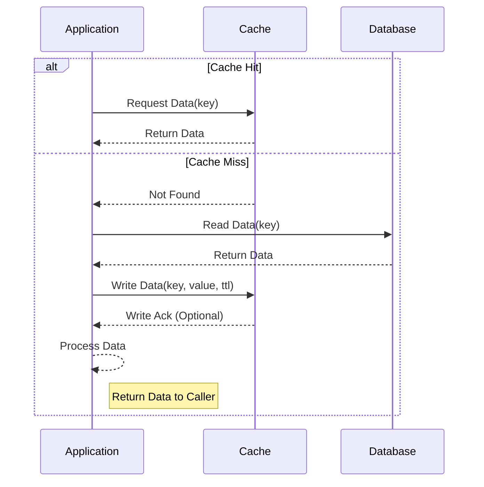
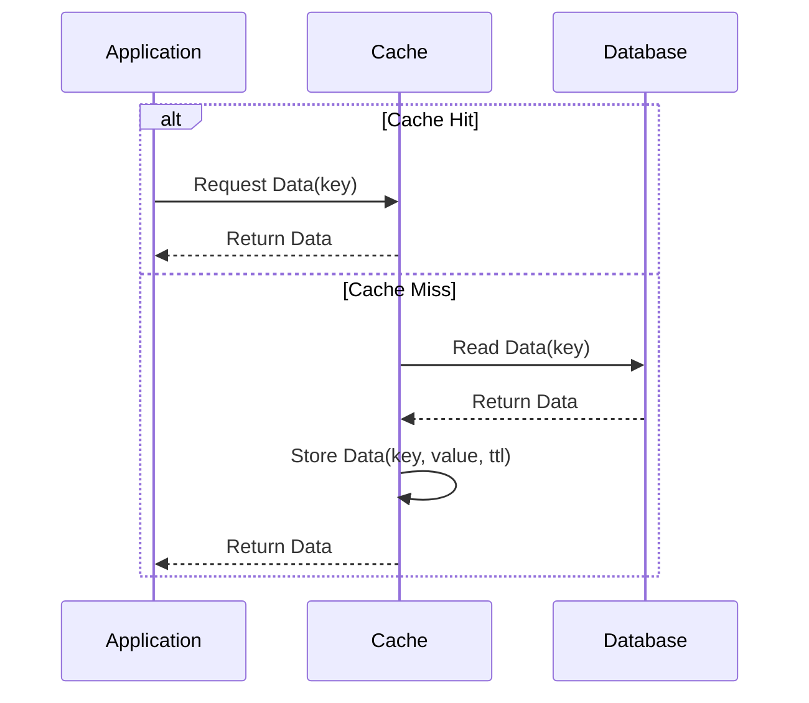
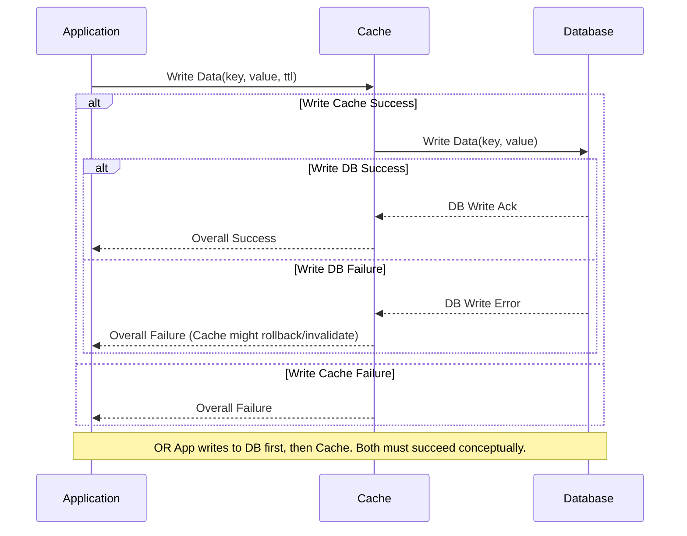
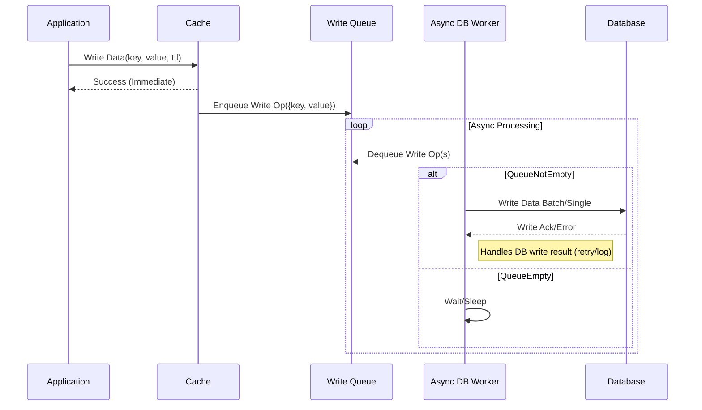
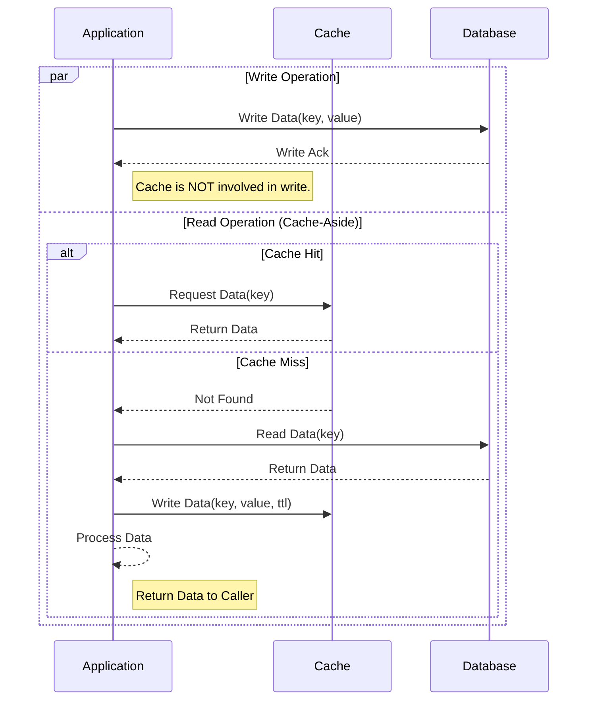

## 常见并发模型

**并发和并行**

- 并发：当你在跑步时，发现鞋带松，要停下来系鞋带，这时候跑步和系鞋带就是并发状态。
- 并行：你跑步时，可以同时听歌，那么跑步和听歌就是并行状态，谁也不影响谁。

在计算机的世界中，一个CPU核严格来说同一时刻只能做一件事，但由于CPU的频率实在太快了，人们根本感知不到其切换的过程，所以我们在编码的时候，实际上是可以在单核机器上写多进程的程序（但你要知道这是假象），这是相对意义上的并行。

而当你的机器有多个 CPU 核时，多个进程之间才能真正的实现并行，这是绝对意义上的并行。

接着来说并发，所谓的并发，就是多个任务之间可以在同一时间段里一起执行。

**并发编程模型**

- 多进程模型：创建新的进程处理请求
- 多线程模型：创建新的线程处理请求
- 使用线程池：线程/进程创建销毁开销大
- I/O 多路复用+单/多线程

`I/O多路复用` ，英文全称为 `I/O multiplexing`，这个中文翻译和把 socket 翻译成 套接字一样，影响了我对其概念的理解。

在互联网早期，为了实现一个服务器可以处理多个客户端的连接，程序猿是这样做的。服务器得知来了一个请求后，就去创建一个线程处理这个请求，假如有10个客户请求，就创建10个线程，这在当时联网设备还比较匮乏的时代，是没有任何问题的。

但随着科技的发展，人们越来越富裕，都买得起电脑了，网民也越来越多了，由于一台机器的能开启的线程数是有限制的，当请求非常集中量大到一定量时，服务器的压力就巨大无比。

终于到了 1983年，人们意识到这种问题，提出了一种最早的 I/O 多路复用的模型（select实现），这种模型，对比之前最大的不同就是，处理请求的线程不再是根据请求来定，后端请求的进程只有一个。虽然这种模型在现在看来还是不行，但在当时已经大大减小了服务器系统的开销，可以解决服务器压力太大的问题，毕竟当时的电脑都是很珍贵的。

再后来，家家都有了电脑，手机互联网的时代也要开始来了，联网设备爆炸式增长，之前的 select ，早已不能支撑用户请求了。

由于使用 select 最多只能接收 1024 个连接，后来程序猿们又改进了 select 发明了 pool，pool 使用的链表存储，没有最大连接数的限制。

select 和 pool ，除了解决了连接数的限制 ，其他似乎没有本质的区别。

都是服务器知道了有一个连接来了，由于并不知道是哪那几个流（可能有一个，多个，甚至全部），所以只能一个一个查过去（轮循），假如服务器上有几万个文件描述符（下称fd，file descriptor），而你要处理一个请求，却要遍历几万个fd，这样是不是很浪费时间和资源。

由此程序员不得不持续改进 I/O多路复用的策略，这才有了后来的 epoll 方法。

epoll 解决了前期 select 和 poll 出现的一系列的尴尬问题，比如：

- select 和 poll 无差别轮循fd，浪费资源，epoll 使用通知回调机制，有流发生 IO事件时就会主动触发回调函数
- select 和 poll 线程不安全，epoll 线程安全
- select 请求连接数的限制，epoll 能打开的FD的上限远大于1024（1G的内存上能监听约10万个端口）
- select 和 pool 需要频繁地将fd复制到内核空间，开销大，epoll通过内核和用户空间共享一块内存来减少这方面的开销。

虽然 I/O 多路复用经历了三种实现：select -> pool -> epoll，这也不是就说 epoll 出现了， select 就会被淘汰掉。

epoll 关注的是活跃的连接数，当连接数非常多但活跃连接少的情况下（比如长连接数较多），epoll 的性能最好。

而 select 关注的是连接总数，当连接数多而且大部分的连接都很活跃的情况下，选择 select 会更好，因为 epoll 的通知回调机制需要很多的函数回调。

另外还有一点是，select 是 POSIX 规定的，一般操作系统均有实现，而 epoll 是 Linux 所有的，其他平台上没有。

IO多路复用除了以上三种不同的具体实现的区别外，还可以根据线程数的多少来分类

- 一个线程的IO多路复用，比如 Redis
- 多个线程的IO多路复用，比如 goroutine

IO多路复用 + 单进（线）程有个好处，就是不会有并发编程的各种坑问题，比如在nginx里，redis里，编程实现都会很简单很多。编程中处理并发冲突和一致性，原子性问题真的是很难，极易出错。

### 三种线程模型？

实际上，goroutine 并非传统意义上的协程。

现在主流的线程模型分三种：

内核级线程模型

用户级线程模型

两级线程模型（也称混合型线程模型）

传统的协程库属于用户级线程模型，而 goroutine 和它的 Go Scheduler 在底层实现上其实是属于两级线程模型，因此，有时候为了方便理解可以简单把 goroutine 类比成协程，但心里一定要有个清晰的认知 — goroutine并不等同于协程。

关于这块，想详细了解的，可以前往： https://studygolang.com/articles/13344[goroutine协程]

协程什么时候会切换

1. I/O,select
2. channel
3. 等待锁
4. 函数调用
5. runtime.Gosched()


## go并发编译参数

### `go run -race main.go`

在运行go程序时可以通过 -race参数来让go编译器替你排查数据竞争的隐患


## 性能分析

### pprof工具的简单使用

- 分析cpu

```go
func main() {
  f, _ := os.OpenFile("cpu.profile", os.O_CREATE|os.O_RDWR, 0644)
  defer f.Close()
  pprof.StartCPUProfile(f)
  defer pprof.StopCPUProfile()

  n := 10
  for i := 1; i <= 5; i++ {
    fmt.Printf("fib(%d)=%d\n", n, fib(n))
    n += 3 * i
  }
}
```

- 分析内存比较简单，随时可以进行采样

```go
func main() {
  f, _ := os.OpenFile("mem.profile", os.O_CREATE|os.O_RDWR, 0644)
  defer f.Close()
  for i := 0; i < 100; i++ {
    repeat(generate(100), 100)
  }

  pprof.Lookup("heap").WriteTo(f, 0)
}
```

当让在profile中对上述操作进行了简化，可以采用如下一行实现pprof采样

```go
# 默认CPU采样
defer profile.Start().Stop()
# 如果需要对内存进行采样
defer profile.Start(profile.MemProfile).Stop()
# 使用浏览器查看
go tool pprof -http :8080 cpu.profile
```


https://darjun.github.io/2021/06/09/youdontknowgo/pprof/[pprof 性能分析工具]


## 缓存策略

### Cache-Aside (旁路缓存/懒加载Lazy Loading)


这是最常用、也最经典的缓存策略。**核心思想是：应用程序自己负责维护缓存。**

工作流程：
1. 应用需要读取数据的时候先检查缓存中是否存在
2. **缓存命中(hit)**: 如果存在直接从缓存中返回数据
3. 缓存未命中(Miss): 如果不存在从主数据源(如数据库)读取数据
4. 数据读取成功后，应用将数据写入缓存(设置合理的过期时间)
5. 最后将应用数据返回调用方

优点：
- 实现相对简单直观
- 对读密集型应用效果好，缓存命中时速度快
- 缓存挂掉不影响读取主数据（只是性能会下降）
缺点：
- 首次请求（冷启动）或缓存过期后，会有一次缓存未命中，延迟较高
- 存在数据不一致风险，需要额外增加缓存失效策略
- 应用代码与缓存逻辑耦合
使用场景：读多写少，能容忍短暂数据不一致的场景
> **Go示例 (核心实现 - strategy/cacheaside/cacheaside.go)**

### Read-Through(穿透读缓存)

应用程序将缓存视作主要数据源，只与缓存交互，缓存内部负责在未命中时从主数据源加载数据

工作流程：
1. 应用向缓存请求数据
2. 缓存检查数据是否存在
3. 缓存命中：直接返回数据
4. 缓存未命中：缓存负责从主数据源加载数据
5. 数据加载成功之后，缓存层更新缓存数据源，并返回获取的数据给应用

优点：
- 应用代码逻辑简洁
- 将数据加载逻辑从应用中解耦出来
- 代码易于维护和测试
缺点：
- 强依赖缓存库或服务是否提供功能，或需要自行封装
- 首次请求延迟依然存在
- 数据不一致问题依然存在
使用场景：读密集型，希望简化应用代码，使用缓存系统支持此特性或愿意自行封装

> **Go 示例 (模拟实现 - strategy/readthrough/readthrough.go):**

### Write-Through(穿透写缓存)

核心细想：数据一致性优先，应用程序更新数据时，同时写入缓存和主数据源，并且两者都成功后才算操作完成。
工作流程：
- 应用发起请求（新增或者更新）
- 应用先将数据写入主数据源（或缓存，顺序可选）
- 如果第一步成功，在将数据写入另一个存储（缓存或主数据源）
- 第二部成功，操作完成返回成功
- 通常以主数据源写入为成功依据，缓存写入失败一般只进行日志记录。

优点：
- 数据一致性相对较高
- 读取时（若命中）能获取较新的数据
缺点：
- 写入延时比较高
- 实现需要考虑失败处理（特别DB成功之后缓存失败的情况）
- 缓存可能成为写入的瓶颈
使用场景：对缓存一致性要求高，可接受一定的写延迟的场景
> **Go 示例 (核心实现 - strategy/writethrough/writethrough.go):**


### Write-Behind/Write-Back(回写/后写缓存)


核心思想：写入性能优先，应用程序只将数据写入缓存，缓存立即返回成功，缓存随后异步地、批量地将数据写入主数据。

工作流程：
1. 应用发起写请求
2. 应用将数据写入缓存
3. 缓存立即向应用返回成功
4. 缓存将此写操作放入一个队列或缓存区
5. 一个独立的后台任务在稍后将队列中的数据批量写入到主数据源
> **Go 示例 (核心实现 - strategy/writebehind/writebehind.go):**


### Write-Around(绕写缓存)


核心思想：写操作直接绕过缓存，只写主数据源，读操作时才将数据写入缓存（通常结合Cache-Aside）
工作流程：
1. 写路径：应用发起请求，直接将数据写入主数据库源
2. 读路径(通常是Cache-Aside)：应用需要读取数据，先检查缓存，如果未命中则从主数据源读取，然后将数据存入缓存，最后返回。
> **Go 示例 (核心实现 - strategy/writearound/writearound.go):**

| 策略            | 读性能 | 写性能 | 一致性      | 实现复杂度   | 适用场景 (Go 视角)                                         |     |
| ------------- | --- | --- | -------- | ------- | ---------------------------------------------------- | --- |
| Cache-Aside   | 快   | 普通  | 中 (最终)   | 低 (手动)  | 最常用，读多写少，能容忍短暂不一致。Go 实现直接，易于理解。                      |     |
| Read-Through  | 快   | 普通  | 中 (最终)   | 中 (抽象化) | 希望简化应用代码，依赖特定库支持。Go 中需寻找支持此模式的库或自行封装。                |     |
| Write-Through | 快   | 慢   | 高 (趋强)   | 中-高     | 数据一致性要求较高，可接受写延迟。Go 实现需仔细考虑错误处理和补偿。                  |     |
| Write-Behind  | 快   | 极快  | 低-中 (最终) | 高       | 写性能优先，高并发写，能容忍数据丢失风险。Go 实现需精心设计异步队列和错误处理。            |     |
| Write-Around  | 普通  | 快   | 中 (最终)   | 低       | 写密集且写后少读，避免缓存污染。Go 实现简单，写路径直接操作 DB，读路径用 Cache-Aside。 |     |
代码仓库 ：[go-example](https://github.com/andrewbytecoder/go-example) 的 go_cache_strategy
