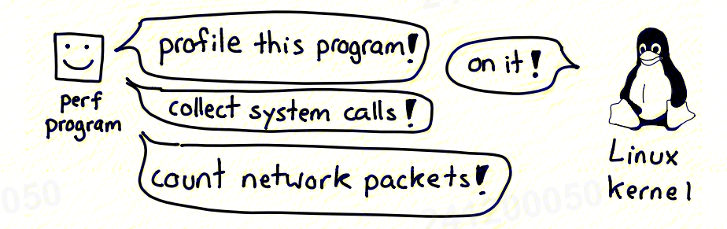

:toc:

// 保证所有的目录层级都可以正常显示图片
:path: linux/
:imagesdir: ../image/

// 只有book调用的时候才会走到这里
ifdef::rootpath[]
:imagesdir: {rootpath}{path}{imagesdir}
endif::rootpath[]

== perf

perf能回答以下问题：

- 哪些代码路径在消耗CPU资源
- CPU是否被滞留在内存的负载/存储上
- 线程因为什么原因离开CPU？ 是主动让出还是被动调度
- 磁盘I/O的模式是什么？

- trace system calls faster than trace
- profile your C, Go, C++, node.js, Rust, and Java/JVM programs really easily
- trace or count almost `any` kernel event

The perf system is split into 2 parts:

- a program in userspace called perf
- a system in the Linux kernel

When you run perf record, perf stat, or perf top to get information about a program, here's what happens:

- perf asks the kernel to collect information.

- the kernel gets samples/traces/CPU counters from the programs perf asks about.
- perf displays the data back to you in a (hopefully) useful way.

=== Command

==== List Events

[source,bash]
----
# List all events
perf list
# 使用perf list列出所有硬编码追踪点，列出的事件通过  tracepoint trace -e + 具体事件进行追踪
perf list tracepoint
# List all kprobes
perf list kprobe
# List all uprobes
perf list uprobe
# List all perf events
perf list perf_event
# List all breakpoints
perf list breakpoint
----

使用 `tracepoint trace -e block:block_rq_issue` 追踪的事件输出格式可以在 `/sys/kernel/debug/tracing/events/` 下的format文件中查看

[source,bash]
----
[root@k8smaster-ims cdw-db]# cat /sys/kernel/debug/tracing/events/block/block_rq_issue/format
name: block_rq_issue
ID: 1099
format:
        field:unsigned short common_type;       offset:0;       size:2; signed:0;
        field:unsigned char common_flags;       offset:2;       size:1; signed:0;
        field:unsigned char common_preempt_count;       offset:3;       size:1; signed:0;
        field:int common_pid;   offset:4;       size:4; signed:1;
        field:unsigned char common_preempt_lazy_count;  offset:8;       size:1; signed:0;

        field:dev_t dev;        offset:12;      size:4; signed:0;
        field:sector_t sector;  offset:16;      size:8; signed:0;
        field:unsigned int nr_sector;   offset:24;      size:4; signed:0;
        field:unsigned int bytes;       offset:28;      size:4; signed:0;
        field:char rwbs[8];     offset:32;      size:8; signed:1;
        field:char comm[TASK_COMM_LEN]; offset:40;      size:16;        signed:1;
        field:__data_loc char[] cmd;    offset:56;      size:4; signed:1;

print fmt: "%d,%d %s %u (%s) %llu + %u [%s]", ((unsigned int) ((REC->dev) >> 20)), ((unsigned int) ((REC->dev) & ((1U << 20) - 1))), REC->rwbs, REC->bytes, __get_str(cmd), (unsigned long long)REC->sector, REC->nr_sector, REC->comm
----

==== perf commond

===== CPU

- 使用 `perf trace -p $(pgrep mysql)` 来调用跟踪具体的应用进程

===== 内核时间分析

- 使用 `perf trace -s -p $(pgrep mysql)` 来调用跟踪具体的应用进程

===== I/O 剖析

[source,bash]
----
# 使用过滤器跟踪sendto调用，但是这里不会给出很具体的信息，如果向概要知到比如套接字类型，IP地址和端口等信息，需要使用bpftrace
perf trace -e sendto -p  $(pgrep mysql)
# 跟踪所有大小不小于100KB的块I/O完成事件
perf record -e block:block_rq_complete --filter 'nr_sector > 200'
# 跟踪所有块I/O同步写完成事件
perf record -e block:block_rq_complete --filter 'rwbs == "WS"'
# 跟踪所有的块I/O写完成事件
perf record -e block:block_rq_complete --filter 'rwbs ~ "*W*"'
# 磁盘I／O延时（前面描述为磁盘请求时间）也可以通过记录磁盘发出和完成事件来确定’以便以后分析。下面记录它们60秒’然后将事件写入out.djskO1.mt文件:
perf record -e block:block_rq_issue,block:block_rq_complete -a sleep 60
perf script --header > out.disk01.txt
----

- biolatency
- biosnoop
- iotop
- biotop
- biostacks
- blktrace

===== 记录exec新进程事件

通过exec记录新进程事件

[source,bash]
----
perf record -e sched:sched_process_exec -a
----

===== 带栈踪迹记录上下文切换事件

[source,bash]
----
perf record -e sched:sched_switch -p $(pgrep mysql)
perf record -e sched:sched_switch -a -g -- sleep 10
----

===== 对CPU迁移进行采样

[source,bash]
----
perf record -e migrations -a -- sleep 10
# 将本地的perf.data 以文本报告的形式显示出来，合并了数据以及计数器的百分比
perf report -n --stdio
----

===== CPU上下文切换

[source,bash]
----
# 展示每秒钟上下文切换率
perf stat -e sched:sched_switch -a -I 1000
# 展示每秒非自愿上下文切换率（上一个状态为TASK_RUNNING）
perf stat -e sched:sched_switch --filter 'prev_state == 0' -a -I 1000

# 先perf sched record 然后再使用 perf sched timehist 查看所有上下文切换的事件
perf sched record
perf sched timehist
----

===== 内存

====== 整个系统缺页 Page Faults(RSS增长)以及系统级别栈追踪(stack traces system wide)

[source,bash]
----
perf record -e page-faults -a -g
----

====== 查看指定进程60s内的所有缺页信息以及栈调用信息

[source,bash]
----
perf record -e page-faults -c 1 -p 1834 -g -- sleep 60
----

====== 通过brk记录堆的增长

[source,bash]
----
perf record -e syscalls:sys_enter_brk -a -g
----

====== 跟踪页在NUMA系统上的页迁移情况

[source,bash]
----
perf record -e migrate:mm_migrate_pages -a
----

====== *vmscan* 虚拟内存扫描

在 Linux 内核中，vmscan（Virtual Memory Scan）指的是内核用于回收内存的一系列机制和过程。当系统的可用内存不足时，vmscan 会尝试通过回收各种类型的页面来释放内存，从而为新的分配请求腾出空间。这个过程涉及到扫描和评估系统中的不同页面，以决定哪些页面可以被安全地回收。

vmscan 的主要功能

1. **页面回收**：当物理内存接近耗尽时，vmscan 会启动页面回收进程，从内存中移除不常用的数据页，并将其写回到交换分区（swap）或者文件系统中。
2. **页面扫描**：vmscan 会扫描不同的页面列表（如活动列表、非活动列表等），以找到可以回收的页面。
3. **平衡内存使用**：通过调整不同页面列表之间的页面分布，确保系统的内存使用处于最佳状态。

相关事件

在性能监控工具（如 `perf`）或系统监视器中提到的 "vmscan" 事件通常指与上述过程相关的特定内核操作或状态变化。例如：

- **pgscan_kswapd**: kswapd 是负责后台页面回收的守护进程。此计数表示由 kswapd 扫描的页面数量。
- **pgscan_direct**: 表示直接页面回收过程中扫描的页面数量。
- **pgsteal**: 表示从页面缓存或其他内存池中实际回收的页面数量。
- **vmeff** (VM efficiency): 页面盗取率与页面扫描率的比率，反映了页面回收的效率。

[source,bash]
----
perf record -e 'vmscan:*' -a -- sleep 10
# 显示每秒vmscan事件, 1000ms
perf record -e 'vmscan:*' -a -I 1000
----

> 请注意，上面的例子可能不会直接工作，因为具体的 vmscan 事件名可能有所不同。你需要根据你的内核版本和架构检查 `perf list` 命令输出，找出正确的事件名称。

====== *kmem* 内核内存分配与释放相关事件

在 Linux 内核性能分析中，`kmem` 相关的事件指的是与内核内存分配和释放相关的操作。这些事件可以帮助开发者和系统管理员了解内核如何管理其内存，识别潜在的性能瓶颈或内存泄漏问题。通过使用性能监控工具如 `perf`，可以记录和分析这些事件。

kmem 事件概述

1. **内核内存分配**：当内核需要为自身操作或其他模块分配内存时触发。
2. **内核内存释放**：当不再需要某块内存时，内核将其释放回空闲池时触发。
3. **Slab 分配器活动**：Linux 使用 slab 分配器来高效地管理内核对象的内存分配，相关事件可以展示 slab 分配器的行为。

要使用 `perf` 工具记录 `kmem` 相关事件，首先需要查看你的系统支持哪些具体的 kmem 事件。这可以通过运行 `perf list` 命令来实现。然后，你可以针对特定的 kmem 事件进行采样。下面是一个基本示例流程：

[source,bash]
----
perf list kmem
----

[source,bash]
----
sudo perf record -e kmem:kmalloc -a -- sleep 10
----

这里 `-e kmem:kmalloc` 指定了要监控的 kmem 事件（即内核内存分配），`-a` 表示对所有 CPU 进行采样，`sleep 10` 则表示持续监控 10 秒钟。

示例事件解释

- **kmalloc**: 内核动态分配内存的操作。
- **kfree**: 内存被释放回内核的过程。
- **kmalloc_node**: 类似于 kmalloc，但指定了内存节点以优化 NUMA 系统上的性能。
- **kmem_cache_alloc**: 从特定的 slab 缓存中分配内存。
- **kmem_cache_free**: 将内存释放回特定的 slab 缓存。

注意事项

- **权限问题**：某些性能事件可能需要超级用户权限才能访问。
- **性能影响**：长时间或高频率的性能监测可能会对系统性能产生一定影响。
- **事件名称差异**：不同版本的 Linux 内核支持的事件名称可能有所不同，请根据实际情况调整使用的事件名称。

====== 内存压缩事件 compaction

在 Linux 内核中，内存压缩事件通常与内存管理子系统中的页面回收机制相关。当系统内存紧张时，内核会尝试通过多种方式释放和回收内存，其中之一就是内存压缩（memory compaction）。内存压缩的目标是将分散的空闲页面合并成较大的连续块，以便更有效地分配大块内存。

为了计算所有的内存压缩事件，可以使用 `perf` 工具来监控与内存压缩相关的特定事件。以下是如何进行操作的步骤：

查找可用的内存压缩事件

[source,bash]
----
sudo perf list | grep compact
  compaction:mm_compaction_begin                     [Tracepoint event]
  compaction:mm_compaction_defer_compaction          [Tracepoint event]
  compaction:mm_compaction_defer_reset               [Tracepoint event]
  compaction:mm_compaction_deferred                  [Tracepoint event]
  compaction:mm_compaction_end                       [Tracepoint event]
  compaction:mm_compaction_finished                  [Tracepoint event]
  # 表示隔离了多少个页面以内存申请或者内存迁移使用
  compaction:mm_compaction_isolate_freepages         [Tracepoint event]
  compaction:mm_compaction_isolate_migratepages      [Tracepoint event]
  compaction:mm_compaction_kcompactd_sleep           [Tracepoint event]
  compaction:mm_compaction_kcompactd_wake            [Tracepoint event]
  # 表示迁移了多少个页面
  compaction:mm_compaction_migratepages              [Tracepoint event]
  compaction:mm_compaction_suitable                  [Tracepoint event]
  compaction:mm_compaction_try_to_compact_pages      [Tracepoint event]
  compaction:mm_compaction_wakeup_kcompactd          [Tracepoint event]
  oom:compact_retry                                  [Tracepoint event]
  xfs:xfs_attr_leaf_compact                          [Tracepoint event]
----

.使用perf记录所有内存压缩的事件
[source,bash]
----
sudo perf record -e 'compaction:*' -a -I 1000
----

==== Counting Events

[source,bash]
----
# CPU counter statistics for the specified command:
perf stat command

# Detailed CPU counter statistics (includes extras) for the specified command:
perf stat -d command

# CPU counter statistics for the specified PID, until Ctrl-C:
perf stat -p PID

# CPU counter statistics for the entire system, for 5 seconds:
perf stat -a sleep 5

# Various basic CPU statistics, system wide, for 10 seconds:
perf stat -e cycles,instructions,cache-references,cache-misses,bus-cycles -a sleep 10

# Various CPU level 1 data cache statistics for the specified command:
perf stat -e L1-dcache-loads,L1-dcache-load-misses,L1-dcache-stores command

# Various CPU data TLB statistics for the specified command:
perf stat -e dTLB-loads,dTLB-load-misses,dTLB-prefetch-misses command

# Various CPU last level cache statistics for the specified command:
perf stat -e LLC-loads,LLC-load-misses,LLC-stores,LLC-prefetches command

# Using raw PMC counters, eg, counting unhalted core cycles:
perf stat -e r003c -a sleep 5

# PMCs: counting cycles and frontend stalls via raw specification:
perf stat -e cycles -e cpu/event=0x0e,umask=0x01,inv,cmask=0x01/ -a sleep 5

# Count syscalls per-second system-wide:
perf stat -e raw_syscalls:sys_enter -I 1000 -a

# Count system calls by type for the specified PID, until Ctrl-C:
perf stat -e 'syscalls:sys_enter_*' -p PID

# Count system calls by type for the entire system, for 5 seconds:
perf stat -e 'syscalls:sys_enter_*' -a sleep 5

# Count scheduler events for the specified PID, until Ctrl-C:
perf stat -e 'sched:*' -p PID

# Count scheduler events for the specified PID, for 10 seconds:
perf stat -e 'sched:*' -p PID sleep 10

# Count ext4 events for the entire system, for 10 seconds:
perf stat -e 'ext4:*' -a sleep 10

# Count block device I/O events for the entire system, for 10 seconds:
perf stat -e 'block:*' -a sleep 10

# Count all vmscan events, printing a report every second:
perf stat -e 'vmscan:*' -a -I 1000
----

==== Profiling

[source,bash]
----
# Sample on-CPU functions for the specified command, at 99 Hertz:
perf record -F 99 command

# Sample on-CPU functions for the specified PID, at 99 Hertz, until Ctrl-C:
perf record -F 99 -p PID

# Sample on-CPU functions for the specified PID, at 99 Hertz, for 10 seconds:
perf record -F 99 -p PID sleep 10

# Sample CPU stack traces (via frame pointers) for the specified PID, at 99 Hertz, for 10 seconds:
perf record -F 99 -p PID -g -- sleep 10

# Sample CPU stack traces for the PID, using dwarf (dbg info) to unwind stacks, at 99 Hertz, for 10 seconds:
perf record -F 99 -p PID --call-graph dwarf sleep 10

# Sample CPU stack traces for the entire system, at 99 Hertz, for 10 seconds (< Linux 4.11):
perf record -F 99 -ag -- sleep 10

# Sample CPU stack traces for the entire system, at 99 Hertz, for 10 seconds (>= Linux 4.11):
perf record -F 99 -g -- sleep 10

# If the previous command didn't work, try forcing perf to use the cpu-clock event:
perf record -F 99 -e cpu-clock -ag -- sleep 10

# Sample CPU stack traces for a container identified by its /sys/fs/cgroup/perf_event cgroup:
perf record -F 99 -e cpu-clock --cgroup=docker/1d567f4393190204...etc... -a -- sleep 10

# Sample CPU stack traces for the entire system, with dwarf stacks, at 99 Hertz, for 10 seconds:
perf record -F 99 -a --call-graph dwarf sleep 10

# Sample CPU stack traces for the entire system, using last branch record for stacks, ... (>= Linux 4.?):
perf record -F 99 -a --call-graph lbr sleep 10

# Sample CPU stack traces, once every 10,000 Level 1 data cache misses, for 5 seconds:
perf record -e L1-dcache-load-misses -c 10000 -ag -- sleep 5

# Sample CPU stack traces, once every 100 last level cache misses, for 5 seconds:
perf record -e LLC-load-misses -c 100 -ag -- sleep 5

# Sample on-CPU kernel instructions, for 5 seconds:
perf record -e cycles:k -a -- sleep 5

# Sample on-CPU user instructions, for 5 seconds:
perf record -e cycles:u -a -- sleep 5

# Sample on-CPU user instructions precisely (using PEBS), for 5 seconds:
perf record -e cycles:up -a -- sleep 5

# Perform branch tracing (needs HW support), for 1 second:
perf record -b -a sleep 1

# Sample CPUs at 49 Hertz, and show top addresses and symbols, live (no perf.data file):
perf top -F 49

# Sample CPUs at 49 Hertz, and show top process names and segments, live:
perf top -F 49 -ns comm,dso
----

==== Static Tracing

[source,bash]
----
# Trace new processes, until Ctrl-C:
# 跟踪新的进程，知道按下Ctrl-C组合键
perf record -e sched:sched_process_exec -a

# Sample (take a subset of) context-switches, until Ctrl-C:
perf record -e context-switches -a

# Trace all context-switches, until Ctrl-C:
perf record -e context-switches -c 1 -a

# Include raw settings used (see: man perf_event_open):
perf record -vv -e context-switches -a

# Trace all context-switches via sched tracepoint, until Ctrl-C:
perf record -e sched:sched_switch -a

# Sample context-switches with stack traces, until Ctrl-C:
perf record -e context-switches -ag

# Sample context-switches with stack traces, for 10 seconds:
perf record -e context-switches -ag -- sleep 10

# Sample CS, stack traces, and with timestamps (< Linux 3.17, -T now default):
perf record -e context-switches -ag -T

# Sample CPU migrations, for 10 seconds:
perf record -e migrations -a -- sleep 10

# Trace all connect()s with stack traces (outbound connections), until Ctrl-C:
perf record -e syscalls:sys_enter_connect -ag

# Trace all accepts()s with stack traces (inbound connections), until Ctrl-C:
perf record -e syscalls:sys_enter_accept* -ag

# Trace all block device (disk I/O) requests with stack traces, until Ctrl-C:
perf record -e block:block_rq_insert -ag

# Sample at most 100 block device requests per second, until Ctrl-C:
perf record -F 100 -e block:block_rq_insert -a

# Trace all block device issues and completions (has timestamps), until Ctrl-C:
perf record -e block:block_rq_issue -e block:block_rq_complete -a

# Trace all block completions, of size at least 100 Kbytes, until Ctrl-C:
perf record -e block:block_rq_complete --filter 'nr_sector > 200'

# Trace all block completions, synchronous writes only, until Ctrl-C:
perf record -e block:block_rq_complete --filter 'rwbs == "WS"'

# Trace all block completions, all types of writes, until Ctrl-C:
perf record -e block:block_rq_complete --filter 'rwbs ~ "*W*"'

# Sample minor faults (RSS growth) with stack traces, until Ctrl-C:
perf record -e minor-faults -ag

# Trace all minor faults with stack traces, until Ctrl-C:
perf record -e minor-faults -c 1 -ag

# Sample page faults with stack traces, until Ctrl-C:
perf record -e page-faults -ag

# Trace all ext4 calls, and write to a non-ext4 location, until Ctrl-C:
perf record -e 'ext4:*' -o /tmp/perf.data -a

# Trace kswapd wakeup events, until Ctrl-C:
perf record -e vmscan:mm_vmscan_wakeup_kswapd -ag

# Add Node.js USDT probes (Linux 4.10+):
perf buildid-cache --add `which node`

# Trace the node http__server__request USDT event (Linux 4.10+):
perf record -e sdt_node:http__server__request -a
----

==== Dynamic Tracing

[source,bash]
----
# Add a tracepoint for the kernel tcp_sendmsg() function entry ("--add" is optional):
# 为内核函数 tcp_sendmsg() 函数入口添加一个tracepoint，可以忽略 --add
perf probe --add tcp_sendmsg

# Remove the tcp_sendmsg() tracepoint (or use "--del"):
perf probe -d tcp_sendmsg

# Add a tracepoint for the kernel tcp_sendmsg() function return:
perf probe 'tcp_sendmsg%return'

# Show available variables for the kernel tcp_sendmsg() function (needs debuginfo):
perf probe -V tcp_sendmsg

# Show available variables for the kernel tcp_sendmsg() function, plus external vars (needs debuginfo):
perf probe -V tcp_sendmsg --externs

# Show available line probes for tcp_sendmsg() (needs debuginfo):
perf probe -L tcp_sendmsg

# Show available variables for tcp_sendmsg() at line number 81 (needs debuginfo):
perf probe -V tcp_sendmsg:81

# Add a tracepoint for tcp_sendmsg(), with three entry argument registers (platform specific):
perf probe 'tcp_sendmsg %ax %dx %cx'

# Add a tracepoint for tcp_sendmsg(), with an alias ("bytes") for the %cx register (platform specific):
perf probe 'tcp_sendmsg bytes=%cx'

# Trace previously created probe when the bytes (alias) variable is greater than 100:
perf record -e probe:tcp_sendmsg --filter 'bytes > 100'

# Add a tracepoint for tcp_sendmsg() return, and capture the return value:
perf probe 'tcp_sendmsg%return $retval'

# Add a tracepoint for tcp_sendmsg(), and "size" entry argument (reliable, but needs debuginfo):
perf probe 'tcp_sendmsg size'

# Add a tracepoint for tcp_sendmsg(), with size and socket state (needs debuginfo):
perf probe 'tcp_sendmsg size sk->__sk_common.skc_state'

# Tell me how on Earth you would do this, but don't actually do it (needs debuginfo):
perf probe -nv 'tcp_sendmsg size sk->__sk_common.skc_state'

# Trace previous probe when size is non-zero, and state is not TCP_ESTABLISHED(1) (needs debuginfo):
perf record -e probe:tcp_sendmsg --filter 'size > 0 && skc_state != 1' -a

# Add a tracepoint for tcp_sendmsg() line 81 with local variable seglen (needs debuginfo):
perf probe 'tcp_sendmsg:81 seglen'

# Add a tracepoint for do_sys_open() with the filename as a string (needs debuginfo):
perf probe 'do_sys_open filename:string'

# Add a tracepoint for myfunc() return, and include the retval as a string:
perf probe 'myfunc%return +0($retval):string'

# Add a tracepoint for the user-level malloc() function from libc:
perf probe -x /lib64/libc.so.6 malloc
perf probe -x /lib64/libc.so.6 --add fopen
perf probe --del probe_libc:fopen --del probe_libc:malloc

# Add a tracepoint for this user-level static probe (USDT, aka SDT event):
perf probe -x /usr/lib64/libpthread-2.24.so %sdt_libpthread:mutex_entry

# List currently available dynamic probes:
perf probe -l
----

.eg 内核函数 do_nanosleep 跟踪
[source, bash]
----
perf probe --add do_nanosleep
perf record -e probe:do_nanosleep -a sleep 5
perf script
perf probe --del do_nanosleep
----

==== Mixed

[source,bash]
----
# Trace system calls by process, showing a summary refreshing every 2 seconds:
perf top -e raw_syscalls:sys_enter -ns comm

# Trace sent network packets by on-CPU process, rolling output (no clear):
stdbuf -oL perf top -e net:net_dev_xmit -ns comm | strings

# Sample stacks at 99 Hertz, and, context switches:
perf record -F99 -e cpu-clock -e cs -a -g

# Sample stacks to 2 levels deep, and, context switch stacks to 5 levels (needs 4.8):
perf record -F99 -e cpu-clock/max-stack=2/ -e cs/max-stack=5/ -a -g
----

==== Special

[source,bash]
----
# Record cacheline events (Linux 4.10+):
perf c2c record -a -- sleep 10

# Report cacheline events from previous recording (Linux 4.10+):
perf c2c report
----

==== Reporting

[source,bash]
----
# Show perf.data in an ncurses browser (TUI) if possible:
perf report

# Show perf.data with a column for sample count:
perf report -n

# Show perf.data as a text report, with data coalesced and percentages:
perf report --stdio

# Report, with stacks in folded format: one line per stack (needs 4.4):
perf report --stdio -n -g folded

# List all events from perf.data:
perf script

# List all perf.data events, with data header (newer kernels; was previously default):
perf script --header

# List all perf.data events, with customized fields (< Linux 4.1):
perf script -f time,event,trace

# List all perf.data events, with customized fields (>= Linux 4.1):
perf script -F time,event,trace

# List all perf.data events, with my recommended fields (needs record -a; newer kernels):
perf script --header -F comm,pid,tid,cpu,time,event,ip,sym,dso

# List all perf.data events, with my recommended fields (needs record -a; older kernels):
perf script -f comm,pid,tid,cpu,time,event,ip,sym,dso

# Dump raw contents from perf.data as hex (for debugging):
perf script -D

# Disassemble and annotate instructions with percentages (needs some debuginfo):
perf annotate --stdio
----

=== 参数

- `-F`: pic sample frequency
- `-g`: record stack traces
- `-p`: trace process
- `-e`: choose events to record
- `-a`: trace all processes
- `-i`: input file
- `-p`: specify a PID

[source,bash]
----
# Sample CPUs at 49 Hertz, show top symbols:
perf top -F 49
# Sample CPUs, show top process names and segments:
perf top -ns comm,dso
# Count system calls by process, refreshing every 1 second:
perf top -e raw_syscalls:sys_enter -ns comm -d 1
# Count sent network packets by process, rolling output:
stdbuf -oL perf top -e net:net_dev_xmit -ns comm | strings

# *perf stat counteventsFCPUcounters9*
# CPU counter statistics for COMMAND:
perf stat COMMAND
# *Detailed* CPU counter statistics for COMMAND:
perf stat -ddd command
# Count system calls for PID, until Ctrl-C:
perf stat -e 'syscalls:sys_enter_*' -p PID
# Count block device I/O events for the entire system, for 10
seconds:
perf stat -e 'block:*' -a sleep 10

# *Reporting*
# Show perf.data in an ncurses browser:
perf report
# Show perf.data as a text report:
perf report --stdio
# List all events from perf.data:
perf script
# Annotate assembly instructions from perf.data
# with percentages
perf annotate [--stdio]

# *perf trace trace system calls otherevents*
# Trace syscalls system wide
perf trace
# Trace syscalls for PID
perf trace -p PID

# *perf record record profiling data*
# Sample CPU functions for COMMAND at 99 Hertz:
perf record -F 99 COMMAND
# Sample CPU functions for PID, until Ctrl-C:
perf record -p PID
# Sample CPU functions for PID, for 10 seconds:
perf record -p PID sleep 10
# Sample CPU stack traces for PID, for 10 seconds:
perf record -p PID -g -- sleep 10
# Sample CPU stack traces for PID, using DWARF to unwind stack:
perf record -p PID --call-graph dwarf

# *perfrecord record tracing data*
# Trace new processes, until Ctrl-C:
perf record -e sched:sched_process_exec -a
# Trace all context switches, until Ctrl-C:
perf record -e context-switches -a
# Trace all context switches with stack traces, for 10 seconds: 上下文切换是指从一个进程或线程切换到另一个的过程，特别是针对高性能的应用，非常有用
perf record -e context-switches -ag -- sleep 10
# Trace all page faults with stack traces, until Ctrl-C: 缓存未命中，对文件经常读写时会用到
perf record -e page-faults -ag

# *adding new trace events*
# Add a tracepoint for kernel function tcp_sendmsg():
perf probe 'tcp_sendmsg'
# Trace previously created probe:
perf record -e probe:tcp_sendmsg -a
# Add a tracepoint for myfunc() and include the retval as a string:
perf probe 'myfunc%return +0($retval):string'
# Trace previous probe when size > 0:
perf record -e probe:tcp_sendmsg --filter 'size > 0' -a
# Add a tracepoint for do_sys_open() with the filename as a string:
perf probe 'do_sys_open filename:string'
----

=== pef top

使用top命令，你能看出进程占用的CPU百分比，使用perf top你能看出函数占用cpu的情况。

如果你想知道具体哪个函数占用CPU，使用 `perf top` 命令来查看。

[source,bash]
----
# perf top
Samples: 36K of event 'cycles:P', 4000 Hz, Event count (approx.): 12219433698 lost: 0/0 drop: 0/0
Overhead  Shared Object                          Symbol
   1.93%  perf                                   [.] __symbols__insert
   1.72%  perf                                   [.] rb_next
   1.48%  [kernel]                               [k] __update_blocked_fair
   0.94%  perf                                   [.] kallsyms__parse
   0.86%  [kernel]                               [k] module_get_kallsym
   0.67%  [kernel]                               [k] kallsyms_expand_symbol.constprop.0
   0.61%  [kernel]                               [k] memcpy_erms
   0.61%  [kernel]                               [k] vsnprintf
   ...
----

以第一行为例：

- 1.93% : CPU使用百分比
- [./k] : 用户态/内核态
- __symbols__insert ： 符号或函数名

=== perf record

和top命令一样，perf record命令只是能让你有个对整体状况有个了解，想要深入挖掘，需要使用perf report命令。

perf record和perf top收集的信息一样，但是perf record会将收集的信息perf.data保存在当前目录，后面有需要的时候可以进行分析。

- perf record [COMMAND] : 运行命令，知道命令退出
- perf record PID : 监控指定进程，知道CTRL+C退出
- perf record -a : 监控所有进程，知道CTRL+C退出
- -e event记录指定的事件
- --filter 对一个事件设置一个布尔过滤器表达式
- -p PID 仅仅记录这个PID的进程
- -t TID仅仅记录这个TID的线程
- -G cgroup 仅记录这个cgroup
- -g 记录栈踪迹
- --call-graph mode:使用指定的方法记录栈踪迹 (fp、dwarf或者lbr)
- -o file设置输出文件
- -v 显示详细信息，使用-vv可以输出更多信息

当然perf也能够支持定时任务，比如：

[source,bash]
----
# 监控 pid 为 8325 的进程，5秒后退出
perf record -p 8325 sleep 5
----

如果你不是很确定是那个函数导致的问题，可以使用 `-e` 参数指定事件，然后使用模糊匹配来监控所有相关的函数

[source,bash]
----
# 监控网络相关的函数
sudo perf record -e 'net:*' -ag -- sleep 60
# 监控系统调用相关函数， -g表示收集函数调用栈
perf record -e syscalls:sys_enter_connect -ag
----

如果只是从函数还是不能断定到底哪里出现了问题，可以在perf record之后，使用perf annotate命令来具体看下哪条指令占用的时间比较久，perf annotate会自动将对应函数进行反汇编。

[source,bash]
----
# 默认会使用当前目录下的perf.data文件
perf annotate
# 也可以使用-i 指定perf.data文件
perf annotate -i perf.data
----

如果你嫌弃perf.data可读性差，可以使用 perf script命令将perf.data转化为可读性高的文本。

[source,bash]
----
perf script > performance.txt
----

当然了一图胜千言，如果你想以图形的方式来查看，可以使用Flamegraph，地址为：`github.com/brendangregg/Flamegraph`

[source,bash]
----
sudo perf script | stackcollapse-perf.pl | flamegraph.pl > graph.svg
----

=== perf stat CPU counters

If you're writing high-performance programs, there  are a lot of CPU/hardware-level events you might be interested in counting:

- L1 cache hits/misses
- instructions per cycle
- page faults
- branch prediction misses
- CPU  cycles
- TLB misses

最后，千万不要忘记man手册

[source,bash]
----
# man 中对perf的子命令也进行了收录
man perf stat
man perf record
man perf report
man perf trace
man perf top
----

