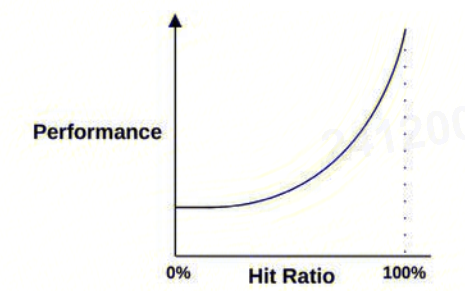

:toc:

// 保证所有的目录层级都可以正常显示图片
:path: linux/
:imagesdir: ../image/

// 只有book调用的时候才会走到这里
ifdef::rootpath[]
:imagesdir: {rootpath}{path}{imagesdir}
endif::rootpath[]

== performance-tools

=== 常见分析方法

==== USE 方法

USE方法全称"Utilization Saturation and Errors Method"，主要用于分析系统性能问题，可以指导用户快速识别资源瓶颈以及错误的方法。正如USE方法的名字所表示的含义，USE方法主要关注与资源的：使用率(Utilization)、饱和度(Saturation)以及错误(Errors)。

- 使用率：关注系统资源的使用情况。 这里的资源主要包括但不限于：CPU，内存，网络，磁盘等等。100%的使用率通常是系统性能瓶颈的标志。
- 饱和度：例如CPU的平均运行排队长度，这里主要是针对资源的饱和度(注意，不同于4大黄金信号)。任何资源在某种程度上的饱和都可能导致系统性能的下降。
- 错误：错误计数。例如：“网卡在数据包传输过程中检测到的以太网网络冲突了14次”。

===== 物理资源

|===
|模块 |类型 |指标
|CPU |使用率 |每个 CPU: mpstat -P ALL 1, CPU 消耗列中的值的总和（%usr、%nice、%sys、%i rq、%soft、%guest、%gnice）或者空闲列中的值的倒数（%iowait、%steal、%idle）; sar -P ALL, CPU 消耗列中的值的总和（%user、%nice、%system）或者空闲列中的值的倒数（%iowait、%steal、%idle） 系统范围：vmstat 1, us + sy ; sar -u, %user + %nice + %system 每个进程：top, %CPU ; htop, CPU%; ps -o pcpu ; pidstat 1, %CPU 每个内核线程：top/htop（按 K 转换显示），找到 VIRT==0（启发式）
|CPU |饱和度 |系统范围：vmstat 1, r > CPU 数量1 ; sar -q, runq-sz > CPU 数量 ; runqlat ; runqlen 每个进程：/proc/PID/schedstat 第二个字段（sched_info.run_delay）; getdelays.c, CPU2 ; perf sched latency（显示每次调度的平均和最大延时3）
|CPU |错误 |在 dmesg、rasdaemon 和 ras-mc-ctl --summary 中出现的机器检查异常（Machine Check Exception, MCE）；如果处理器特定错误事件（PMC）可用，使用 perf(1)；例如，AMD64 的“04Ah Single-bit ECC Errors Recorded by Scrubber”1（也可以被当成内存设备错误）；ipmitool sel list；ipmitool sdr list
|内存容量 |使用率 |系统范围：free -m Mem:（主存）, Swap:（虚存）; vmstat 1, free（主存）, swap（虚存）; sar -r, %memused; slabtop -s c 检查 kmem slab 使用情况 每个进程：top/htop, RES（驻留主存），VIRT（虚存），Mem 为系统范围内的总计
|内存容量 |饱和度 |系统范围：vmstat 1, si/so（交换）; sar -B, pgscank+pgscand（扫描）; sar -W 每个进程：getdelays.c, SWAP2 ; /proc/PID/stat 中的第 10 项（min_flt）可以得到次要缺页率，或者使用动态跟踪2; dmesg \| grep killed（OOM 终结者）
|内存容量 |错误 |dmesg 可以得到物理失效，或者使用 rasdaemon 加上 ras-mc-ctl --summary，抑或使用 edac-util；dmidecode 可能也会展示物理失效；ipmitool sel list；impitool sdr list；动态检测，例如，使用 uprobe 获得失败的 malloc() 数量（bpfrace）
|网络接口 |使用率 |ip -s link, RX/TX 吞吐量除以最大带宽; sar -n DEV, rx/tx kB/s 除以最大带宽; /proc/net/dev, RX/TX 吞吐量字节数除以最大值
|网络接口 |饱和度 |netstat, TcpRetransSegs；sar -n EDEV, *drop/s, *fifo/s3；/proc/net/dev, RX/TX 丢包；动态跟踪其他 TCP/IP 栈排队情况
|网络接口 |错误 |ip -s link, errors, sar -n EDEV all；/proc/net/dev, errs, drop6；其他计数器可能可以在 /sys/class/net/*/statistics/*error* 下找到；动态检测驱动函数的返回值
|存储设备 I/O |使用率 |系统范围：iostat -xz 1, %util；sar -d %util； 每个进程：iotop, biotop；/proc/PID/sched se.statistics.iowait_sum
|存储设备 I/O |饱和度 |iostat -xnz 1, avgqu-sz > 1，或者较高的 await；sar -d 的相同项；perf(1) 块 tracepoint 获得队列长度 / 延时；biolatency
|存储设备 I/O |错误 |/sys/devices/.../ioerr_cnt；smartctl；动态 / 静态检测 I/O 子系统响应代码4
|存储容量 |使用率 |swap：swapon -s；free；/proc/meminfo SwapFree/SwapTotal；文件系统：df -h
|存储容量 |饱和度 |不太确定这项是否有意义——一旦爆满会返回 ENOSPC（在接近爆满的时候，取决于文件系统空闲块算法，性能有可能会下降）
|存储容量 |文件系统：错误 |strace 跟踪 ENOSPC；动态检测 ENOSPC；/var/log/messages errs，取决于文件系统；应用程序日志错误
|存储控制器 |使用率 |iostat -xz 1，把设备的数值加起来与已知的每张卡的 IOPS/ 吞吐量进行对比
|存储控制器 |饱和度 |参见存储设备 I/O 的饱和度
|存储控制器 |错误 |参见存储设备 I/O 的错误
|网络控制器 |使用率 |从 ip -s link（或者 sar，或者 /proc/net/dev）和已知控制器的最大吞吐量推断出接口类型
|网络控制器 |饱和度 |参见网络接口的饱和度
|网络控制器 |错误 |参见网络接口的错误
|CPU 互联 |使用率 |带 PMC 的 perf stat 获得 CPU 互联端口，用吞吐量除以最大值
|CPU 互联 |饱和度 |带 PMC 的 perf stat 获得停滞周期
|CPU 互联 |错误 |带 PMC 的 perf stat 得到的所有信息
|内存互联 |使用率 |带 PMC 的 perf stat 获得内存总线，用吞吐量除以最大值；例如，Intel uncore_imc/data_reads, uncore_imc / data_writes；或者小于 0.2 的 IPC；PMC 可能有本地和远程计数器的对比
|内存互联 |饱和度 |带 PMC 的 perf stat 获得停滞周期
|内存互联 |错误 |带 PMC 的 perf stat 得到的所有信息；dmidecode 可能也有其他信息
|I/O 互联 |使用率 |带 PMC 的 perf stat 获得吞吐量除以最大值（如果能够获得）；通过 iostat/ip/…获得的已知吞吐量进行推断
|I/O 互联 |饱和度 |带 PMC 的 perf stat 获得停滞周期
|I/O 互联 |错误 |带 PMC 的 perf stat 得到的所有信息
|===

===== 软件资源

|===
|模块 |类型 |指标

|内核态互斥量 |使用率 |在内核编译带 CONFIG_LOCK_STAT=y 的情况下，使用 /proc/lock_stat 里的 holdtime-total 项除以 acquisitions 项（另外可参考 holdtime-min、holdtime-max）；对锁函数或者指令（可能有）进行动态检测
|内核态互斥量 |饱和度 |在内核编译带 CONFIG_LOCK_STAT=y 的情况下，使用 /proc/lock_stat 里的 waittime-total 项除以 contentions 项（另外可参考 waittime-min、waittime-max）；对锁函数，如 mlock.bt 进行动态检测 [Gregg 19]；自旋情况也可以通过剖析显示出来（perf record -a -g -F 99 ...）
|内核态互斥量 |错误 |动态检测（例如，递归进入互斥量）；其他错误可能会造成内核锁起 / 恐慌，可以使用 kdump/crash 进行调试
|用户态互斥量 |使用率 |valgrind --tool=drd --exclusive-threshold=……（持有时间）；对加锁到解锁这段的函数时间进行动态检测
|用户态互斥量 |饱和度 |valgrind --tool=drd 可以根据持有时间推断竞争的情况；对同步函数进行动态跟踪得到等待时间，例如，pmlock.bt；剖析（perf(1)）用户栈踪迹，得到自旋等待的情况
|用户态互斥量 |错误 |valgrind --tool=drd 提示的各种错误；动态检测 pthread_mutex_lock() 的返回值，如 EAGAIN、EINVAL、EPERM、EDEADLK、ENOMEM、EOWNERDEAD 等
|任务容量 |使用率 |top/htop，Tasks（当前）；sysctl kernel.threads-max，/proc/sys/kernel/threads-max（最大值）
|任务容量 |饱和度 |被阻塞在内存分配上的线程数；这个时候页面扫描器应该正在运行（sar -B, pgscan*），或者使用动态跟踪检查
|任务容量 |错误 |“can’t fork()” 错误；用户级线程：pthread_create() 错误返回值，如 EAGAIN、EINVAL……；内核级：动态跟踪 kernel_thread() 函数的 ENOMEM 返回值
|文件描述符 |使用率 a|系统范围：sar -v, file-nr 和 /proc/sys/fs/file-max 相比较；或者是 /proc/sys/fs/file-nr 每个线程：`echo /proc/PID/fd/* \| wc -w` 与 ulimit -n 的对比
|文件描述符 |饱和度 |这一项没有意义
|文件描述符 |错误 |在返回文件描述符的系统调用上（例如 open()、accept()……）使用 strace errno == EMFILE；opensnoop -x
|===

==== RED方法

对于每个服务，检查请求率、错误和持续时间

- (请求)速率：服务每秒接收的请求数。
- (请求)错误：每秒失败的请求数。
- (请求)耗时：每个请求的耗时。

==== 工作负载归纳

- 负载是谁产生的，进程ID、用户ID、远端IP地址
- 负载为什么被调用，代码路径，栈追踪
- 负载的特征是什么，IOPS、吞吐量、方向类型(读取/写入)？包含变动(标准方差)。
- 负载是怎样随着时间变化的？有日常模式吗？

==== 延时分析

延时分析检查完成-项操作所用的时间,然后把时间再分成小的时间段，接着对有着最大延时的时间段再次做划分，最后定位并量化问题的根本原因°与向下钻取分析相同,延时分析也会探入软件栈的各层来找到延时问题的原因。分析可以从所施加的工作负载开始，检查工作负载是如何在应用程序中被处理的，然后深入操作系统的库、系统调用、内核以及设备驱动。

*分析示例*

- 是否存在请求延时的问题？（是的）
- 查询时间主要是on-CPU还是off-CPU等待?(off-CPU)
- 没花在CPU上的时间在等待什么？（文件系统I/O）
- 文件系统的I/O时间是花在磁盘I/O还是锁竞争上？（磁盘I/O）
- 磁盘I/O时间主要用于排队还是服务I/O(服务)
- 磁盘服务时间主要是I/O初始化还是数据传输（数据传输）

> 见性能之巅第2章

=== 常见架构

.性能调优的影响
|===
|层级 |调优对象

|应用程序 |应用程序逻辑、请求队列大小、执行的数据库请求

|数据库 |数据库表的布局、索引、缓冲

|系统调用 |内存映射或读写、同步或异步 I/O 标志

|文件系统 |记录尺寸、缓存尺寸、文件系统可调参数、日志

|存储 |RAID 级别、磁盘类型和数目、存储可调参数

|===

image::linux/image-2025-02-27-11-42-32-481.png[]

=== 性能基础

==== 性能问题快速排查

|===
|# |工具 |检查

|1
|uptime
|平均负载，可识别负载的增加或减少(比较1分钟，5分钟，15分钟的平均值)

|2
|d,esg -T \| tail
|查看包含OOM事件的内核错误

|3
|vmstat -SM 1
|系统级统计：运行队列长度、交换、CPU总体使用情况等

|4
|mpstat -P ALL 1
|CPU情况：单个CPU很繁忙，意味着现在程序性能糟糕

|5
|pidstat 1
|每个进程的CPU使用情况：识别意外的CPU消费者，以及每个进程的用户/系统的CPU时间

|6
|iostat -szx 1
|磁盘IO：磁盘IO的瓶颈，IOPS和吞吐量，平均等待时间，忙碌百分比

|7
|free -m
|内存使用情况，包括系统的缓存

|8
|sar -n DEV 1
|网络设备I/O: 数据包和吞吐量

|9
|sar -n TCP,ETCP 1
|TCP统计：连接率、重传

|===

==== 缓存

缓存被频繁使用来提高性能。缓存是将较慢的存储层的结果存放在较快的存储层中。把磁盘的块缓存在主内存（RAM）中就是一例

`命中率 = 命中次数/(命中次数 + 失效次数)`

一般使用的都是多层缓存。CPU 通常利用多层的硬件作为主缓存（L1、L2 和L3），开始是一个非常快但是很小的缓存（L1），后续的L2 和L3 就逐渐增加了缓存容量和访问延时。这是一个在密度和延时之间经济上的权衡。

98%和99%之间的性能差异要比10%和11%之间的性能差异大很多。由于缓存命中和失效之间的速度差异（两个存储层级），导致了这是一条非线性曲线。两个存储层级速度差异越大，曲线倾斜越陡峭。

`运行时间 =（命中率×命中延时）+（失效率×失效延`

=== 操作系统

了解操作系统和它的内核对于系统性能分析至关重要.你会经常需要进行针对系统行为的开发和测试，如系统调用是如何执行的、CPU是如何调度线程的、有限大小的内存是如何影响性能的，或者文件系统是如何处理I／O的,等等。这些行为需要你应用自
己掌握的操作系统和内核知识。

==== 内核的执行

内核是一个庞大的程序，通常有几十万行代码。内核的执行主要是按需的，例如，当用户级别的程序发起一次系统调用，或者设备发送一个中断时。一些内核线程会异步地执行一些系统维护的工作，其中可能包括内核时钟程序和内存管理任务，但是这些都是轻量级的，只占用很少的 CPU 资源。

内核是运行在特殊CPU模式下的程序，这＿特殊的CPU模式叫作内核态，在这—状态下，设备的一切访问及特权指令的执行都是被允许的。由内核来控制设备的访问，用以支持多任务处理，除非明确允许，否则进程之间和用户之间的数据是无法彼此访问的

用户程序（进程）运行在用户态下，对于内核特权操作（例如I／O）的请求是通过系统调用传递的。

内核态和用户态是在处理器上使用特权环（或保护环）实现的。

image::linux/image-2025-02-27-14-58-35-021.png[]

例如，x86处理器支持4个特权环，编号为0到3。通常只使用两个或三个:用户态、内核态和管理程序（如果存在）°访问设备的特权指令只允许在内核态下执行;在用户态下执行这些指令会触发并常,然后由内核处理

在用户态和内核态之间的切换是模式转换。

所有的系统调用都会进行模式转换。对于某些系统调用也会进行上下文切换：那些阻塞的系统调用，比如磁盘和网络 I/O，会进行上下文切换，以便在第一个线程被阻塞的时候，另一个线程可以运行。

这些模式转换和上下文切换都会增加一小部分的时间开销（CPU 周期）1，有多种优化方法来避免开销，如下所述。

- 用户态的系统调用：可以单独在用户态库中实现一些系统调用。Linux 内核通过导出一个映射到进程地址空间里的虚拟动态共享对象（vDSO）来实现，该对象包含如 `gettimeofday(2)` 和 `getcpu(2)` 的系统调用 [Drysdale 14]。
- **内存映射**：用于按需换页（见 7.2.3 节），内存映射也可以用于数据存储和其他 I/O，可避免系统调用的开销。
- **内核旁路 (kernel bypass)**：这类技术允许用户态的程序直接访问设备，绕过系统调用和典型的内核代码路径。例如，用于网络的 DPDK 数据平面开发工具包。
- **内核态的应用程序**：这些包括在内核中实现的 TUX 网络服务器 [Lever 00]，以及图 3.2 所示的 eBPF 技术。

内核态和用户态都有自己的软件执行的上下文，包括栈和注册表。一些处理器架构（例如，SPARC）为内核使用一个单独的地址空间，这意味着模式切换也必须改变虚拟内存的上下文。

==== 进程工作环境

.进程工作环境
image::linux/image-2025-02-27-15-10-10-790.png[]

.进程内存映射
image::linux/image-2025-02-27-15-12-35-529.png[]

.内核调度器
image::linux/image-2025-02-27-15-13-33-086.png[]

.虚拟文件系统
image::linux/image-2025-02-27-15-14-15-044.png[]

.I/O栈
image::linux/image-2025-02-27-15-17-15-063.png[]

image::linux/image-2025-02-27-15-23-07-550.png[]

*工具来源*

|===
|软件包 | 提供的工具

|procps | ps(1)、vmstat(8)、uptime(1)、top(1)

|util-linux | dmesg(1)、lsblk(1)、lscpu(1)

|sysstat | iostat(1)、mpstat(1)、pidstat(1)、sar(1)

|iproute2 | ip(8)、ss(8)、nstat(8)、tc(8)

|numactl | numastat(8)

|linux-tools-common linux-tools-$(uname -r) | perf(1)、turbostat(8)

|bcc-tools (aka bpfcc-tools) | opensnoop(8)、execsnoop(8)、runqlat(8)、runqlen(8)、softirqs(8)、hardirqs(8)、ext4slower(8)、ext4dist(8)、biotop(8)、biosnoop(8)、biolatency(8)、tcptop(8)、tcplife(8)、trace(8)、argdist(8)、funcount(8)、stackcount(8)、profile(8) 等

|bpfttrace | bpfttrace、basic versions of opensnoop(8)、execsnoop(8)、runqlat(8)、runqlen(8)、biosnoop(8)、biolatency(8) 等

|perf-tools-unstable | Ftrace versions of opensnoop(8)、execsnoop(8)、iolatency(8)、iosnoop(8)、bitesize(8)、funcount(8)、kprobe(8)

|trace-cmd | trace-cmd(1)

|nicstat | nicstat(1)

|ethtool | ethtool(8)

|tiptop | tiptop(1)

|msr-tools | rdmsr(8)、wrmsr(8)

|github.com/brendangregg/msr-cloud-tools | showboost(8)、cpuhot(8)、cputemp(8)

|github.com/brendangregg/pmc-cloud-tools | pmcarch(8)、cpucache(8)、icache(8)、tlbstat(8)、resstalls(8)

|===

=== `/proc`

内核统计信息的文件系统接口，`/proc`由内核动态创建，不需要任何存储设备(在内存中运行)，多数文件是只读的，为观测工具提供统计数据，一部分文件是可写的，用于控制进程和内核的行为。

*进程级别信息统计*

- **limits**: 实际的资源限制。
- **maps**: 映射的内存区域。
- **sched**: CPU 调度器的各种统计。
- **schedstat**: CPU 运行时、延时和时间分片。
- **smaps**: 映射内存区域的使用统计。
- **stat**: 进程状态和统计信息，包括总的 CPU 和内存的使用情况。
- **statm**: 以页为单位的内存使用总结。
- **status**: 标记过的 stat 和 statm 的信息。
- **fd**: 文件描述符符号链接的目录（也见 fdinfo）。
- **cgroup**: Cgroup 成员信息。
- **task**: 每个任务的统计目录。

Linux还扩展了 `/proc`，以包含系统级别统计信息，这些数据包含在这些额外的文件和目录中。

[source, bash]
----
[root@k8smaster-147 proc]# ls -Fd [a-z]*
acpi/       consoles   driver/         interrupts  key-users    loadavg  mounts@       scsi/     sys/           uptime
bootconfig  cpuinfo    dynamic_debug/  iomem       keys         locks    mtrr          self@     sysrq-trigger  version
buddyinfo   crypto     execdomains     ioports     kmsg         mdstat   net@          slabinfo  sysvipc/       vmallocinfo
bus/        devices    fb              irq/        kpagecgroup  meminfo  pagetypeinfo  softirqs  thread-self@   vmstat
cgroups     diskstats  filesystems     kallsyms    kpagecount   misc     partitions    stat      timer_list     zoneinfo
cmdline     dma        fs/             kcore       kpageflags   modules  schedstat     swaps     tty/
----

- **cpuinfo**: 物理处理器信息，包含所有虚拟 CPU、型号、时钟频率和缓存大小。
- **diskstats**: 对于所有磁盘设备的磁盘 I/O 统计。
- **interrupts**: 每个 CPU 的中断计数器。
- **loadavg**: 平均负载。
- **meminfo**: 系统内存使用明细。
- **net/dev**: 网络接口统计。
- **net/netstat**: 系统级别的网络统计。
- **net/tcp**: 活跃的 TCP 套接字信息。
- **pressure**: 压力滞留信息（PSI）文件。
- **schedstat**: 系统级别的 CPU 调度器统计。
- **self**: 为了使用方便，关联当前进程 ID 路径的符号链接。
- **slabinfo**: 内核 slab 分配器缓存统计。
- **stat**: 内核和系统资源的统计，包括 CPU、磁盘、分页、交换区、进程。
- **zoneinfo**: 内存区信息。

=== 观测工具

.观测工具
image::linux/image-2025-02-27-15-31-07-239.png[]

.静态工具分析
image::linux/image-2025-02-27-15-32-21-502.png[]

.追踪数据来源
image::linux/image-2025-02-27-15-40-08-564.png[]

==== strace

strace命令是Linux中系统调用跟踪器，跟踪系统调用，为每个系统调用打印一行摘要信息。

[source, bash]
----
# -ttt 打印第一列UNIX时间戳，单位秒，分辨率微秒
# -T 打印最后一个字段（<time>）,即系统调用持续时间，单位秒，分辨率微秒
# -p PID 跟踪的进程ID，也可指定为命令。 -f 跟踪子线程
strace -ttt -T -p 18836
# -c 选项可以对系统调用活动做一个汇总
strace -c dd if=/dev/zero of=/dev/null bs=1M count=1024
----

*strace* 开销

当前版本的strace通过linux ptrace接口采用基于断点的跟踪，这为所有系统调用的进入和返回设置了断点，这种侵入做法会使经常调用系统函数的应用程序性能下降一个数量级。

[source, bash]
----
[root@localhost ~]# dd if=/dev/zero of=/dev/null bs=1k count=5000k
5120000+0 records in
5120000+0 records out
5242880000 bytes (5.2 GB, 4.9 GiB) copied, 1.05875 s, 5.0 GB/s
[root@localhost ~]# strace -c dd if=/dev/zero of=/dev/null bs=1k count=5000k
5120000+0 records in
5120000+0 records out
5242880000 bytes (5.2 GB, 4.9 GiB) copied, 56.7417 s, 92.4 MB/s
% time     seconds  usecs/call     calls    errors syscall
------ ----------- ----------- --------- --------- ----------------
 50.82    4.404512           0   5120003           read
 49.18    4.262552           0   5120003           write
  0.00    0.000010           0        35        15 openat
  0.00    0.000004           0        23           close
  0.00    0.000000           0        18           fstat
  0.00    0.000000           0         1           lseek
  0.00    0.000000           0        22           mmap
  0.00    0.000000           0         3           mprotect
  0.00    0.000000           0         1           munmap
  0.00    0.000000           0         3           brk
  0.00    0.000000           0         3           rt_sigaction
  0.00    0.000000           0         4           pread64
  0.00    0.000000           0         1         1 access
  0.00    0.000000           0         2           dup2
  0.00    0.000000           0         1           execve
  0.00    0.000000           0         2         1 arch_prctl
  0.00    0.000000           0         1           futex
  0.00    0.000000           0         1           set_tid_address
  0.00    0.000000           0         1           set_robust_list
  0.00    0.000000           0         1           prlimit64
  0.00    0.000000           0         1           getrandom
  0.00    0.000000           0         1           rseq
------ ----------- ----------- --------- --------- ----------------
100.00    8.667078           0  10240131        17 total
----

==== numastat

非统一访问NUMA系统提供统计数据。

==== pmap

列出一个进程的内存映射，显示其大小、权限和映射对象

==== hardware

image::linux/image-2025-03-03-22-07-33-934.png[]

- P-cache: 预取缓存（每个CPU核一个）
- W-cache: 写缓存（每个CPU核一个）
- 时钟：CPU时钟信号生成器
- 时间戳计数器：通过时钟递增，可获取高精度时间
- 微代码ROM: 快速把指令转化为电路信号
- 温度传感器：用户温度检测
- 网络接口： 如果集成在芯片里（为了高性能）

*缓存一致性*

内存可能会同时被缓存在不同的处理器的多个CPU里，当一个CPU修改了内存时，所有的缓存都需要知道他们的缓存拷贝已经失效，应该被丢弃，这样后续所有的读才会读取到新修改的拷贝，这个过程叫缓存一致性，确保了CPU永远访问正确的内存状态。

*MMU*

MMU负责虚拟地址到物理地址的转换，通过一个在芯片上集成的TLB来缓存地址转换的缓存。主存DRAM里的转换表（页表），处理缓存未命中的情况(Cache misses are satisfied by translation tables in main memory (DRAM), called page tables, which are read directly by
the MMU (hardware) and maintained by the kernel.)。

image::linux/image-2025-03-04-10-00-08-357.png[]

内核CPU调度器的主要功能：

- 分时： 可运行线程之间的多任务，优先执行优先级最高的任务
- 抢占： 一旦有高优先级线程变为可运行状态，调度器就能够抢占当前运行的线程，这样高优先级线程可以马上开始运行。
- 负载均衡：把可运行的线程移动到空闲或者不太繁忙的CPU队列中。

.内核CPU调度函数
image::linux/image-2025-03-04-11-00-39-174.png[]

> VCX: 自愿上下文切换 +
> ICX: 非自愿上下文切换 + Time sharing/preemption 分时/抢占 + Load balancing 负载均衡 + Migration 迁移 + sleep 休眠

=== *CPU的观测工具*

|===
|工具 |描述

|uptime
|平均负载

|vmstat
|包括系统级的CPU平均负载

|mpstat
|单个CPU统计信息

|sar
|历史统计信息

|ps
|进程状态

|top
|检测每个进程/线程的CPU用量

|pidstat
|每个进程/线程CPU用量分解

|time && ptime
|给一个命令计时

|turbostat
|显示CPU时钟频率和其他状态

|showboost
|显示CPU时钟频率和睿频加速

|pmcarch
|显示高级CPU周期用量

|tlbstat
|总结TLB周期

|perf
|CPU剖析和PMC分析

|profile
|CPU栈踪迹采样

|cpudist
|总结在CPU上运行的时间

|runqlat
|总计诶在CPU运行队列延时

|runqlen
|总结CPU运行队列长度

|softirqs
|总结软中断时间

|hardirqs
|总结硬中断时间

|bpftrace
|进行CPU分析的跟踪程序

|offcputime
|使用调度器跟踪剖析不在CPU上运行的行为

|===

==== uptime

[source, bash]
----
# 查看系统负载，最后三个是1分钟、5分钟、15分钟的平均负载，通过这些值的变化就可以知道最近15分钟内系统负载的变化情况。
[root@localhost ~]# uptime
 19:38:08 up 4 days,  2:04,  4 users,  load average: 0.01, 0.00, 0.00
----

负载是以当前的资源用量（使用率）加上排队的请求（饱和度）来衡量的.想象一下一个公路收费站:你可以通过统计-天中不同时间点的负荷，计算有多少辆汽车正在被服务（使用率）以及有多少辆汽车正在排队（饱和度）。

举一个现代的例子,一个有64颗CPU的系统的平均负载为128。这意昧着平均每个CPU上有一个线程在运行’还有一个线程在等待。

==== vmstat

虚拟内存统计命令，它提供包括当前内存和换页在内的系统内存健康程度总览。

> r列是等待的任务总数加上正在运行的任务总数。

[source, bash]
----
# swpd: 交换出的内存量
# free: 空闲可用内存
# buff: 用于缓冲缓存的内存
# cache: 用于页缓存的内存
# si: 换入的内存（换页）
# so: 换出的内存（换页）
[root@k8smaster-ims ~]# vmstat 1
procs -----------memory---------- ---swap-- -----io---- -system-- ------cpu-----
 r  b   swpd   free   buff  cache   si   so    bi    bo   in   cs us sy id wa st
 9  0      0 1961552 890952 20010716    0    0    10   187    8    9  3  2 94  0  0
----

==== mpstat

多处理器统计工具，能够报告每个CPU的统计信息

[source, bash]
----
[root@k8smaster-ims ~]# mpstat -P ALL 1
Linux 5.14.0-503.16.1.el9_5.x86_64 (k8smaster-ims)      03/04/25        _x86_64_        (32 CPU)

19:54:26     CPU    %usr   %nice    %sys %iowait    %irq   %soft  %steal  %guest  %gnice   %idle
19:54:27     all    5.40    0.00    1.48    0.00    0.41    0.44    0.00    0.00    0.00   92.27
19:54:27       0    2.04    0.00    2.04    0.00    0.00    0.00    0.00    0.00    0.00   95.92
19:54:27       1    1.98    0.00    1.98    0.00    0.99    0.99    0.00    0.00    0.00   94.06
19:54:27       2    8.00    0.00    2.00    0.00    1.00    0.00    0.00    0.00    0.00   89.00
19:54:27       3    7.92    0.00    1.98    0.00    0.99    0.99    0.00    0.00    0.00   88.12
19:54:27       4    2.04    0.00    1.02    0.00    0.00    1.02    0.00    0.00    0.00   95.92
----

- %usr: 用户态CPU使用率，不包括%nice
- %nice: 以nice设置的优先级运行的进程的用户时间
- %sys: 系统态CPU使用率，不包括%iowait
- %iowait: 等待IO的CPU使用率
- %irq: 硬中断的CPU使用率
- %soft: 软中断的CPU使用率
- %steal: 用在服务其他租户上的时间
- %guest: 虚拟化平台虚拟CPU使用率，用在客户虚拟机上的CPU时间
- %gnice: 以nice设置的优先级运行的进程的系统时间
- %idle: 空闲CPU使用率

==== sar

sar命令提供了对内核和设备非常广泛的覆盖，甚至对风扇也能进行观测，选项 `-m` (电源管理)

- -B: 换页统计信息
- -H: 巨型页统计信息
- -r: 内存使用率
- -S: 交换空间统计信息
- -W: 交换统计信息

.sar 命令覆盖范围
image::linux/image-2025-02-28-19-28-53-811.png[]

系统活动报告器，可以用来观测当前活动，以及配置归档和报告历史系统信息。

- sar -q : 包括运行队列长度runq-sz(等待加上运行，与vmstat的r列相同)和平均负载值

[source, bash]
----
# 1秒为时间间隔，采集5次TCP数据
sar -n TCP 1 5
----

[options="header"]
|===
|选项 |统计信息 |描述 |单位

|-B |pgpgin/s |页面换入 |千字节 / 秒
|-B |pgpgout/s |页面换出 |千字节 / 秒
|-B |fault/s |严重及轻微缺页 |次数 / 秒
|-B |majflt/s |严重缺页 |次数 / 秒
|-B |pgfree/s |将页面加入空闲链表 |次数 / 秒
|-B |pgscank/s |被后台页面换出守护进程扫描过的页面（kswapd） |次数 / 秒
|-B |pgscand/s |直接页面扫描 |次数 / 秒
|-B |pgsteal/s |页面及交换缓存回收 |次数 / 秒
|-B |%vmeff |页面盗取 / 页面扫描的比率，其显示页面回收的效率 |百分比
|-H |hbhugfree |空闲巨型页内存（大页面尺寸） |千字节
|-H |hbhugused |占用的巨型页内存 |千字节
|-H |%hugused |巨型页使用率 |百分比
|-r |kbmemfree |空闲内存（完全未使用的） |千字节
|-r |kbavail |可用的内存，包括可以随时从页面缓存中释放的页 |千字节
|-r |kbmemused |使用的内存（包括内核） |千字节
|-r |%memused |内存使用率 |百分比
|-r |kbbuffers |缓冲高速缓存尺寸 |千字节
|-r |kbcached |页面高速缓存尺寸 |千字节
|-r |kbcommit |提交的主存：服务当前工作负载需要量的估计 |千字节
|-r |%commit |为当前工作负载提交的主存，估计值 |百分比
|-r |kbactive |活动列表内存尺寸 |千字节
|-r |kbinact |未活动列表内存尺寸 |千字节
|-r |kbdirtyw |将被写入磁盘的修改过的内存 |千字节
|-r ALL |kbanonpg |进程匿名内存 |千字节
|-r ALL |kbslab |内核 slab 缓存大小 |千字节
|-r ALL |kbbkstack |内核栈空间大小 |千字节
|-r ALL |kbpgtbl |最低级别的页表大小 |千字节
|-r ALL |kbvmused |已使用的虚拟内存地址空间 |千字节
|-S |kbswpfree |释放的交换空间 |千字节
|-S |kbswpused |占用的交换空间 |千字节
|-S |%swpused |占用的交换空间的百分比 |百分比
|-S |kbswpcad |高速缓存的交换空间：它同时保存在主存和交换设备中，因此不需要磁盘 I/O 就能被页面换出 |千字节
|-S |%swpcad |缓存的交换空间大小和使用的交换空间的比例 |百分比
|-W |pswpin/s |页面换入（Linux 换入） |页面 / 秒
|-W |pswpout/s |页面换出（Linux 换出） |页面 / 秒
|===

[options="header"]
|===
|选项 | 统计信息 | 描述 | 单位
|-n DEV | rxcmp/s | 接收的压缩包 | 数据包数量 / 秒
|-n DEV | txcmp/s | 传输的压缩包 | 数据包数量 / 秒
|-n DEV | rxmcst/s | 接收的多播包 | 数据包数量 / 秒
|-n DEV | %ifutil | 接口使用率；对于全双工，rx 或 tx 的较大值 | 百分比
|-n EDEV | rxerr/s | 接收的数据包错误 | 数据包数量 / 秒
|-n EDEV | txerr/s | 传输的数据包错误 | 数据包数量 / 秒
|-n EDEV | coll/s | 碰撞 | 数据包数量 / 秒
|-n EDEV | rxdrop/s | 接收的数据包丢包（缓冲溢出） | 数据包数量 / 秒
|-n EDEV | txdrop/s | 传输的数据包丢包（缓冲溢出） | 数据包数量 / 秒
|-n EDEV | txcarr/s | 传输载波错误 | 错误 / 秒
|-n EDEV | rxfram/s | 接收的排列错误 | 错误 / 秒
|-n EDEV | rxfifo/s | 接收的数据包 FIFO 超限错误 | 数据包数量 / 秒
|-n EDEV | txfifo/s | 传输的数据包 FIFO 超限错误 | 数据包数量 / 秒
|-n IP | irec/s | 输入的数据报文（接收） | 数据报文 / 秒
|-n IP | fwddgm/s | 转发的数据报文 | 数据报文 / 秒
|-n IP | idel/s | 输入的 IP 数据报文（包括 ICMP） | 数据报文 / 秒
|-n IP | orq/s | 输出的数据报文请求（传输） | 数据报文 / 秒
|-n IP | asmrq/s | 接收的 IP 分段 | 分段数量 / 秒
|-n IP | asmok/s | 重组的 IP 数据报文 | 数据报文 / 秒
|-n IP | fragok/s | 分段的数据报文 | 数据报文 / 秒
|-n IP | fragcrt/s | 创建的分段 IP 数据报文 | 分段数量 / 秒
|-n EIP | ihdrerr/s | IP 头错误 | 数据报文 / 秒
|-n EIP | iukrerr/s | 无效的 IP 目标地址错误 | 数据报文 / 秒
|-n EIP | iukwnprt/s | 未知的协议错误 | 数据报文 / 秒
|-n EIP | idisc/s | 输入的丢弃（例如，缓冲溢满） | 数据报文 / 秒
|-n EIP | odisc/s | 输出的丢弃（例如，缓冲溢满） | 数据报文 / 秒
|-n EIP | onort/s | 输入数据报文无路由错误 | 数据报文 / 秒
|-n EIP | asmf/s | IP 重组失败 | 失败数 / 秒
|-n EIP | fragf/s | IP 不分段丢弃 | 数据报文 / 秒
|-n TCP | active/s | 新的主动 TCP 连接（connect(2)） | 连接数 / 秒
|-n TCP | passive/s | 新的被动 TCP 连接（connect(2)） | 连接数 / 秒
|-n TCP | iseg/s | 输入的段（接收） | 段 / 秒
|-n TCP | oseg/s | 输出的段（接收） | 段 / 秒
|-n ETCP | atmptf/s | 主动 TCP 失败连接 | 连接数 / 秒
|-n ETCP | estres/s | 建立的重置 | 重置数 / 秒
|-n ETCP | retrans/s | TCP 段重传 | 段 / 秒
|-n ETCP | isegerr/s | 分段错误 | 段 / 秒
|-n ETCP | orsts/s | 发送重置 | 段 / 秒
|-n SOCK | totsck | 使用中的套接字总数 | 套接字
|-n SOCK | tcpsck/s | 使用中的 TCP 套接字总数 | 套接字
|-n SOCK | udpsck/s | 使用中的 UDP 套接字总数 | 套接字
|-n SOCK | rawsck/s | 使用中的 RAW 套接字总数 | 套接字
|-n SOCK | ip-frag | 当前队列中的 IP 段 | 段
|-n SOCK | tcp-tw | TIME_WAIT 中的 TCP 套接字 | 套接字
|===

|===
|选项 |指标 |描述
|-u |%user %nice %system %iowait %steal %idle |每个 CPU 的使用率（-u 可选）
|-P ALL |%user %nice %system %iowait %steal %idle |CPU 的使用率
|-u ALL |... %irq %soft %guest %gnice |CPU 的扩展使用率
|-m CPU |MHz |每个 CPU 的频率
|-P ALL | |
|-q |runq-sz plist-sz ldavg-1 ldavg-5 ldavg-15 blocked |CPU 运行队列长度
|-w |proc/s cswch/s |CPU 调度器事件
|-B |pgpgin/s pgpgout/s fault/s majflt/s pgfree/s pgscank/s pgscand/s pgsteal/s %vmeff |换页统计
|-H |kbbhugfree kbbhugused %bhugused |巨型页
|-r |kbmemfree kbavail kbmemused %memused kbbuffers kbcached kbbcommit %commit kactive kbinact kbdirty |内存使用率
|-S |kbswpfree kbswpuused %swpused kbswpcad %swpcad |交换使用率
|-W |pswpin/s pswpout/s |交换统计信息
|-v |dentunusd file-nr inode-nr pty-nr |内核表
|-d |tps rKB/s wKB/s areq-sz aqu-sz await svcctm %util |磁盘统计信息
|-n DEV |rxpck/s txpck/s rxkB/s txxkB/s rxcmp/s txcmp/s rxmcst/s %ifutil |网卡接口统计信息
|-n EDEV |rxerr/s txerr/s coll/s rxdrop/s txdrop/s txcarr/s rxfram/s rxfifo/ s txfifo/s |网卡接口错误
|-n IP |irec/s fwddgm/s idel/s orq/s asmrq/s asmok/s fragok/s fragcrt/s |IP 统计信息
|-n EIP |ihdrerr/s iadrerr/s iukwnpr/s idisc/s odisc/s onort/s asmf/s fragf/s |IP 错误
|-n TCP |active/s passive/s iseg/s oseg/s |TCP 统计信息
|-n ETCP |atmptf/s estres/s retrans/s isegerr/s orsts/s |TCP 错误
|-n SOCK |totsck tcpsck udpsck rawsck ip-frag tcp-tw |套接字统计信息
|===

==== pidstat

按照进程或者线程打印CPU使用量，包括用户时间和系统时间的细分

> 这里的wait并不是I/O wait，和top里面的不一样，这里面的wait是等待执行的时间， %wait  Percentage of CPU spent by the task while waiting to run

[source, bash]
----
# pidstat 1
Average:      UID       PID    %usr %system  %guest   %wait    %CPU   CPU  Command
Average:        0         1    2.83    1.89    0.00    0.00    4.72     -  systemd
Average:        0       892    0.94    0.00    0.00    0.00    0.94     -  systemd-journal
Average:        0      1271    2.83    0.00    0.00    0.00    2.83     -  containerd
Average:        0      1300    1.89    1.89    0.00    0.00    3.77     -  systemd
----

还可以使用-d选项输出磁盘I/O的统计信息

[source, bash]
----
[root@k8smaster ~]# pidstat -d 1
Linux 5.14.0-503.16.1.el9_5.x86_64 (k8smaster)      03/10/25        _x86_64_        (32 CPU)

14:18:41      UID       PID   kB_rd/s   kB_wr/s kB_ccwr/s iodelay  Command
14:18:42        0      1271      0.00     18.35      0.00       0  containerd
14:18:42        0      1289      0.00     14.68      0.00       0  java
14:18:42        0      1502      0.00     47.71      0.00       0  etcd
14:18:42        0      1508      0.00     22.02      0.00       0  rsyslogd
----

==== time && ptime

time命令可以用来运行程序并报告CPU用量

=== 内存

- L1: 通常分为指令缓存和数据缓存
- L2: 同时缓存指令和数据
- L3: 更大一级的缓存

.缓存是否命中指的是一级缓存命中率
image::linux/image-2025-03-06-20-08-29-044.png[]

=== 文件

*读取*

在顺序进行文件读写时，Linux系统采用预读来减少磁盘的读写次数，从而提高性能。最新的Linux系统已经支持使用readahead来允许应用程序显式地预热文件系统缓存。

*写入*

写回缓存广泛地应用于文件系统，用来提高写性能。它的原理是，当数据写入主存后，就认为写入已经结束并返回，之后再异步地把数据刷入磁盘。文件系统写入“脏”数据的过程称为刷新（flushing）。

1.应用程序发起一个文件的write()请求，把控制权交给内核。
2.数据从应用程序地址空间复制到内核空间。
3.write()系统调用被内核视为已经结束，并把控制权交还给应用程 序。
4.一段时间后，一个异步的内核任务定位到要写入的数据，并发起磁盘的写请求

这期间牺牲了可靠性。基于DRAM 的主存是不可靠的，“脏”数据会在断电的情况下丢失，而应用程序却认为写入已经完成。并且，数据可能被非完整写入，这样磁盘上的数据就是在一种破坏（corrupted）的状态。

文件系统I/O栈

.File System I/O Stack
image::linux/image-2025-03-07-19-11-23-712.png[]

文件系统分析工具

[options="header"]
|===
|工具 |描述

|mount |列出文件系统和它们的挂载选项

|free |缓存容量统计信息

|top |包括内存使用概要

|vmstat |虚拟内存统计信息

|sar |多种统计信息，包括历史信息

|slabtop |内核 slab 分配器统计信息

|strace |系统调用跟踪

|fatrace |使用 fanotify 跟踪文件系统操作

|LatencyTop |显示系统级的延时来源

|opensnoop |跟踪打开的文件

|filetop |使用中的最高 IOPS 和字节数的文件

|cachestat |页缓存统计信息

|ex4dist(xfs、zfs、btrfs、nfs) |显示 ext4 操作延时分布

|ext4slower(xfs、zfs、btrfs、nfs) |显示慢的 ext4 操作

|bpfttrace |自定义文件系统跟踪
|===

==== mount

列出挂载文件系统和挂载他们的选项

[source, bash]
----
# mount
proc on /proc type proc (rw,nosuid,nodev,noexec,relatime)
sysfs on /sys type sysfs (rw,nosuid,nodev,noexec,relatime)
devtmpfs on /dev type devtmpfs (rw,nosuid,size=4096k,nr_inodes=3980866,mode=755,inode64)
securityfs on /sys/kernel/security type securityfs (rw,nosuid,nodev,noexec,relatime)
tmpfs on /dev/shm type tmpfs (rw,nosuid,nodev,inode64)
devpts on /dev/pts type devpts (rw,nosuid,noexec,relatime,gid=5,mode=620,ptmxmode=000)
tmpfs on /run type tmpfs (rw,nosuid,nodev,size=6377420k,nr_inodes=819200,mode=755,inode64)
cgroup2 on /sys/fs/cgroup type cgroup2 (rw,nosuid,nodev,noexec,relatime)
----

==== free

展示内存和交换区的统计信息

[source, bash]
----
[root@k8smaster-ims changeIP]# free
               total        used        free      shared  buff/cache   available
Mem:        31887100     7125876     3982104      828252    23442876    24761224
Swap:              0           0           0
----

==== slabtop

打印有关内核的slab缓存信息。

==== strace

文件系统延时课可以在系统调用接口层面使用strace在内的linux跟踪工具测量，因为strace本身使用ptrace实现，对于性能会有较大的影响，因此只能测试系统调用的相对耗时。

[source, bash]
----
strace -ttT -p 854
# 会输出系统调用的具体耗时
----

[options="header"]
|===
|工具 |描述
|syscount |统计包括与文件系统相关的系统调用
|statsnoop |跟踪对 stat(2) 变种的调用
|syncsnoop |跟踪对 stat(2) 及其变种的调用，带时间戳
|mmapfiles |统计 mmap(2) 文件数
|scread |统计 read(2) 文件数
|filelife |跟踪短命文件，带生命长度，单位为秒
|vfscount |统计所有 VFS 操作
|vfssize |显示 VFS 读 / 写大小
|fileslower |显示慢的文件读 / 写
|filetype |按照文件类型和进程显示 VFS 读写
|ioprofile |统计 I/O 上的栈，显示代码路径
|writesync |按照同步标志显示普通文件写
|writeback |显示回写事件和延时
|dcstat |目录缓存命中统计信息
|dcsnoop |跟踪目录缓存查找
|mountsnoop |全系统范围内跟踪挂载和卸载
|icstat |inode 缓存命中统计信息
|bufgrow |按照进程和字节数显示缓存高速缓冲区增长
|readahead |显示预读命中和效率
|===

==== dd

[source, bash]
----
# 生成一个1024M大小的文件
dd if=/dev/zero of=/tmp/test.log bs=1M count=1024
----

==== fio

[source, bash]
----
# fio --runtime=60 --time_based --clocksource=clock_gettime --name=randread numjobs=1 --rw=randread --random_distribution=pareto:0.9 --bs=8k --size=5g filename=fio.tmp
----

==== blkreplay

块I/O重放工具，在调试难以用微基准测试工具重现的磁盘问题时，非常有用。

==== 缓存刷新

基准测试之间为了避免相互影响，需要进行缓存刷新

[source, bash]
----
To free pagecache:
echo 1 > /proc/sys/vm/drop_caches
To gree reclaimable slab objects (includes detries and inodes):
echo 2 > /proc/sys/vm/drop_caches
To gree slab objects and pagecache:
echo 3 > /proc/sys/vm/drop_caches
----

=== 磁盘

DWT是磁盘等待时间，DST是磁盘服务时间

image::linux/image-2025-03-10-10-07-24-161.png[]

image::linux/image-2025-03-10-10-08-34-523.png[]

==== 时间尺度

磁盘I/O时间千差万别，无法进行统一，但是基本的磁盘操作时间还是能大致估计出，真是场景测试需要参考具体磁盘厂商给出的指标说明

[options="header"]
|===
|事件 |延时 |比例
|磁盘缓存命中 |小于 100 µs¹ |1 秒
|读闪存 |100 ~ 1000µs (I/O 由小到大) |1 ~ 10 秒
|旋转磁盘连续读 |约 1ms |10 秒
|旋转磁盘随机读（7200r/min） |约 8ms |1.3 分钟
|旋转磁盘随机读（慢，排队） |大于 10ms |1.7 分钟
|旋转磁盘随机读（队列较长） |大于 100ms |17 分钟
|最差情况的虚拟磁盘 I/O（硬盘控制器、RAID-5、排队、随机 I/O）|大于 1000msRAID-5、排队、随机 I/O |2.8 小时
|===

==== 缓存

最好的磁盘I/O就是没有I/O，许多软件栈会通过缓存读和缓存写来避免磁盘I/O抵达磁盘

.应用程序和文件系统的缓存
[options="header"]
|===
|缓存 |示例
|设备缓存 |ZFS vdev
|块缓存 |缓冲区高速缓存
|磁盘控制器缓存 |RAID 卡缓存
|存储阵列缓存 |阵列缓存
|磁盘缓存 |磁盘数据控制器（DDC）附带 DRAM
|===

操作系统软件（软RAID）可以用来创建虚拟磁盘。

image::linux/image-2025-03-10-11-51-31-433.png[]

Linux增强了块I/O，增加了I/O合并和I/O调度器以提高性能，增加了用于对多个设备分组的卷管理器，以及用于创建虚拟设备的设备映射器。

===== I/O合并

当创建I/O请求时，Linux可以对他们进行合并和结合，将相邻地址的操作进行合并，这样可以将I/O进行分组，减少内核存储栈中单次I/O的CPU开销和磁盘上的开销，提高吞吐量。

image::linux/image-2025-03-10-11-52-27-803.png[]

==== 工具法

- iostat: 使用扩展模式寻找繁忙磁盘
- iotop: 发现哪个进程引发了磁盘I/O
- biolatency: 以直方图的形式检查I/O延时的分布
- biosnoop: 检查单个I/O

==== USE 方法

检查磁盘的如下指标：

- 使用率： 设备忙碌的时间
- 饱和度： I/O在队列里等待的程度
- 错误： 设备错误

==== 磁盘观测工具

[options="header"]
|===
|Linux |描述
|iostat |单个磁盘的各种统计信息
|sar |磁盘历史统计信息
|PSI |磁盘压力滞留信息
|pidstat |按进程列出磁盘 I/O 使用情况
|perf |记录块 I/O 跟踪点
|biolatency |把磁盘 I/O 延时汇总成直方图
|biosnoop |带 PID 和延时来跟踪磁盘 I/O
|iotop、biotop |磁盘的 top 程序：按进程汇总磁盘 I/O
|biostacks |带初始化栈来显示磁盘 I/O
|blktrace |磁盘 I/O 事件跟踪
|bpfttrace |自定义磁盘跟踪
|MegaCli |LSI 控制器统计信息
|smartctl |磁盘控制器统计信息
|===

===== iostat

iostat(1)汇总了单个磁盘的统计信息，为负载特征归纳、使用率和饱和度提供了指标。它可以由任何用户执行，通常是在命令行调查磁盘I/O 问题使用的第一个命令。

[source, bash]
----
[root@k8smaster-ims ~]# iostat -szx
Linux 5.14.0-503.16.1.el9_5.x86_64 (k8smaster-ims)      03/10/25        _x86_64_        (32 CPU)

avg-cpu:  %user   %nice %system %iowait  %steal   %idle
           5.63    0.00    2.60    2.11    0.00   89.66

Device             tps      kB/s    rqm/s   await  areq-sz  aqu-sz  %util
dm-0            199.34  21489.17     0.00    0.97   107.80    0.19  17.44
sda             206.71  21489.34    44.46    0.94   103.96    0.19   0.88
----

由于`areq-sz`（平均请求大小）是在合并之后计算的，8KB或更小的小尺寸指标表明存在无法被合并的随机I/O工作负载。较大的尺寸则可能表示存在大的I/O操作或者是已经合并的顺序工作负载（这可以通过前面的列来指示）。

更详细的中文解释如下：

- 如果这个值较小（8KB或以下），这通常意味着系统处理的是随机I/O工作负载，这些工作负载由于其随机性质而难以被合并。
- 相反，如果`areq-sz`显示的值较大，则可能表示有两种情况：一是确实存在大尺寸的I/O操作；二是这是由多个可以合并的小I/O请求组成的顺序I/O工作负载。要区分这两种情况，可以参考其他指标或之前的列数据，它们可能会提供关于I/O模式更多的上下文信息。

- tps: 每秒事务数(IOPS)
- rqm/s： 每秒入队及合并请求数，表明连续的请求再交付给设备之前被合并，以提高性能，是顺序工作负载的一个标志
- aqu-sz：在驱动请求队列中等待在设备上活动的请求的平均数量
- `areq-sz`指的是在I/O请求合并之后的平均请求大小。

- -c：显示CPU报告
- -d：显示磁盘报告
- -k：使用KB代替(512B)块数目
- -m：使用MB代替(512B)块数目
- -p：包括单个分区的统计信息
- -t：输出时间戳
- -x：扩展统计信息
- -s：短窄输出
- -z：跳过显示零活汇总

===== PSI

PSI 提供了一种机制来报告当系统资源紧张时，任务（进程）由于缺乏足够的资源而被延迟或“停滞”的程度。这些资源包括：

- **CPU**：处理器时间。
- **Memory**：物理内存。
- **IO**：磁盘或网络 I/O。

通过 PSI，可以更精确地了解系统在高负载情况下如何应对资源瓶颈，以及哪些进程受到了影响。

PSI 的使用场景

PSI 对于以下几种情况特别有用：

1. **容量规划**：帮助识别系统何时接近其处理能力极限，从而为扩展计划提供依据。
2. **性能调优**：允许深入分析系统性能瓶颈，并据此调整配置或优化代码。
3. **问题诊断**：快速定位导致系统响应缓慢的根本原因，如是否由于内存不足、CPU过载或I/O阻塞引起的问题。

如何查看 PSI 数据

在 Linux 系统上，可以通过读取 `/proc/pressure/` 目录下的文件来获取 PSI 数据。例如：

- `/proc/pressure/cpu`：显示 CPU 压力信息。
- `/proc/pressure/memory`：显示内存压力信息。
- `/proc/pressure/io`：显示 I/O 压力信息。

这些文件包含了关于不同压力级别的统计信息，比如短期（short-term）、中期（medium-term）和长期（long-term）的压力情况。

假设你读取了 `/proc/pressure/io` 文件的内容如下：

[source]
----
some avg10=0.00 avg60=0.00 avg300=0.00 total=0
full avg10=0.00 avg60=0.00 avg300=0.00 total=0
----

- `some` 行表示至少有一些任务因为 I/O 资源紧张而受到某种程度的影响。
- `full` 行则表示所有任务都因 I/O 资源紧张而完全停滞。
- `avg10`, `avg60`, 和 `avg300` 分别代表过去 10 秒、60 秒和 300 秒内的平均压力比例（以百分比形式），数值越接近 1 表示压力越大。
- `total` 则是自系统启动以来受影响的任务累计的时间（以微秒为单位）。

=== 网络

- 理解网络模型的概念
- 理解网络延时的不同衡量标准
- 掌握常见网络协议的工作原理
- 熟悉网络硬件的内部结构
- 熟悉套接字和设备的内核路径
- 遵循网络分析的不同方法
- 描述整个系统每个进程的网络I/O
- 识别由TCP重传引起的问题
- 使用跟踪工具调查网络内部情况
- 了解网络可调参数

- *网络接口*

网络接口是网络连接的操作系统端点，它是系统管理员可以配置和管理的抽象层。

image::linux/image-2025-03-10-20-53-50-180.png[]

- *控制器*

网络接口卡（网卡，NIC）给系统提供一个或多个网络端口，并且设有一个网络控制器，一个在端口与系统I/O传输通道间传输包的微处理器。

image::linux/image-2025-03-10-20-57-29-750.png[]

- *协议栈*

网络是由一组协议栈组成的，其中每一层服务一个特定目标。

image::linux/image-2025-03-10-21-00-40-431.png[]

image::linux/image-2025-03-10-21-04-13-884.png[]

image::linux/image-2025-03-10-21-04-40-293.png[]

- *TCP连接队列*

突发的连接由积压队列进行处理，一个在TCP握手完成前处理未完成的连接(SYN积压队列)，而另一个处理等待应用程序接受已建立的会话（也称为侦听积压队列）。早期的内核仅使用一个队列，并且易受SYN 洪水攻击。SYN 洪水是一种DoS 攻击类型，它从伪造的IP 地址发送大量的SYN 包到TCP侦听端口。这会在TCP 等待完成握手时填满积压队列，进而阻止真实的客户连接。有两个队列的情况下，第一个可作为潜在的伪造连接的集结地，仅在连接建立后才迁移到第二个队列。第一个队列可以设置得很长以吸收海量SYN 并且优化为仅存放最少的必要元数据。

当然用户可以使用SYN cookie绕过第一个队列，因为它们显示客户端已经被授权。

image::linux/image-2025-03-11-09-12-17-632.png[]

- *缓冲区*

利用套接字的发送和接收缓冲区能够提升数据吞吐量

.TCP的发送与接受缓冲区
image::linux/image-2025-03-11-09-22-47-239.png[]

- *网络设备驱动*

网络设备驱动通常还有一个附加的缓冲区-环形缓冲区-用于在内核与网卡之间发送和接收数据包。

一个在高速网络中变得越来越普遍的性能特征是利用中断结合模式，一个中断仅在计时器（轮询）激活或者到达一定数量的包时才会被发送，而不是每当有数据包到达就中断内核，这降低了内核与网卡通信的频率，允许缓存更多的发送，从而达到更高的吞吐量。

Linux内核使用一个新API(NAPI)框架，该框架使用中断缓解计数，对于低数据包率使用中断（处理过程通过softirq安排），对于高数据包率中断被禁用，使用轮询来允许结合；使用工作负载来决定工作模式，这提供了低时延和高吞吐的特性。

- *网卡的发送和接收*

对于发送的数据包，网卡收到通知，通常会使用直接内存访问（DMA）从内核内存中读取数据包，以提高效率，网卡提供发送描述符来管理DMA数据包

对于接收的数据包，网卡可以使用DMA将数据包放入内核环形缓冲区内存，然后使用中断通知内核（可以忽略中断，以便进行结合）。中断出发一个softirq，将数据包发送到网络栈进行进一步处理。

- *CPU扩展*

- **RSS**: 接受侧缩放，对于支持多个队列的现代网卡，可以将数据包哈希到不同的队列中，再由不同的 CPU 处理，直接中断它们。这种哈希可能是基于 IP 地址和 TCP 端口号的，所以来自同一连接的数据包最终由同一个 CPU 处理。

- **RPS**：接收端包控制。RSS 的一个软件实现，适用于不支持多队列的网卡。这涉及一个简短的中断服务例程，其将入站数据包映射到 CPU 进行处理。可以用类似的哈希方式将数据包映射到 CPU。
- **RFS**：接收端流控制。这与 RPS 类似，但对套接字最后在 CPU 上处理的地方有亲和力，这可以提高 CPU 缓存命中率和内存定位。
- **加速的接收端流控制**。这在硬件上实现了 RFS，适用于支持该功能的网卡。这包括用流量信息更新网卡，以便它能确定哪些 CPU 要中断。
- **XPS**：发送端包控制。对于具有多个发送队列的网卡来说，它支持多个 CPU 向队列进行传输。

- *内核旁路*

使用诸如数据平面开发工具包 (DPDK) 等技术，应用程序可以绕过内核网络栈，以实现更高的数据包率和性能。这涉及一个应用程序在用户空间实现自己的网络协议，通过 DPDK 库和内核用户空间 I/O (UIO) 或虚拟功能 I/O (VFIO) 驱动向网络驱动写入。通过直接访问网卡的内存，可以避免复制数据包的开销。

eXpress 数据路径 (XDP) 技术为网络数据包提供了另一种路径：一个可编程的快速路径，它使用扩展的 BPF，并集成到现有的内核栈中，而不是绕过它 [Høiland-Jørgensen 18]。(DPDK 现在支持 XDP 来接收数据包，将一些功能移回内核 [DPDK 20])。

在绕过内核网络栈的情况下，使用传统工具和指标的仪器是不可用的，因为它们使用的计数器和跟踪事件也被绕过了，这使得性能分析更加困难。

除了全栈旁路之外，还有一些功能可以避免复制数据的开销：如 MSG_ZEROCOPY send(2) 标志，以及通过 mmap(2) 的零拷贝接收 [Linux 20c][Corbet 18b]。

- *其他优化*

在整个Linux网络栈中，还有其他的一些算法用于提高性能

image::linux/image-2025-03-11-09-47-48-971.png[]

- **控速**：控制何时发送数据包、分散传输，以避免可能损害性能的数据突发（这可能有助于避免 TCP 的微突发，因为它可能导致排队延时，或甚至导致网络交换机丢弃数据包。当许多端点同时向一个端点传输数据时，它也可以帮助解决 incast 问题 [Fritchie 12])。
- **TCP 小队列 (TSQ)**：它控制（减少）网络栈的排队数量，以避免包括缓冲区膨胀的问题 [Bufferbloat 20]。
- **字节队列限制 (BQL)**：BQL 自动调整驱动队列的大小，使其足够大，以避免“饥饿”，但也足够小，以减少排队数据包的最大延时，并避免耗尽网卡 TX 描述符 [Hruby 12]。它的工作原理是在必要时暂停向驱动队列添加数据包，这是在 Linux 3.3 [Siemon 13] 中添加的。
- **最早出发时间 (Earliest Departure Time, EDT)**：它使用计时轮而不是队列来排序发送到网卡的数据包。根据策略和速率配置，在每个数据包上设置时间戳。这是在 Linux 4.20 中加入的，具有类似 BQL 和 TSQ 的功能 [Jacobson 18]。

==== 工具法

- **nstat/netstat -s**：查找高重传率的和乱序的数据包。哪些数据包是高重传率的依客户机而不同，面向互联网的系统因具有不稳定的远程客户会比仅拥有同数据中心客户的内部系统具有更高的重传率。
- **ip -s link/netstat -i**：检查接口错误计数器，包括“错误”、“丢弃”、“超速”。
- **ss -tiepm**：检查重要套接字的限制器标志，看看它们的瓶颈是什么，以及显示套接字健康状况的其他统计数据。
** **State**: 当前连接的状态（这里为 ESTAB，表示已建立）。
** **Recv-Q**: 接收队列中的数据大小（以字节为单位）。0 表示没有未处理的数据。
** **Send-Q**: 发送队列中的数据大小（以字节为单位）。0 表示没有等待确认的数据。
** **Local Address:Port**: 本地地址和端口号。
** **Peer Address:Port**: 对等端地址和端口号。
** **Process**: 使用该连接的进程信息，包括名称、PID 和文件描述符编号。
** **timer**: 定时器信息，如 keepalive 的状态和剩余时间。
** **skmem**: 套接字内存使用情况，包括接收缓冲区大小(rb)、发送缓冲区大小(tb)等。
** **ts sack cubic wscale**: TCP 窗口缩放选项值，TCP 拥塞控制算法（这里是 cubic），以及时间戳支持。
** **rto, rtt, ato**: 重传超时时间(RTO)，往返时间(RTT)及其方差，ack 超时(ATO)。
** **mss pmtu rcvmss advmss**: 最大报文段长度(MSS)，路径最大传输单元(PMTU)，接收MSS(rcvmss)，通告MSS(advmss)。
** **cwnd bytes_sent bytes_acked bytes_received segs_out segs_in data_segs_out data_segs_in**: 拥塞窗口(cwnd)，已发送字节数(bytes_sent)，已确认字节数(bytes_acked)，已接收字节数(bytes_received)，已发送段数(segs_out)，已接收段数(segs_in)，数据段数(data_segs_out/in)。
** **send pacing_rate delivery_rate delivered app_limited busy rcv_rtt rcv_space rcv_ssthresh minrtt snd_wnd**: 包括发送速率(send)，调节速率(pacing_rate)，交付速率(delivery_rate)，已交付段数(delivered)，应用限制(app_limited)，忙碌时间(busy)，接收端RTT(rcv_rtt)，接收空间(rcv_space)，接收端慢启动阈值(rcv_ssthresh)，最小RTT(minrtt)，发送窗口大小(snd_wnd)。

[source, bash]
----
# -t tcp套接字，-i TCP内部信息，-e显示扩展套接字信息，-p显示进程信息，-m显示内存使用情况
[root@k8smaster-ims ~]# ss -tiepm
State            Recv-Q        Send-Q                        Local Address:Port                          Peer Address:Port        Process
ESTAB            0             0                             10.161.30.172:2584                         10.161.30.172:2379         users:(("kube-apiserver",pid=110805,fd=14)) timer:(keepalive,8.337ms,0) ino:1779099 sk:1 cgroup:/kubepods.slice/kubepods-burstable.slice/kubepods-burstable-podf25a5ad61ab09bb2febf844a32a36dd9.slice/cri-containerd-4fb988fdc6f9cdbaba04bac2ed9e89c229b2f1820699e8f4a23d0f78a9a62ee8.scope <->
         skmem:(r0,rb2430976,t0,tb2626560,f0,w0,o0,bl0,d1) ts sack cubic wscale:11,11 rto:201 rtt:0.214/0.134 ato:40 mss:65483 pmtu:65535 rcvmss:1558 advmss:65483 cwnd:10 bytes_sent:286099 bytes_acked:286100 bytes_received:309309 segs_out:10959 segs_in:8049 data_segs_out:3760 data_segs_in:6146 send 24.5Gbps lastsnd:21813 lastrcv:21813 lastack:6663 pacing_rate 48.9Gbps delivery_rate 30.8Gbps delivered:3761 app_limited busy:813ms rcv_rtt:164075 rcv_space:36383 rcv_ssthresh:33280 minrtt:0.017 snd_wnd:409600
ESTAB            0             0                             10.161.30.172:3902                         10.161.30.172:2379    
----

- **nicstat/ip -s link**：检查传输和接收字节的速率。高吞吐量可能受到协商的数据链路速度或外部网络节流的限制。这种限制也可能导致系统中的网络用户之间的争夺和延时。
- **tcplife**：记录 TCP 会话的进程细节、持续时间（寿命）和吞吐量统计数据。
- **tcptop**：实时观测速率最高的 TCP 会话。
- **tcpdump**：虽然这在 CPU 和存储成本方面可能很昂贵，但短期内使用 tcpdump(8) 可以帮助你识别不寻常的网络流量或协议头信息。
- **perf(1)/BCC/bpftrace**：检查应用程序和线缆之间的选定数据包，包括检查内核状态。

=== 网络延时分析

[options="header"]
|===
| 延时 | 描述

| 主机名解析延时
| 一台主机被解析到一个 IP 地址的时间，通常是通过 DNS 解析——性能问题的常见来源。

| Ping 延时
| 从 ICMP echo 请求到响应的时间。这衡量的是网络和内核栈对每台主机上的数据包的处理。

| TCP 连接初始化延时
| 从发送 SYN 到收到 SYN ACK 的时间。由于不涉及任何应用程序，所以这测量的是每台主机上的网络和内核栈的延时，类似于 ping 延时，有一些额外用于 TCP 会话的内核处理。TCP 快速打开（TFO）可以用来减少这个延时。

| TCP 首字节延时 (TTFB)
| 衡量从建立连接到客户端收到第一个数据字节的时间。这包括服务端的 CPU 调度和应用程序处理时间，其是衡量应用性能和当前负载的一个指标，而不是 TCP 连接延时。

| TCP 重传输
| 如果发送，会为网络 I/O 增加数千毫秒的延时。

| TCP TIME_WAIT 延时
| 本地关闭的 TCP 会话等待迟来的数据包的时间。

| 连接 / 会话寿命
| 一个网络连接从初始化到关闭的持续时间。一些协议，如 HTTP，可以使用保持在线的策略，使连接处于开放和空闲状态，以避免重复建立连接所带来的开销和延时。

| 系统调用发送 / 接收延时
| 套接字读 / 写调用的时间（任何对套接字进行读 / 写的系统调用，包括 read(2)、write(2)、recv(2)、send(2) 和它们的变体）。

| 系统调用连接延时
| 用于建立连接；请注意，一些应用程序将其作为非阻塞系统调用来执行一个网络请求在端点之间进行往返的时间。内核可以在拥塞控制算法中使用这些测量值。

| 网络往返时间
| 接收到的数据包从触发网络控制器中断到它开始被内核处理的时间。

| 中断延时
| 数据包在内核 TCP/IP 栈中移动的时间。
|===

=== 观测工具

[options="header"]
|===
|工具 | 描述

|ss | 套接字统计信息

|ip | 网络接口和路由统计信息

|ifconfig | 网络接口统计信息

|nstat | 网络栈统计信息

|netstat | 多种网络栈和接口统计信息

|sar | 历史统计信息

|nicstat | 网络接口吞吐量和使用率

|ethtool | 网络接口驱动程序统计信息

|tcplife | 用连接细节跟踪 TCP 会话的寿命

|tcptop | 按主机和进程显示 TCP 吞吐量

|tcpretrans | 用地址和 TCP 状态跟踪 TCP 重传的情况

|bpfttrace | TCP/IP 栈跟踪；连接、数据包、掉线、延时

|tcpdump | 网络数据包嗅探器

|Wireshark | 图形化网络数据包检查器
|===

==== ip

ip是一个管理路由，网络设备，接口和隧道的工具

[source, bash]
----
ip -s link
----

==== netstat

- 默认列出连接的套接字
- -a 列出所有套接字的信息
- -s 列出网络栈的统计信息
- -i 列出网络接口的统计信息
- -r 列出路由表

.各层网络信息统计
[source, bash]
----
[root@k8smaster-ims ~]# netstat -s
Ip:
    Forwarding: 1
    19848192 total packets received
    2874866 forwarded
    0 incoming packets discarded
    14292264 incoming packets delivered
    13366854 requests sent out
    4 dropped because of missing route
    OutTransmits: 18838377
Icmp:
----

==== ethtool

ethtool可以使用-i和-k选项来检查网络接口静态配置，也可以使用-S打印驱动程序的统计信息。

==== 常用观测工具列表

|===
|工具               |简介
|offcpuptime        |CPU 阻塞时间的剖析可以显示网络 I/O 情况
|sockstat           |高级的套接字统计信息
|sofamily           |按进程统计新套接字的地址系列
|soprotocol         |按进程统计新套接字的传输协议
|soconnect          |跟踪套接字 IP 协议的连接细节
|soaccept           |跟踪套接字 IP 协议的接受细节
|socketio           |用 I/O 计数总结套接字的细节
|socksize           |以直方图显示每个进程的套接字 I/O 大小
|sormem             |显示套接字接收缓冲的使用和溢出情况
|soconnlat          |用栈总结 IP 套接字的连接延时
|solstbyte          |总结 IP 套接字的第一个字节的延时
|tcpconnect         |跟踪 TCP 主动连接 (connect())
|tcpaccept          |跟踪 TCP 被动连接 (accept())
|tcpwin             |跟踪 TCP 发送拥塞窗口参数
|tcpnagle           |跟踪 TCP Nagle 的使用和发送延时
|udpconnect         |跟踪来自 localhost 的新 UDP 连接
|gethostlatency     |通过库调用跟踪 DNS 查询延时
|ipecn              |跟踪 IP 接入显式拥塞通知
|superping          |从网络栈测量 ICMP 应答时间
|qdisc-fq(...)      |显示 FQ qdisc 队列的延时
|netsize            |显示网络设备 I/O 大小
|netxlat            |显示网络设备传输延时
|skbdrop            |用内核栈踪迹跟踪 sk_buff 的丢弃情况
|skblife            |sk_buff 的寿命作为栈间延时
|ieee80211scan      |跟踪 IEEE 802.11 WiFi 扫描
|===

- **strace(1)**：跟踪套接字相关的系统调用并检查其使用的选项（注意，strace(1) 的系统开销较高）。
- **lsof(8)**：按进程 ID 列出包括套接字细节在内的打开的文件。
- **nfsstat(8)**：NFS 服务器和客户机统计信息。
- **ifpps(8)**：top 命令风格的网络和系统统计工具。
- **iftop(8)**：按主机（嗅探）总结网络接口吞吐量。
- **perf(1)**：统计和记录网络跟踪点和内核函数。
- **/proc/net**：包含许多网络统计信息文件。
- **BPF 迭代器**：允许 BPF 程序在 /sys/fs/bpf 中导出自定义的统计数据。

===== traceroute

发出一系列数据包实验性地探测到一台主机的当前路由，它的实现利用递增每个数据包IP协议的生存时间TTL，从而导致网关顺序的发送ICMP超时响应报文，向主机揭示自己的存在（如果防火墙没有拦截它们）。

===== iperf

测量TCP和UDP吞吐量的开源工具。

===== netperf

微基准测试工具，可以用来测试请求/响应的性能

[source, bash]
----
netserver -D -p 7001
netperf -v 100 -H 100.66.63.99 -t TCP_RR -p 7001
----

===== tc

流量控制工具tc，允许选择各种排队规则(qdiscs)来改善或管理性能

[source, bash]
----
# 查看设备网络设备的队列规则
tc qdisc show dev eth0
# 使用netem将丢包率设置为1%
tc qdisc add dev eth0 root netem loss 1%
# 使用-s显示网卡丢包的统计数据
tc -s qdisc show dev eth0
----

==== 调优

可通过配置来对网络性能进行调优，但是在试图调整之前最好先理解网络的使用情况，这样能发现可避免的不需要的操作，以提高更高的性能收益

===== *系统级可调参数*

可以使用 `sysctl -a` 列出所有系统级可调参数

[source, bash]
----
[root@k8smaster-ims changeIP]# sysctl -a |grep tcp
net.ipv4.tcp_abort_on_overflow = 0
net.ipv4.tcp_adv_win_scale = 1
net.ipv4.tcp_allowed_congestion_control = reno cubic
net.ipv4.tcp_app_win = 31
net.ipv4.tcp_autocorking = 1
net.ipv4.tcp_available_congestion_control = reno cubic
net.ipv4.tcp_available_ulp = espintcp mptcp
net.ipv4.tcp_base_mss = 1024
net.ipv4.tcp_challenge_ack_limit = 1000
net.ipv4.tcp_comp_sack_delay_ns = 1000000
···
----

那么多调优参数是不是看的眼花缭乱，这么多的可调项，处理好可不是一件容易的事情，tuned项目提供了基于配置文件的自动调优

[source, bash]
----
tuned-adm list
----

激活网络延迟的配置

[source, bash]
----
[root@k8smaster-ims changeIP]# tuned-adm profile
Available profiles:
- accelerator-performance     - Throughput performance based tuning with disabled higher latency STOP states
- balanced                    - General non-specialized tuned profile
- desktop                     - Optimize for the desktop use-case
- hpc-compute                 - Optimize for HPC compute workloads
- intel-sst                   - Configure for Intel Speed Select Base Frequency
- latency-performance         - Optimize for deterministic performance at the cost of increased power consumption
- network-latency             - Optimize for deterministic performance at the cost of increased power consumption, focused on low latency network performance
- network-throughput          - Optimize for streaming network throughput, generally only necessary on older CPUs or 40G+ networks
- optimize-serial-console     - Optimize for serial console use.
- powersave                   - Optimize for low power consumption
- self-performance            - Broadly applicable tuning that provides excellent performance across a variety of common server workloads
- throughput-performance      - Broadly applicable tuning that provides excellent performance across a variety of common server workloads
- virtual-guest               - Optimize for running inside a virtual guest
- virtual-host                - Optimize for running KVM guests
Current active profile: self-performance
[root@k8smaster-ims changeIP]# tuned-adm profile network-latency
# 如果想查看具体设置了那些配置，可以通过查看tuned 的源码来查看
more tuned/profiles/network-latency/tuned.conf
#
# tuned configuration
#

[main]
summary=Optimize for deterministic performance at the cost of increased power consumption, focused on low latency network performance
include=latency-performance

[vm]
transparent_hugepages=never

[sysctl]
net.core.busy_read=50
net.core.busy_poll=50
net.ipv4.tcp_fastopen=3
kernel.numa_balancing=0
kernel.hung_task_timeout_secs = 600
kernel.nmi_watchdog = 0
vm.stat_interval = 10
kernel.timer_migration = 0

[bootloader]
cmdline_network_latency=skew_tick=1 tsc=reliable rcupdate.rcu_normal_after_boot=1

[rtentsk]
----

===== 套接字选项

应用程序可以通过setsockopt()系统调用对套接字进行单独调优

|===
|参数名               |说明
|SO_SNDBUF、SO_RCVBUF  |发送和接收缓冲区的大小（这些可以如前面描述过的那样进行系统层限制；也可以用 SO_SNDBUFFORCE 来覆盖发送限制）
|SO_REUSEPORT          |允许多个进程或线程绑定到同一个端口，允许内核在它们之间分配负载以实现可伸缩性（从 Linux 3.9 开始）
|SO_MAX_PACING_RATE    |设置最大速率，以每秒字节数为单位（见 tc-fq(8)）
|SO_LINGER             |可以用来减少 TIME_WAIT 的延时
|SO_TXTIME            |请求基于时间的数据包传输，可以提供截止日期（自 Linux 4.19 起）[Corbet 18c]（也能用于 UDP 控速 [Bruijn 18]）
|TCP_NODELAY          |禁用 Nagle，尽可能快地发送分段。这可能会改善延时，但代价是更高的网络使用率（更多的数据包）
|TCP_CORK             |暂停传输，直到可以发送完整的数据包，这样可以提高吞吐量。还有一个系统级的设置可以让内核自动尝试分流：net.ipv4.tcp_autocorking）
|TCP_QUICKACK         |立即发送 ACK（可以增加发送带宽）
|TCP_CONGESTION       |套接字的一种拥塞控制算法
|===

==== 命令工具

=== 云计算

https://github.com/deepflowio/deepflow/blob/main/README-CN.md

https://deepflow.io/zh/ebpf-the-key-technology-to-observability/

https://cloud.tencent.com/developer/article/2310547
https://deepflow.io/docs/zh/about/overview/
https://github.com/deepflowio/deepflow/blob/main/README-CN.md

https://apache.csdn.net/66c300c1c618435984a0123b.html

https://cloud.tencent.com/developer/article/2432675
https://ost.51cto.com/posts/24940

