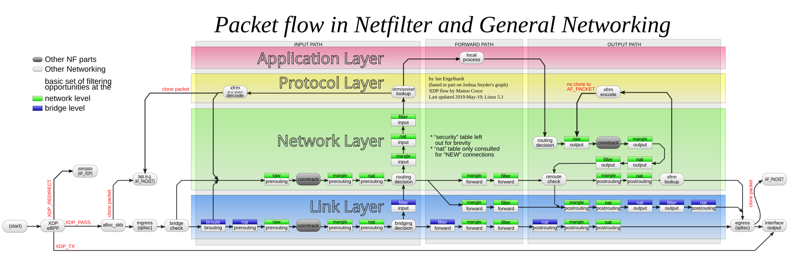

## 内核网络架构
1. 外部数据包到达主机时，首先由网卡 eth0 接收。
2. 网卡通过 DMA（Direct Memory Access，直接内存访问）技术，将数据包拷贝到内核中的 RingBuffer（环形缓冲区）等待 CPU 处理。RingBuffer 是一种首尾相接的环形数据结构，它作为缓冲区，缓解网卡接收数据的速度快于 CPU 处理数据的速度问题。
3. 接着，网卡产生 IRQ（Interrupt Request，硬件中断），通知内核有新的数据包到达。
4. 内核调用中断处理函数，标记新数据到达。接着，唤醒 ksoftirqd 内核线程，执行软中断（SoftIRQ）处理。
5. 软中断处理中，内核调用网卡驱动的 NAPI（New API）poll 接口，从 RingBuffer 中提取数据包，并转换为 skb（Socket Buffer）格式。skb 是描述网络数据包的核心数据结构，无论是数据包的发送、接收还是转发，Linux 内核都会以 skb 的形式来处理。
6. skb 被传递到内核协议栈，在多个网络层次间处理：
    - 网络层（L3 Network layer）：根据主机中的路由表，判断数据包路由到哪一个网络接口（Network Interface）。这里的网络接口可能是稍后介绍的虚拟设备，也可能是物理网卡 eth0 接口。
    - 传输层（L4 Transport layer）：处理网络地址转换（NAT）、连接跟踪（conntrack）等。
7. 内核协议栈处理完成后，数据包被传递到 socket 接收缓冲区。应用程序利用系统调用（如 Socket API）从缓冲区读取数据。至此，整个收包过程结束。

## 内核网络框架
Netfilter 围绕网络协议栈（主要在网络层）“埋下”了 5 个钩子（也称 hook），用来干预 Linux 网络通信。Linux 内核中的其他模块（如 iptables、IPVS 等）向这些钩子注册回调函数。当数据包进入内核协议栈并经过钩子时，回调函数会自动触发，从而对数据包进行处理。

这 5 个钩子的名称与含义如下：

- **PREROUTING**：只要数据包从设备（如网卡）进入协议栈，就会触发该钩子。当我们需要修改数据包的 “Destination IP” 时，会使用到该钩子，即 PREROUTING 钩子主要用于目标网络地址转换（DNAT，Destination NAT）。
- **FORWARD**：顾名思义，指转发数据包。前面的 PREROUTING 钩子并未经过 IP 路由，不管数据包是不是发往本机的，全部照单全收。如果发现数据包不是发往本机，则会触发 FORWARD 钩子进行处理。此时，本机就相当于一个路由器，作为网络数据包的中转站，FORWARD 钩子的作用就是处理这些被转发的数据包，以此来保护其背后真正的“后端”机器。
- **INPUT**：如果发现数据包是发往本机的，则会触发本钩子。INPUT 钩子一般用来加工发往本机的数据包，当然也可以做数据过滤，保护本机的安全。
- **OUTPUT**：数据包送达到应用层处理后，会把结果送回请求端，在经过 IP 路由之前，会触发该钩子。OUTPUT 钩子 一般用于加工本地进程输出的数据包，同时也可以限制本机的访问权限。比如，将发往 www.example.org 的数据包都丢弃掉。
- **POSTROUTING**：数据包出协议栈之前，都会触发该钩子，无论这个数据包是转发的，还是经过本机进程处理过的。POSTROUTING 钩子 一般用于源网络地址转换（SNAT，Source NAT）。

Netfilter 允许在同一钩子上注册多个回调函数，每个回调函数都有明确的优先级，以确保按预定顺序触发。这些回调函数串联起来形成了一个“回调链”（Chained Callbacks）。这种设计使得基于 Netfilter 构建的上层应用大多带有“链”的概念


## 数据包过滤工具 iptables
Netfilter 的钩子回调固然强大，但需要通过编写程序才能使用，并不适合系统管理员日常运维。为此，基于 Netfilter 框架开发的应用便出现了，如 iptables。

熟悉 Linux 的工程师通常都接触过 iptables，它常被视为 Linux 内置的防火墙管理工具。严谨地讲，iptables 能做的事情远超防火墙的范畴，它的定位应是能够代替 Netfilter 多数常规功能的 IP 包过滤工具。
### iptables 表和链
Netfilter 中的钩子在 iptables 中的对应称作“链”（chain）。

iptables 默认包含 5 条规则链 PREROUTING、INPUT、FORWARD、OUTPUT、POSTROUTING，它们分别对应了 Netfilter 的 5 个钩子。

iptables 将常见的数据包管理操作抽象为具体的规则动作，当数据包在内核协议栈中经过 Netfilter 钩子时（也就是 iptables 的链），iptables 会根据数据包的源/目的 IP 地址、传输层协议（如 TCP、UDP）以及端口等信息进行匹配，并决定是否触发预定义的规则动作。

iptables 常见的动作及含义如下：

- ACCEPT：允许数据包通过，继续执行后续的规则。
- DROP：直接丢弃数据包。
- RETURN：跳出当前规则“链”（Chain，稍后解释），继续执行前一个调用链的后续规则。
- DNAT：修改数据包的目标网络地址。
- SNAT：修改数据包的源网络地址。
- REDIRECT：在本机上做端口映射，比如将 80 端口映射到 8080，访问 80 端口的数据包将会重定向到 8080 端口对应的监听服务。
- REJECT：功能与 DROP 类似，只不过它会通过 ICMP 协议向发送端返回错误信息，比如返回 Destination network unreachable 错误。
- MASQUERADE：地址伪装，可以理解为动态的 SNAT。通过它可以将源地址绑定到某个网卡上，因为这个网卡的 IP 可能是动态变化的，此时用 SNAT 就不好实现；
- LOG：内核对数据包进行日志记录。

在 iptables 规则体系中，不同的链用于处理数据包在协议栈中的不同阶段，将不同类型的动作归类，也更便于管理。如数据包过滤的动作（ACCEPT、DROP、RETURN、REJECT 等）可以合并到一处，数据包的修改动作（DNAT、SNAT）可以合并到另外一处，这便有了规则表的概念。

iptables 共有 5 张规则表，它们的名称与含义如下：

- raw 表：主要用于绕过数据包的连接追踪机制。默认情况下，内核会对数据包进行连接跟踪，而使用 raw 表可以避免 conntrack 处理，从而减少系统开销，提高数据包转发性能。
- mangle 表：用于修改数据包的特定字段，主要应用于数据包头的调整。例如，可以修改 ToS（服务类型）、TTL（生存时间）或 Mark（标记）等字段，以影响 QoS 处理或路由决策。
- nat 表：负责网络地址转换（NAT），用于修改数据包的源地址或目的地址。当数据包进入协议栈时，nat 表中的规则决定是否以及如何进行地址转换，从而影响数据包的路由。例如，可用于访问私有网络或负载均衡。
- filter 表：用于数据包过滤，决定数据包是放行（ACCEPT）、拒绝（REJECT）还是丢弃（DROP）。如果不指定 -t 选项，iptables 默认操作的就是 filter 表。
- security 表：主要用于安全策略强化，通常配合 SELinux 使用，以施加更严格的访问控制策略。除 SELinux 相关应用外，security 表并不常用。

举一个具体的例子。如下命令所示，放行 TCP 22 端口的流量，即在 INPUT 链上添加 ACCEPT 动作。
```bash
iptables -A INPUT -p tcp --dport 22 -j ACCEPT
```


### iptables 自定义链与应用
除了 5 个内置链 之外，iptables 还支持管理员创建自定义链。

自定义链 可以看作对调用它的内置链的扩展。当数据包进入自定义链后，可以选择返回调用它的内置链，或继续跳转到其他自定义链，从而实现更复杂的流量处理逻辑。这种机制使 iptables 不仅仅是一个 IP 包过滤工具，还在容器网络等场景中发挥了关键作用。

例如，在 Kubernetes 中，kube-proxy 依赖 iptables 的自定义链 实现 Service 负载均衡，通过规则跳转管理流量转发，从而确保容器服务的高效通信。一旦创建一个 Service，Kubernetes 会在主机添加这样一条 iptable 规则。

```bash
-A KUBE-SERVICES -d 10.0.1.175/32 -p tcp -m tcp --dport 80 -j KUBE-SVC-NWV5X
```

这条 iptables 规则的含义是：凡是目的地址是 10.0.1.175、目的端口是 80 的 IP 包，都应该跳转到另外一条名叫 KUBE-SVC-NWV5X 的 iptables 链进行处理。10.0.1.175 其实就是 Service 的 VIP（Virtual IP Address，虚拟 IP 地址）。可以看到，它只是 iptables 中一条规则的配置，并没有任何网络设备，所以 ping 不通。
接下来的 KUBE-SVC-NWV5X 是一组规则的集合，如下所示：

```bash
-A KUBE-SVC-NWV5X --mode random --probability 0.33332999982 -j KUBE-SEP-WNBA2
-A KUBE-SVC-NWV5X --mode random --probability 0.50000000000 -j KUBE-SEP-X3P26
-A KUBE-SVC-NWV5X -j KUBE-SEP-57KPR
```

可以看到，这一组规则实际上是一组随机模式（–mode random）的自定义链，也是 Service 实现负载均衡的位置。随机转发的目的地为 `KUBE-SEP-<hash>` 自定义链。

查看自定义链`KUBE-SEP-<hash>`的明细，我们就很容易理解 Service 进行转发的具体原理了，如下所示：
```bash
-A KUBE-SEP-WNBA2 -s 10.244.3.6/32  -j MARK --set-xmark 0x00004000/0x00004000
-A KUBE-SEP-WNBA2 -p tcp -m tcp -j DNAT --to-destination 10.244.3.6:9376
```

可以看到，自定义链 `KUBE-SEP-<hash>` 是一条 DNAT 规则。DNAT 规则的作用是在 PREROUTING 钩子处，也就是在路由之前，将流入 IP 包的目的地址和端口，改成 `–to-destination` 所指定的新的目的地址和端口。而目的地址和端口 `10.244.3.6:9376`，正是 Service 代理 Pod 的 IP 地址和端口。这样，访问 Service VIP 的 IP 包经过上述 iptables 处理之后，就已经变成了访问具体某一个后端 Pod 的 IP 包了。

上述实现负载均衡的方式在 kube-proxy 中被称为 iptables 模式。在该模式下，所有容器间的请求和负载均衡操作 都依赖 iptables 规则 进行处理，因此其性能直接受到 iptables 机制的影响。随着 Service 数量的增加，iptables 规则数量也呈现暴涨趋势，导致系统负担加重。

为解决 iptables 模式的性能问题，kube-proxy 新增了 IPVS 模式。**该模式使用 Linux 内核四层负载均衡模块 IPVS 实现容器间请求和负载均衡，性能和 Service 规模无关**。

需要注意的是，内核中的 IPVS 模块仅负责负载均衡和代理功能，而 Service 的完整工作流程还依赖 iptables 进行初始流量捕获和过滤。不过，这些 iptables 规则仅用于辅助，其数量相对有限，不会随着 Service 数量增加而指数级膨胀。

如图所示，展示了 iptables 与 IPVS 两种模式在性能方面的对比。可以观察到，当 Kubernetes 集群 中的 Service 数量达到 1,000 个（对应约 10,000 个 Pod）时，两者的性能表现开始出现明显差异。


现在，你应该理解了，当 Kubernetes 集群规模较大时，应尽量避免使用 iptables 模式，以避免性能瓶颈。如果使用的是 Cilium 作为容器间通信解决方案，还可以构建无需 kube-proxy 组件的 Kubernetes 集群，利用“内核旁路”技术绕过 iptables 限制，全方位提升容器网络性能。

### 连接跟踪模块 conntrack
conntrack 是“连接跟踪”（connection tracking）的缩写，顾名思义，它用于跟踪 Linux 内核中的通信连接。需要注意的是，conntrack 跟踪的“连接”不仅限于 TCP 连接，还包括 UDP、ICMP 等类型的连接。当 Linux 系统收到数据包时，conntrack 模块会为其创建一个新的连接记录，并根据数据包的类型更新连接状态，如 NEW、ESTABLISHED 等。

以 TCP 三次握手为例，说明 conntrack 模块的工作原理 ：

1. 客户端向服务器发送一个 TCP SYN 包，发起连接请求。
2. Linux 系统收到 SYN 包后，conntrack 模块为其创建新的连接记录，并将状态标记为 NEW。
3. 服务器回复 SYN-ACK 包，等待客户端的 ACK。一旦握手完成，连接状态变为 ESTABLISHED。

通过命令 cat /proc/net/nf_conntrack 查看连接记录，如下所示，输出了一个状态为 ESTABLISHED 的 TCP 连接。

```bash
$ cat /proc/net/nf_conntrack
ipv4     2 tcp      6 88 ESTABLISHED src=10.0.12.12 dst=10.0.12.14 sport=48318 dport=27017 src=10.0.12.14 dst=10.0.12.12 sport=27017 dport=48318 [ASSURED] mark=0 zone=0 use=2
```
conntrack 连接记录是 iptables 连接状态匹配的基础，也是实现 SNAT 和 DNAT 的前提。我们知道 Kubernetes 的核心组件 kube-proxy，它作用是负责处理集群中的服务（Service）网络流量。它本质上是一个反向代理（即 NAT），当外部请求访问 Service 时，流量会被 DNAT 转发到 PodIP:Port，响应则经过 SNAT 处理。

举一个具体的例子说明。假设客户端向 my-service（IP 10.0.0.10，端口 80）发送 HTTP 请求，流程如下：

- 节点中的 kube-proxy 收到请求后，执行 DNAT 操作，将目标地址从 10.0.0.10:80 转换为某个 Pod 的 IP 和端口（如 192.168.1.2:8080）。
- Pod 处理请求并返回响应，kube-proxy 执行 SNAT 操作，将响应包的源地址从 192.168.1.2:8080 转换为 Service IP 10.0.0.10:80。

conntrack 模块维护的连接记录包含了从客户端到 Pod 的 DNAT 映射、从 Pod 到客户端的 SNAT 映射。这样有来有回，是一条完整的 NAT 映射关系。但是，如果客户端与 Pod 在同一主机上（如图 3-5），则会出现以下问题：

- 客户端发起请求时，数据包经过网络层，conntrack 模块根据 iptables 规则判断是否需要进行 DNAT；
- 返回响应时，Linux 网桥发现目标 IP 位于同一网桥上，会直接通过链路层转发数据包，而不会触发网络层的 conntrack 模块，导致 SNAT 操作没有执行。

通信双方不在同一“频道”上，NAT 映射关系不完整，进而影响容器间通信，产生各种异常

为了解决上述问题，Linux 内核引入了 bridge-nf-call-iptables 配置，决定是否在网桥中触发 iptables 匹配规则，从而保证 NAT 处理时 conntrack 连接记录的完整性。这也解释了为什么在部署 Kubernetes 集群时，必须将该配置设置为 1。

## 数据平面开发套件 DPDK
2010 年，Intel 主导开发了 DPDK（Data Plane Development Kit，数据平面开发套件），基于“内核旁路”理念构建高性能网络应用方案，并逐步发展为一套成熟的技术体系。

最初，DPDK 是 Intel 为推销自家硬件而开发的高性能网络驱动组件，专门针对 Intel 处理器和网卡。随着 DPDK 开源，越来越多厂商开始贡献代码，DPDK 扩展了对更多硬件的支持：不仅支持 Intel 处理器，还兼容 AMD、ARM 等厂商的处理器；网卡支持范围也涵盖了 Intel、Mellanox、ARM 集成网卡等。因此，DPDK 也逐渐具有广泛的适用性。

如图展示了 DPDK（Fast Path）与传统内核网络（Slow Path）之间的区别。在 Linux 系统中，DPDK 的库和应用程序在用户空间的编译、链接和加载方式与普通程序相同，但它们的数据包传输路径却大相径庭：

- **传统内核网络**（图左侧）：网络数据包从网络接口卡（NIC）出发，经驱动程序、内核协议栈处理，最终通过 Socket 接口传递给用户空间的业务层。
- **DPDK 加速网络**（图右侧）：在该方案中，网络数据包通过用户空间 I/O（UIO）技术，直接绕过内核协议栈，从网卡传输至 DPDK 基础库，再传递至业务逻辑。也就是说，DPDK 绕过了 Linux 内核协议栈的数据包处理过程，在用户空间直接进行收发和处理。


## eBPF 和 快速数据路径 XDP

由于 DPDK 完全基于“内核旁路”的思想，它天然无法与 Linux 内核生态很好地结合。

2016 年，Linux Netdev 会议，Linux 内核开发者 David S. Miller[[1]](https://www.thebyte.com.cn/network/XDP.html#footnote1) 喊出了“DPDK is not Linux”的口号。同年，随着 eBPF 技术成熟，Linux 内核终于迎来了属于自己的“高速公路” —— XDP（eXpress Data Path，快速数据路径）。XDP 因其媲美 DPDK 的性能、背靠 Linux 内核，无需第三方代码库和许可、无需专用 CPU 等多种优势，一经推出便备受关注。

DPDK 技术完全绕过内核，直接将数据包透传至用户空间处理。XDP 正好相反，它在内核空间根据用户的逻辑处理数据包。

在内核执行用户逻辑的关键在于 BPF（Berkeley Packet Filter，伯克利包过滤器）技术 —— 一种允许在内核空间运行经过安全验证的代码的机制。Linux 内核 2.5 版本起，Linux 系统就开始支持 BPF 技术了，但早期的 BPF 主要用于网络数据包的捕获和过滤。到了 Linux 内核 3.18 版本，开发者推出了一套全新的 BPF 架构，也就是我们今天所说的 eBPF（Extended Berkeley Packet Filter）。与早期的 BPF 相比，eBPF 的功能不再局限于网络分析，它几乎能访问所有 Linux 内核关联的资源，逐渐发展成一个多功能的通用执行引擎。

至此，相信读者已经能够察觉到，eBPF 访问 Linux 内核资源的方式与 Netfilter 开放钩子的机制相似。两者的主要区别在于，Netfilter 提供的钩子数量有限，主要面向 Linux 的其他内核模块；而 eBPF 则面向普通开发者，Linux 系统提供了大量钩子供开发者挂载 eBPF 程序。

列举部分钩子供读者参考：

- **TC**（Traffic Control）钩子：位于内核的网络流量控制层，用于处理流经 Linux 内核的网络数据包。它可以在数据包进入或离开网络栈的各个阶段触发。
- Tracepoints 钩子：Tracepoints 是内核代码中的静态探测钩子，分布在内核的各个子系统中。主要用于内核的性能分析、故障排查、监控等。例如，可以在调度器、文件系统操作、内存管理等处进行监控。
- **LSM**（Linux Security Modules）钩子：位于 Linux 安全模块框架中，允许在内核执行某些安全相关操作（如文件访问、网络访问等）时触发 eBPF 程序。主要用于实现安全策略和访问控制。例如，可以编写 eBPF 程序来强制执行自定义的安全规则或监控系统的安全事件。
- **XDP** 钩子：位于网络栈最底层的钩子，直接在网卡驱动程序中触发，用于处理收到的网络数据包，主要用于实现超高速的数据包处理操作，例如 DDoS 防护、负载均衡、数据包过滤等。

从上述钩子可见，XDP 本质上是 Linux 内核在网络路径上设置的钩子，位于网卡驱动层，在数据包进入网络协议栈之前。当 XDP 执行完 eBPF 程序后，通过“返回码”来指示数据包的最终处理决定。

XDP 的 5 种返回码及其含义如下：

- **XDP_ABORTED**：表示 XDP 程序处理数据包时遇到错误或异常。
- **XDP_DROP**：在网卡驱动层直接将该数据包丢掉，通常用于过滤无效或不需要的数据包，如实现 DDoS 防护时，丢弃恶意数据包。
- **XDP_PASS**：数据包继续送往内核的网络协议栈，和传统的处理方式一致。这使得 XDP 可以在有需要的时候，继续使用传统的内核协议栈进行处理。
- **XDP_TX**：数据包会被重新发送到入站的网络接口（通常是修改后的数据包）。这种操作可以用于实现数据包的快速转发、修改和回环测试（如用于负载均衡场景）。
- **XDP_REDIRECT**：数据包重定向到其他的网卡或 CPU，结合 AF_XDP[[2]](https://www.thebyte.com.cn/network/XDP.html#footnote2)可以将数据包直接送往用户空间。


eBPF 运行在内核空间，能够极大地减少数据的上下文切换开销，再结合 XDP 钩子，在 Linux 系统收包的早期阶段介入处理，就能实现高性能网络数据包处理和转发。以业内知名的容器网络方案 Cilium 为例，它在 eBPF 和 XDP 钩子（也有其他的钩子）基础上，实现了一套全新的 conntrack 和 NAT 机制。并以此为基础，构建出如 L3/L4 负载均衡、网络策略、观测和安全认证等各类高级功能。

由于 Cilium 实现的底层网络功能独立于 Netfilter，它的连接追踪数据和 NAT 规则不再存储在 Linux 内核默认的 conntrack 表和 NAT 表中。因此，常规的 Linux 命令（如 conntrack、netstat、ss 和 lsof）无法查看这些数据。必须使用 Cilium 提供的查询命令，例如：

```bash
$ cilium bpf nat list  // 列出 Cilium 中配置的 NAT 规则。
$ cilium bpf ct list global // 列出 Cilium 中的连接追踪条目
```

## 远程直接内存访问 RDMA
近年来，人工智能、分布式训练和分布式存储技术快速发展，对网络传输性能提出了更高要求。但传统以太网在延迟、吞吐量和 CPU 资源消耗方面存在先天不足。在这一背景下，RDMA（Remote Direct Memory Access，远程直接内存访问）技术凭借卓越的性能，逐渐成为满足高性能计算需求的优选方案。

RDMA 设计起源于 DMA（Direct Memory Access）技术[[1]](https://www.thebyte.com.cn/network/RDMA.html#footnote1)，它的工作原理如图所示，应用程序通过 RDMA Verbs API 直接访问远程主机内存，而无需经过操作系统或 CPU 参与数据拷贝，从而极大地降低延迟和 CPU 开销，提高数据传输效率。


RDMA 网络的协议实现有三类，它们的含义及区别如下。

- **Infiniband**（无限带宽）），是一种专门为 RDMA 而生的技术，由 IBTA（InfiniBand Trade Association， InfiniBand 贸易协会）在 2000 年提出，因其极致的性能（能够实现小于 3 μs 时延和 400Gb/s 以上的网络吞吐），在高性能计算领域中备受青睐。 但注意的是，构建 Infiniband 网络需要配置全套专用设备，如专用网卡、专用交换机和专用网线，限制了其普及性。其次，它的技术架构封闭，不兼容现有的以太网标准。这意味着，绝大多数通用数据中心都无法兼容 Infiniband 网络。
    
    尽管存在这些局限，InfiniBand 仍因其极致的性能成为特定领域的首选。例如，全球流行的人工智能应用 ChatGPT 背后的分布式机器学习系统，就是基于 Infiniband 网络构建的。
    
- **iWRAP**（Internet Wide Area RDMA Protocol，互联网广域 RDMA 协议）是一种将 RDMA 封装在 TCP/IP 协议中的技术。RDMA 旨在提供高性能传输，而 TCP/IP 侧重于可靠性，其三次握手、拥塞控制等机制削弱了 iWRAP 的 RDMA 技术优势，导致其性能大幅下降。因此，iWRAP 由于先天设计上的局限性，逐渐被业界淘汰。
    
- 为降低 RDMA 的使用成本，并推动其在通用数据中心的应用，IBTA 于 2010 年发布了 **RoCE**（RDMA over Converged Ethernet，融合以太网的远程直接内存访问）技术。RoCE 将 Infiniband 的数据格式（IB Payload）“移植”到以太网，使 RDMA 能够在标准以太网环境下运行。只需配备支持 RoCE 的专用网卡和标准以太网交换机，即可享受 RDMA 技术带来的高性能。
    
    如图所示，RoCE 在发展过程中演化出两个版本：
    
    - **RoCEv1**：基于二层以太网，仅限于同一子网内通信，无法跨子网传输；
    - **RoCEv2**：基于三层 IP 网络，支持跨子网通信，提高了灵活性和可扩展性。
    
    RoCEv2 克服了 RoCEv1 不能跨子网的限制，并凭借其低成本和良好的兼容性，在分布式存储、并行计算等通用数据中心场景中得到广泛应用。根据微软 Azure 公开信息，截至 2023 年，Azure 数据中心中 RDMA 流量已占总流量的 70%[[1:1]](https://www.thebyte.com.cn/network/RDMA.html#footnote1)。
RDMA 网络对丢包极为敏感，任何数据包丢失都可能触发大量重传，严重影响传输性能。Infiniband 依赖专用设备确保网络可靠性，而 RoCE 构建在标准以太网上，实现 RDMA 通信。因此，RoCE 网络需要无损以太网支持，以避免丢包对性能造成重大影响。

目前，大多数数据中心采用 DCQCN（由微软与 Mellanox 提出）或 HPCC（由阿里巴巴提出）算法，为 RoCE 网络提供可靠性保障。由于这些算法涉及底层技术，超出本书讨论范畴，感兴趣的读者可参考其他资料以进一步了解。

[https://www.usenix.org/system/files/nsdi23-bai.pdf](https://www.usenix.org/system/files/nsdi23-bai.pdf)

## 网络命名空间
从 Linux 内核 2.4.19 版本开始，逐步集成了多种命名空间技术，以实现对各类资源的隔离。其中，网络命名空间（Network Namespace）是最为关键的一种，也是容器技术的核心。

网络命名空间允许 Linux 系统内创建多个独立的网络环境，每个环境拥有独立的网络资源，如防火墙规则、网络接口、路由表、ARP 邻居表及完整的网络协议栈。当进程运行在某个网络命名空间内时，就像独享一台物理主机。


在 Linux 系统 中，ip 工具的子命令 netns 集成了网络命名空间的增、删、查、改等功能。接下来，笔者将使用 ip 命令演示如何操作网络命名空间，帮助你加深理解。

首先，创建一个名为 ns1 的网络命名空间。命令如下所示：

```bash
$ ip netns add ns1
```

查询 ns1 网络命名空间内的网络设备信息。可以看到，由于没有进行任何配置，该网络命名空间内只有一个名为 lo 的本地回环设备，且设备状态为 DOWN。

```bash
$ ip netns exec ns1 ip link list 
1: lo: <LOOPBACK> mtu 65536 qdisc noop state DOWN mode DEFAULT group default qlen 1000
    link/loopback 00:00:00:00:00:00 brd 00:00:00:00:00:00
```

查看 ns1 网络命名空间下的 iptables 规则配置。可以看到，由于这是一个初始化的网络命名空间，因此 iptables 规则为空，并没有任何配置。

```bash
$ ip netns exec ns1 iptables -L -n
Chain INPUT (policy ACCEPT)
target     prot opt source               destination         

Chain FORWARD (policy ACCEPT)
target     prot opt source               destination         

Chain OUTPUT (policy ACCEPT)
target     prot opt source               destination 
```

不难看出，不同的网络命名空间默认相互隔离，也无法直接通信。如果它们需要与外界（其他网络命名空间或宿主机）建立连接，该如何实现呢？

我们先看看物理机是怎么操作的，一台物理机如果要想与外界进行通信，那得插入一块网卡，通过网线连接到以太网交换机，加入一个局域网内。被隔离的网络命名空间如果想与外界进行通信，就需要利用到稍后介绍的各类虚拟网络设备。也就是，在网络命名空间里面插入“虚拟网卡”，然后把“网线”的另一头桥接到“虚拟交换机”中。

没错，这些操作完全和物理环境中的配置局域网一样，只不过全部是虚拟的、用代码实现的而已。

### 虚拟网络设备 TUN 和 TAP
TUN 和 TAP 是 Linux 内核自 2.4.x 版本引入的虚拟网卡设备，专为用户空间（user space）与内核空间（kernel space）之间的数据传输而设计。两者的主要区别如下：

- **TUN 设备**：工作在网络层（Layer 3），用于处理 IP 数据包。它模拟一个网络层接口，使用户空间程序能够直接收发 IP 数据包；
- **TAP 设备**：工作在数据链路层（Layer 2），用于处理以太网帧。与 TUN 设备不同，TAP 设备传输完整的以太网帧（包括数据链路层头部），使用户空间程序可以处理原始以太网帧。

Linux 系统中，内核空间和用户空间之间数据传输有多种方式，字符设备文件是其中一种。

TUN/TAP 设备对应的字符设备文件为 /dev/net/tun。当用户空间的程序打开（open）字符设备文件时，同时，TUN/TAP 的字符设备驱动会创建并注册相应的虚拟网卡，默认命名为 tunX 或 tapX。随后，用户空间程序读写(read/write)该文件描述符，就可以和内核网络栈进行数据交互了。

如图 3-13 所示，下面以 TUN 设备构建 VPN 隧道为例，说明其工作原理。

1. 首先，一个普通的用户程序发起一个网络请求；
2. 接着，数据包进入内核协议栈，并路由至 tun0 设备。路由规则如下:
    
    ```bash
    $ ip route show
    default via 172.12.0.1 dev tun0  // 默认流量经过 tun0 设备
    192.168.0.0/24 dev eth0  proto kernel  scope link  src 192.168.0.3
    ```
    
3. tun0 设备的字符设备文件 /dev/net/tun 由 VPN 程序打开。所以，用户程序发送的数据包不会直接进入网络，而是被 VPN 程序读取并处理。
4. VPN 程序对数据包进行封装操作，封装（Encapsulation）是指在原始数据包外部包裹新的数据头部，就像将一个盒子放在另一个盒子中一样。
5. 最后，处理后的数据包再次写入内核网络栈，并通过 eth0（即物理网卡）发送到目标网络。


封装数据包以构建网络隧道，是实现虚拟网络的常见方式。例如，在本书第七章介绍的容器网络插件 Flannel 早期版本中，曾使用 TUN 设备来实现容器间的虚拟网络通信。但是，TUN 设备的数据传输需经过两次协议栈，并涉及多次封包与解包操作，导致了很大的性能损耗。这也是 Flannel 后来弃用 TUN 设备的主要原因。


