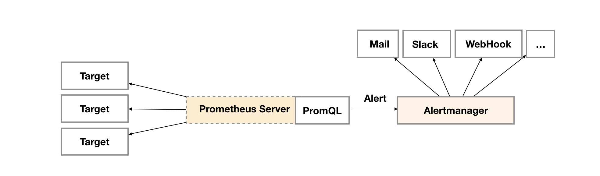
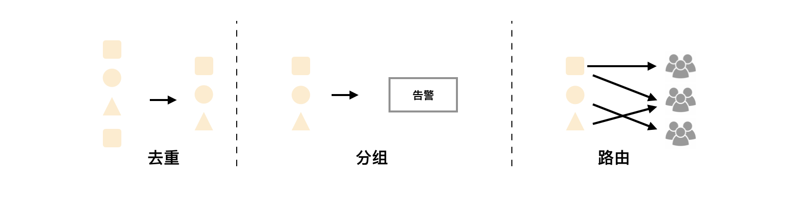
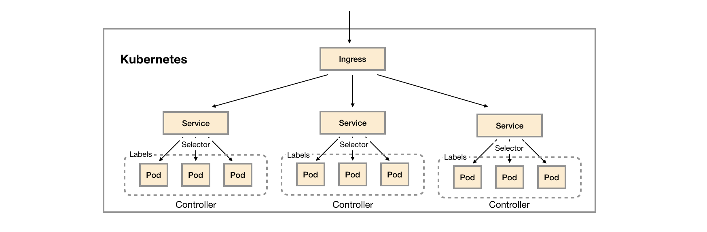

:toc:

// 保证所有的目录层级都可以正常显示图片
:path: prometheus/
:imagesdir: ../image/

// 只有book调用的时候才会走到这里
ifdef::rootpath[]
:imagesdir: {rootpath}{path}{imagesdir}
endif::rootpath[]

// 用于文件跳转
ifndef::rootpath[]
:rootpath: ../
endif::rootpath[]

== prometheus

prometheus官方架构图。

image::image-2024-12-25-10-03-02-517.png[]

TIP: 以下代码相关内容是参考的prometheus 3.0.1  2024-11-28

=== 基础知识

==== 热加载更新配置

Prometheus支持热加载更新配置，即在运行时，可以修改配置文件，然后触发配置的重新加载即可。

[source,bash]
----
# 1. 向prometheus发送SIGHUP信号，实现配置的热加载
kill -HUP <pid>
# 2. 向prometheus发送POST请求到 /-/reload 来实现配置的热加载
curl -X POST http://localhost:9090/-/reload
----

- keep：丢弃source_labels指定的值中没有匹配到regex正则表达式内容的target。
- drop：丢弃source_labels指定的值中匹配到regex正则表达式内容的target。
- hashmod：将多个source_labels的值进行hash，作为target标签的值。
- labelmap：针对所有标签名来匹配regex，然后将匹配的标签的值复制到replacement所指定的新标签中。
- labelkeep：针对所有标签名来匹配regex，任何不匹配的标签将从标签集中删除。
- labeldrop：针对所有标签来匹配regex，任何匹配的标签将从标签集中删除。

=== Alertmanager

==== 配置

==== 告警分组
分组机制（Grouping）是指，AlertManager将同类型的告警进行分组，合并多条告警到一个通知中。在实际环境中，特别是云计算环境中的业务线之间密集耦合时，若出现多台设备宕机，可能会导致成百上千个告警被触发。在这种情况下使用分组机制，可以将这些被触发的告警合并为一个告警进行通知，从而避免瞬间突发性地接收大量的告警通知，使得管理员无法对问题进行快速定位。

例如，在一个Kubernetes集群中，运行着重量级规模数量的实例，即便是集群中持续一小段时间的网络延时或间歇式断开，也会引起大量应用程序无法连接数据库的故障。如果我们在Prometheus告警规则中配置为每一个服务实例都发送告警，那么最后的结果就是大量的告警被发送到Alertmanager中心。

其实，作为集群管理员，可能希望在一个通知中就能快速查看是哪些服务实例被本次故障影响了。此时，对服务所在集群或者告警名称进行分组打包配置，将这些告警紧凑在一起成为一个“大”的通知时，管理员就不会受到告警的频繁“轰炸”。告警分组、告警时间和告警接收器均是通过Alertmanager的配置文件来完成配置的。

==== 告警抑制

Alertmanager的抑制机制（Inhibition）是指，当某告警已经发出，停止重复发送由此告警引发的其他异常或故障的告警机制。在生产环境中，例如IDC托管机柜中，若每个机柜接入层仅仅是单台交换机，那么该机柜接入交换机故障会造成机柜中服务器非UP状态告警；再有服务器上部署的应用不可访问也会触发告警。此时，可以配置Alertmanager忽略由交换机故障造成的机柜所有服务器及其应用不可访问而产生的告警。

在我们的灾备体系中，当原集群故障宕机业务彻底无法访问时，会把用户流量切换到灾备集群中，这样为故障集群及其提供的各个微服务状态发送告警就失去了意义，此时，Alertmanager的抑制机制在一定程度上避免了管理员收到过多的触发告警通知。抑制机制也是通过Alertmanager的配置文件进行设置的。

==== 告警静默

告警静默（Silences）提供了一个简单的机制，可以根据标签快速对告警进行静默处理。对传入的告警进行匹配检查，如果接收到的告警符合静默的配置，Alertmanager则不会发送告警通知。管理员可以直接在Alertmanager的Web界面中临时屏蔽指定的告警通知。

==== prometheus的告警规则

=== kube-prometheus

=== 数据设计

每个监控系统都有自己的一套指标定义和规范。

==== 指标

.prometheus指标格式定义
`<metric name>{<label name>=<label value> , . .. }`

- metric name: 监控指标名称，必须以字母开头，只能包含字母、数字、下划线、点、中划线、冒号，其中冒号不能用于exporter。

- label name: 标签可以提现指标的维度特征，用于过滤和聚合，通过标签名和标签值的组合形式，形成多种维度。

==== 指标分类

1. gauge类型，仪表盘，表示一个瞬时值，例如cpu使用率，内存使用率等。

2. counter类型，计数器，表示一个累计值，例如请求总数，错误总数等。

3. histogram类型，直方图，表示一个统计数据，例如请求耗时，响应大小等。

4. summary类型，摘要，表示一个统计数据，例如请求耗时，响应大小等。

==== 数据采集

采用pull的方式采集监控数据，因此为了兼容push方式prometheus提供了pushgateway服务。

prometheus支持静态配置文件的服务发现方式和动态发现两种模式：

- 静态配置文件

.指定采集本地8080端口的Agent数据的代码
[source, bash]
----
"targets": ["10.10.10.10:8080"]
----

- 动态发现

**数据采集**

采用Restful API方式获取数据，具体来说就是调用HTTP GET请求或Metrics数据接口获取监控数据。

配置修改之后，有两种方式用来更新配置：

1. 调用reload接口进行配置更新
2. 发送 `kill -HUP prometheus进程ID` 动态加载配置

**数据处理**

Prometheus 支持数据处理，主要包括 relabel 、 replace 、 keep 、 drop 等操作。

Prometheus 会从 target 中获取所有暴露的数据，但某些数据对 Prometheus 是无用的，如果直接保存这些数据，则不仅浪费空间，还会降低系统的吞吐量 。 Prometheus提供了 keep 或 drop 机制，如果设置了 keep 机制，则会保留所有匹配标签的数据；如果设置了 drop 机制 ， 则会丢弃匹配标签的数据，从而完成数据过滤

==== 数据存储

- 本地存储

- 远程存储

通过适配器实现Prometheus的read和write接口来实现。

==== 数据查询

数据查询可以通过promQL语法进行查询。和关系数据库的SQL不一样的地方是PromQL只支持查询、聚合、统计等操作，不支持修改、删除等操作。

==== 告警

告警机制，Prometheus支持告警机制，alerter通过配置告警规则，当监控指标达到设定的阈值时，alerter会发送告警信息。

[source, bash]
----
request latency seconds :mean5m {job="myjob"} > 0.5
----

告警处理需要依赖告警组件AlertManager

==== 集群

多个prometheus实例可以组成一个集群，用来监控多个实例。多个prometheus节点组成两层联邦结构，下层的prometheus充当代理。

image::image-2024-12-25-11-55-51-356.png[]

存在问题：

- 配置复杂
- 历史数据存储问题没有得到解决，需要依赖第三方存储，并缺少针对历史数据的降准采样能力。

*Thanos*

.Thanos架构图
image::image-2024-12-25-12-06-25-188.png[]

=== 数据存储

prometheus数据存储方式有本地存储和远程存储两种方式。

- 本地存储

- 远程存储

==== 存储接口

本地存储方式，prometheus会将数据存储在本地文件中，从而实现高性能读写，但是时序性数据库非集群的数据库，为此prometheus提供了远程存储方式，为了适配远端存储，prometheus抽象了一组读写数据接口。

Appender提供批量向数据库添加数据接口

[source, go]
----
// 必须调用Commit Rollback等完成数据提交，并且调用之后该appender不能再重复使用。
// 单次 Commit中如果有重复数据，那么具体行为将是未定义的
type Appender interface {
    //  将给定的样本数据添加到对应的序列中，并返回索引
	Append(ref SeriesRef, l labels.Labels, t int64, v float64) (SeriesRef, error)
    // 批量提交
	Commit() error
    // 回滚操作
	Rollback() error

	// 为添加数据提供额外的选项，比如 ： out-of-order
	SetOptions(opts *AppendOptions)

    // 特例提交
	ExemplarAppender
	HistogramAppender
	MetadataUpdater
	CreatedTimestampAppender
}
----

Querier监控数据查询接口，Select方法用于给定的标签查询对应的时序数据。

[source, go]
----
type Querier interface {
	// 根据指定标签进行数据查询
	LabelQuerier

	// 根据标签查询时序数据
	Select(ctx context.Context, sortSeries bool, hints *SelectHints, matchers ...*labels.Matcher) SeriesSet
}
----

为了兼容本地存储和远端存储，prometheus提供了fanout接口，该接口同样实现了上面的Appender接口。

当执行fanout中的方法时，fanout会首先执行本地存储primary的Add方法，然后便利执行每个远端存储的Add方法。

image::image-2024-12-25-14-37-44-315.png[]

[source, go]
----
type fanout struct {
	logger *slog.Logger

	primary     Storage
	secondaries []Storage
}
----

==== 本地存储

===== 样本

Prometheus会将所有采集到的样本数据以时间序列（time-series）的方式保存在内存数据库中，并且定时保存到硬盘上。time-series是按照时间戳和值的序列顺序存放的，我们称之为向量(vector). 每条time-series通过指标名称(metrics name)和一组标签集(labelset)命名。如下所示，可以将time-series理解为一个以时间为Y轴的数字矩阵：

[source, bash]
----
./data
   |- 01BKGV7JBM69T2G1BGBGM6KB12 # 块
      |- meta.json  # 元数据
      |- wal        # 写入日志
        |- 000002
        |- 000001
   |- 01BKGTZQ1SYQJTR4PB43C8PD98  # 块
      |- meta.json  #元数据
      |- index   # 索引文件
      |- chunks  # 样本数据
        |- 000001
      |- tombstones # 逻辑数据
   |- 01BKGTZQ1HHWHV8FBJXW1Y3W0K
      |- meta.json
      |- wal
        |-000001
----

[source, bash]
----
^
│   . . . . . . . . . . . . . . . . .   . .   node_cpu{cpu="cpu0",mode="idle"}
│     . . . . . . . . . . . . . . . . . . .   node_cpu{cpu="cpu0",mode="system"}
│     . . . . . . . . . .   . . . . . . . .   node_load1{}
│     . . . . . . . . . . . . . . . .   . .
v
<------------------ 时间 ---------------->
----

在time-series中的每一个点称为一个样本（sample），样本由以下三部分组成：

- 指标(metric)：metric name和描述当前样本特征的labelsets;
- 时间戳(timestamp)：一个精确到毫秒的时间戳;
- 样本值(value)： 一个float64的浮点型数据表示当前样本的值

[source, bash]
----
<--------------- metric ---------------------><- timestamp -><- value ->
http_request_total{status="200", method="GET"}@1434417560938 => 94355
http_request_total{status="200", method="GET"}@1434417561287 => 94334

http_request_total{status="404", method="GET"}@1434417560938 => 38473
http_request_total{status="404", method="GET"}@1434417561287 => 38544

http_request_total{status="200", method="POST"}@1434417560938 => 4748
http_request_total{status="200", method="POST"}@1434417561287 => 4785
----

===== TSDB设计理念

TSDB设计有两个核心：block和WAL，而block又包含chunk、index、meta.json、tombstones等。

存储的监控数据按照时间分隔成block，block大小并不固定，按照设定的步长倍数递增，默认情况下最小的block保存2h的监控数据，随着数据的增长，TSDB会将小的block合并成大的block，这样不仅可以减少数据存储还可以方便对数据的快速查询。

*block*

每个block都有全局唯一的名称，通过ULID(Universal Unique Lexicographically Sortable Identifier，全局字典可排序ID)原理生成，可以通过block文件名确认创建时间。

[source, bash]
----
0                   1                   2                   3
 0 1 2 3 4 5 6 7 8 9 0 1 2 3 4 5 6 7 8 9 0 1 2 3 4 5 6 7 8 9 0 1
+-+-+-+-+-+-+-+-+-+-+-+-+-+-+-+-+-+-+-+-+-+-+-+-+-+-+-+-+-+-+-+-+
|                      32_bit_uint_time_high                    |
+-+-+-+-+-+-+-+-+-+-+-+-+-+-+-+-+-+-+-+-+-+-+-+-+-+-+-+-+-+-+-+-+
|     16_bit_uint_time_low      |       16_bit_uint_random      |
+-+-+-+-+-+-+-+-+-+-+-+-+-+-+-+-+-+-+-+-+-+-+-+-+-+-+-+-+-+-+-+-+
|                       32_bit_uint_random                      |
+-+-+-+-+-+-+-+-+-+-+-+-+-+-+-+-+-+-+-+-+-+-+-+-+-+-+-+-+-+-+-+-+
|                       32_bit_uint_random                      |
+-+-+-+-+-+-+-+-+-+-+-+-+-+-+-+-+-+-+-+-+-+-+-+-+-+-+-+-+-+-+-+-+
----

可以看到ULID的总长度为128字节，为了生成可排序的字符串，Prometheus使用Base32算法，转化为26字节的可排序字符串。

.block 组成示意图
image::image-2024-12-25-15-06-32-209.png[]

- chunks

chunks用于保存压缩后的时序数据，每个chunk的大小为512MB，如果超过就会被截断成多个chunk保存，并以数字编号命令。

- index

index是为了对监控数据进行快速检索和查询而设计的，主要用来记录chunk中的时序偏移位置。

- tombstones

TSDB在删除block数据块时会将整个目录删除，如果只删除一部分数据块的内容，则可以通过tombstone进行软删除。

- meta.json

用于保存block的元数据信息，主要包括一个数据块记录样本的起始时间minTIme、截止时间maxTime、样本数量numSamples、时序数和数据源等信息。

*WAL*

WAL(Write-Ahead Log，预写日志)，是关系型数据库中利用日志来实现事务性和持久性的一种技术，即在进行某个操作之前先将整个事情记录下来，一遍以后对数据进行回滚、重试等操作保证数据的可靠性。

TSDB存储空间计算：

存储空间 = 每个指标大小(1~2字节) * 采集的周期 * storage.tsdb.retention

=== prometheus在kubernetes中的应用

- 使用kubernetes创建命名空间

[source, bash]
----
$ kubectl create ns kube-ops
----

cAdvisor内置在kubelet中 会实时采集所在节点及在节点上运行的容器的性能指标 数据。

项目中使用了更加智能的方式来管理prometheus，也就是 [prometheus-operator](https://github.com/prometheus-operator/prometheus-operator/tree/main)

=== prometheus-operator

如果其他项目想自定义集应用管理器，可以使用 `operator` 库，prometheus-operator就是在 `operator` 库的基础上开发出来用来管理 `prometheus` 的。

通过helm布置prometheus-operator，通过prometheus-operator管理prometheus。

[source, bash]
----
# 获取自定义资源类型
kubectl get crd
# 获取创建的Service
kubectl get svc
# 编辑Service的配置，比如将对应的服务类型修改为NodePort，NodePort只是Service的一种类型
kubectl edit svc prometheus-k8s
----

- 如何在 prometheus-operator中添加自定义监控项

- 首先，建立一个ServiceMonitor对象，用于为 Prometheus 添加监控项；
- 然后，将 ServiceMonitor 对象关联 metrics 数据接口的一个 Service 对象；
- 最后， Service 对象可以正确获取 metrics 数据 。

==== prometheus pod 数据持久化

查看现有的 `/prometheus` 是挂载在 `emptyDir` 的

[source, bash]
----
  volumeMounts:
    - mountPath: /prometheus
      name: prometheus-k8s-db
volumes:
 - emptyDir: {}
    name: prometheus-k8s-db
----

那么就会导致一旦出现pod重启，数据就丢失了。为了解决这个问题，需要将数据持久化到磁盘中。在实际部署中prometheus是通过Statefulset控制器进行部署的，所里可以通过storageclass进行数据持久化。

[source, yaml]
----
apiVersion: storage.k8s.io/v1
kind: StorageClass
metadata:
  name: prometheus-data-db
provisioner: fuseim.pri/ifs
----

这里声明一个 StorageClass 对象，因为在集群中将 NFS 作为存储后端（在线上使用环境中不要将 NFS 作为 Prometheus 的存储后端 因为 Prometheus 对 NFS 的支持很弱，可能会导致数据破坏），所以要使用 StorageClass 对象，就需要创建一个provisioner 的驱动，对应的资源清单如下：

详细可以参考 https://github.com/kubernetes-sigs/nfs-subdir-external-provisioner

k8s中的prometheus中很多配置是通过ConfigMap进行配置的，所以如果想进行热更新可以进行如下操作：

[source, bash]
----
# 直接使用edit编辑
kubectl edit configmap prometheus-k8s-config
# 或者手动编辑
kubectl delete -f prome-cm.yaml
# 修改好之后再创建
kubectl create -f prome-cm.yaml
# 等一会 执行热更新操作
curl -X POST http://localhost:9090/-/reload
----

=== prometheus 进阶

- 源码修改
- log日志替换

==== prometheus 的初始化过程

初始化主函数在： `prometheus/cmd/prometheus/main.go` 的 `main` 方法中完成。

- 存储组件
- notifier组件
- discoveryManagerScrape组件
- discoveryManagerTNotify组件
- scrapeManager组件
- queryEngine组件
- ruleManager组件
- Web组件

理解了初始化流程也就理解了程序的一般逻辑，因为所有的prometheus的服务组件的初始化和引用关系都在prometheus初始化节点完成。

[source, go]
----
// 开启prometheus调试模式，只需要将系统环境变量设置为DEBUG模式，或者在yaml配置中将debug打开
if os.Getenv("DEBUG") != "" {
    // 设置goroutine阻塞分析器的采样频率
    runtime.SetBlockProfileRate(20)
    // 设置goroutine互斥锁竞争的采样频率
    runtime.SetMutexProfileFraction(20)
}
----

[source, yaml]
----
  args:
    - --log.level=debug
----

=== PromQL

PromQL是Prometheus内置的数据查询语言，其提供对时间序列数据丰富的查询，聚合以及逻辑运算能力的支持。并且被广泛应用在Prometheus的日常应用当中，包括对数据查询、可视化、告警处理当中。可以这么说，PromQL是Prometheus所有应用场景的基础，理解和掌握PromQL是Prometheus入门的第一课。

==== PromQL 支持的简单操作

*支持使用=和!=*

[source, bash]
----
# 获取instance名为 localhost:9090 的所有指标
http_requests_total{instance="localhost:9090"}
# 获取instance名不为 localhost:9090 的所有指标
http_requests_total{instance!="localhost:9090"}
----

*支持使用正则表达式作为匹配条件*

- 使用`label=~regx`表示选择那些标签符合正则表达式定义的时间序列；
- 反之使用`label!~regx`进行排除；

> ~ 为正则选中， !~ 为正则排除

[source, bash]
----
# 获取所有指标
http_requests_total
# 获取所有指标，并且匹配instance为localhost:9090的指标
http_requests_total{instance=~"localhost:9090"}
# 获取所有指标，并且匹配instance不为localhost:9090的指标
http_requests_total{instance!~"localhost:9090"}
# 获取所有指标，并且匹配instance为localhost:9090或者localhost:9091的指标
http_requests_total{instance=~"localhost:9090|localhost:9091"}
----

*按照范围查询*

直接通过类似于PromQL表达式`http_requests_total`查询时间序列时，返回值中只会包含该时间序列中的最新的一个样本值，这样的返回结果我们称之为**瞬时向量**。而相应的这样的表达式称之为**瞬时向量表达式**。

而如果我们想过去一段时间范围内的样本数据时，我们则需要使用**区间向量表达式**。区间向量表达式和瞬时向量表达式之间的差异在于在区间向量表达式中我们需要定义时间选择的范围，时间范围通过时间范围选择器`[]`进行定义。例如，通过以下表达式可以选择最近5分钟内的所有样本数据：

[source, bash]
----
http_requests_total{}[5m]
----

该表达式将会返回查询到的时间序列中最近5分钟的所有样本数据：

[source, bash]
----
http_requests_total{code="200",handler="alerts",instance="localhost:9090",job="prometheus",method="get"}=[
    1@1518096812.326
    1@1518096817.326
    1@1518096822.326
    1@1518096827.326
    1@1518096832.326
    1@1518096837.325
]
http_requests_total{code="200",handler="graph",instance="localhost:9090",job="prometheus",method="get"}=[
    4 @1518096812.326
    4@1518096817.326
    4@1518096822.326
    4@1518096827.326
    4@1518096832.326
    4@1518096837.325
]
----

通过区间向量表达式查询到的结果我们称为**区间向量**。

除了使用m表示分钟以外，PromQL的时间范围选择器支持其它时间单位：

- s - 秒
- m - 分钟
- h - 小时
- d - 天
- w - 周
- y - 年

*支持时间位移操作*

在瞬时向量表达式或者区间向量表达式中，都是以当前时间为基准：

[source, bash]
----
http_request_total{} # 瞬时向量表达式，选择当前最新的数据
http_request_total{}[5m] # 区间向量表达式，选择以当前时间为基准，5分钟内的数据
----

而如果我们想查询，5分钟前的瞬时样本数据，或昨天一天的区间内的样本数据呢? 这个时候我们就可以使用位移操作，位移操作的关键字为**offset**。

可以使用offset时间位移操作：

[source, bash]
----
http_request_total{} offset 5m
http_request_total{}[1d] offset 1d
----

*支持时间位移操作*

在瞬时向量表达式或者区间向量表达式中，都是以当前时间为基准：

[source, bash]
----
http_request_total{} # 瞬时向量表达式，选择当前最新的数据
http_request_total{}[5m] # 区间向量表达式，选择以当前时间为基准，5分钟内的数据
----

而如果我们想查询，5分钟前的瞬时样本数据，或昨天一天的区间内的样本数据呢? 这个时候我们就可以使用位移操作，位移操作的关键字为**offset**。

可以使用offset时间位移操作：

[source, bash]
----
http_request_total{} offset 5m
http_request_total{}[1d] offset 1d
----

*使用聚合操作*

如果多个样本数据的标签不唯一(多个数据源)，通过PromQL查询会有很多数据，通过聚合操作可以用来处理这些时间序列数据。

[source, bash]
----
# 查询系统所有http请求的总量
sum(http_request_total)

# 按照mode计算主机CPU的平均使用时间
avg(node_cpu) by (mode)

# 按照主机查询各个主机的CPU使用率
sum(sum(irate(node_cpu{mode!='idle'}[5m]))  / sum(irate(node_cpu[5m]))) by (instance)
----

*标量(Scalar):一个浮点型的数字值*

比如直接输入一个浮点型数字，PromQL将会返回一个标量。

> 需要注意的是，当使用表达式count(http_requests_total)，返回的数据类型，依然是瞬时向量。用户可以通过内置函数scalar()将单个瞬时向量转换为标量

*合法的PromQL*表达式*

所有的PromQL表达式都必须至少包含一个指标名称(例如http\_request\_total)，或者一个不会匹配到空字符串的标签过滤器(例如{code="200"})。

因此以下两种方式，均为合法的表达式：

[source, bash]
----
http_request_total # 合法
http_request_total{} # 合法
{method="get"} # 合法
----

而如下表达式，则不合法：

[source, bash]
----
{job=~".*"} # 不合法
----

同时，除了使用 `<metric name>{label=value}` 的形式以外，我们还可以使用内置的 `__name__` 标签来指定监控指标名称：

[source, bash]
----
# ~ 代表使用正则表达式进行匹配
{__name__=~"http_request_total"} # 合法
{__name__=~"node_disk_bytes_read|node_disk_bytes_written"} # 合法
----

==== PromQL 操作符

除了简单的按照时间排序外，PromQL还支持一些操作符， 这些操作符包括：数学运算操作符、逻辑运算符、布尔运算符等。

*数学运算符*

1. 加减乘除：

    - `+` 加
    - `-` 减
    - `*` 乘
    - `/` 除
    - `%` 取余
    - `^` 幂

2. 比较运算符：

    - `==` 等于
    - `!=` 不等于
    - `>` 大于
    - `<` 小于
    - `>=` 大于等于
    - `<=` 小于等于

3. 逻辑运算符：

    - `and` 与

[source, bash]
----
# 计算能力
node_memory_free_bytes_total / (1024 * 1024)
# 比较能力
(node_memory_bytes_total - node_memory_free_bytes_total) / node_memory_bytes_total > 0.95
----

*bool修饰符改变布尔运算符的行为*

布尔运算符的默认行为是对时序数据进行过滤。而在其它的情况下我们可能需要的是真正的布尔结果。例如，只需要知道当前模块的HTTP请求量是否>=1000，如果大于等于1000则返回1（true）否则返回0（false）。这时可以使用bool修饰符改变布尔运算的默认行为。 例如：

[source, bash]
----
http_requests_total > bool 1000
----

使用bool修改符后，布尔运算不会对时间序列进行过滤，而是直接依次瞬时向量中的各个样本数据与标量的比较结果0或者1。从而形成一条新的时间序列。

****
> 如果两个标量之间进行布尔运算，必须使用bool修饰符

[source, bash]
----
2 == bool 2 # 结果为1
----
****

*使用集合运算符*

使用瞬时向量表达式能够获取到一个包含多个时间序列的集合，我们称为瞬时向量。 通过集合运算，可以在两个瞬时向量与瞬时向量之间进行相应的集合操作。目前，Prometheus支持以下集合运算符：

- `and` (并且)
- `or` (或者)
- `unless` (排除)

***vector1 and vector2*** 会产生一个由vector1的元素组成的新的向量。该向量包含vector1中完全匹配vector2中的元素组成。

***vector1 or vector2*** 会产生一个新的向量，该向量包含vector1中所有的样本数据，以及vector2中没有与vector1匹配到的样本数据。

***vector1 unless vector2*** 会产生一个新的向量，新向量中的元素由vector1中没有与vector2匹配的元素组成。

*操作符优先级*

对于复杂的表达式，需要了解运算符操作的运行优先级，例如查询主机的CPU使用率率，可以使用表达式：

[source, bash]
----
100 * (1 - avg (irate(node_cpu{mode='idle'}[5m])) by(job) )
----

其中irate是PromQL中的内置函数，用于计算区间向量中时间序列每秒的即时增长率。

在PromQL操作符中优先级由高到低依次为：

1. `^`
2. `*, /, %`
3. `+, -`
4. `==, !=, <=, <, >=, >`
5. `and, unless`
6. `or`

*匹配模式*

- 一对一匹配

匹配模式会从操作符两边表达式获取的瞬时向量依次比较并找到唯一匹配(标签完全一致)的样本值。默认情况下，使用表达式：

[source, bash]
----
vector1 <operator> vector2
----

在操作符两边表达式标签不一致的情况下，可以使用on(label list)或者ignoring(label list）来修改便签的匹配行为。使用ignoreing可以在匹配时忽略某些便签。而on则用于将匹配行为限定在某些便签之内。

[source, bash]
----
<vector expr> <bin-op> ignoring(<label list>) <vector expr>
<vector expr> <bin-op> on(<label list>) <vector expr>
----

例如当存在样本：

[source, bash]
----
method_code:http_errors:rate5m{method="get", code="500"}  24
method_code:http_errors:rate5m{method="get", code="404"}  30
method_code:http_errors:rate5m{method="put", code="501"}  3
method_code:http_errors:rate5m{method="post", code="500"} 6
method_code:http_errors:rate5m{method="post", code="404"} 21

method:http_requests:rate5m{method="get"}  600
method:http_requests:rate5m{method="del"}  34
method:http_requests:rate5m{method="post"} 120
----

使用PromQL表达式：

[source]
----
method_code:http_errors:rate5m{code="500"} / ignoring(code) method:http_requests:rate5m
----

该表达式会返回在过去5分钟内，HTTP请求状态码为500的在所有请求中的比例。如果没有使用ignoring(code)，操作符两边表达式返回的瞬时向量中将找不到任何一个标签完全相同的匹配项。

因此结果如下：

[source]
----
{method="get"}  0.04            //  24 / 600
{method="post"} 0.05            //   6 / 120
----

- 多对一和一对多

多对一和一对多两种匹配模式指的是“一”侧的每一个向量元素可以与"多"侧的多个元素匹配的情况。在这种情况下，必须使用group修饰符：group\_left或者group\_right来确定哪一个向量具有更高的基数（充当“多”的角色）。

[source, bash]
----
<vector expr> <bin-op> ignoring(<label list>) group_left(<label list>) <vector expr>
<vector expr> <bin-op> ignoring(<label list>) group_right(<label list>) <vector expr>
<vector expr> <bin-op> on(<label list>) group_left(<label list>) <vector expr>
<vector expr> <bin-op> on(<label list>) group_right(<label list>) <vector expr>
----

多对一和一对多两种模式一定是出现在操作符两侧表达式返回的向量标签不一致的情况。因此需要使用ignoring和on修饰符来排除或者限定匹配的标签列表。

例如,使用表达式：

[source, bash]
----
method_code:http_errors:rate5m / ignoring(code) group_left method:http_requests:rate5m
----

该表达式中，左向量`method_code:http_errors:rate5m`包含两个标签method和code。而右向量`method:http_requests:rate5m`中只包含一个标签method，因此匹配时需要使用ignoring限定匹配的标签为code。 在限定匹配标签后，右向量中的元素可能匹配到多个左向量中的元素 因此该表达式的匹配模式为多对一，需要使用group修饰符group\_left指定左向量具有更好的基数。

最终的运算结果如下：

[source, bash]
----
{method="get", code="500"}  0.04            //  24 / 600
{method="get", code="404"}  0.05            //  30 / 600
{method="post", code="500"} 0.05            //   6 / 120
{method="post", code="404"} 0.175           //  21 / 120
----

==== PromQL聚合操作

聚合操作作用于瞬时向量，并对瞬时表到时返回的样本数据进行聚合，形成一个新的时间序列。

- `sum` (求和)
- `min` (最小值)
- `max` (最大值)
- `avg` (平均值)
- `stddev` (标准差)
- `stdvar` (标准方差)
- `count` (计数)
- `count_values` (对value进行计数)
- `bottomk` (后n条时序)
- `topk` (前n条时序)
- `quantile` (分位数)

聚合操作语法：

[source, bash]
----
<aggr-op>([parameter,] <vector expression>) [without|by (<label list>)]
----

其中只有count_values, quantile, topk, bottomk支持参数(parameter)。

without用于从计算结果中移除列举的标签。by用于指定计算结果中包含的标签。

*without*

[source, bash]
----
sum(http_requests_total) without (instance)
----

quantile用于计算当前样本数据值的分布情况quantile(φ, express)其中0 ≤ φ ≤ 1。

例如，当φ为0.5时，即表示找到当前样本数据中的中位数：

[source, bash]
----
quantile(0.5, http_requests_total)
----

==== PromQL 内置函数

*计算Counter指标增长率*

我们知道Counter类型的监控指标其特点是只增不减，在没有发生重置（如服务器重启，应用重启）的情况下其样本值应该是不断增大的。为了能够更直观的表示样本数据的变化剧烈情况，需要计算样本的增长速率。

[source, bash]
----
increase(node_cpu[2m]) / 120
# 等价
rate(node_cpu[2m])
----

需要注意的是使用rate或者increase函数去计算样本的平均增长速率，容易陷入“长尾问题”当中，其无法反应在时间窗口内样本数据的突发变化。 例如，对于主机而言在2分钟的时间窗口内，可能在某一个由于访问量或者其它问题导致CPU占用100%的情况，但是通过计算在时间窗口内的平均增长率却无法反应出该问题。

为了解决该问题，PromQL提供了另外一个灵敏度更高的函数irate(v range-vector)。irate同样用于计算区间向量的计算率，但是其反应出的是瞬时增长率。irate函数是通过区间向量中最后两个样本数据来计算区间向量的增长速率。这种方式可以避免在时间窗口范围内的“长尾问题”，并且体现出更好的灵敏度，通过irate函数绘制的图标能够更好的反应样本数据的瞬时变化状态。

[source, bash]
----
irate(node_cpu[2m])
----

*预测Gauge指标变化趋势*

资源监控时，资源不够的情况下才发送告警会导致很多功能异常，那么有没有办法来预测Gauge指标变化趋势呢？

PromQL中内置的predict_linear(v range-vector, t scalar) 函数可以帮助系统管理员更好的处理此类情况，predict_linear函数可以预测时间序列v在t秒后的值。它基于简单线性回归的方式，对时间窗口内的样本数据进行统计，从而可以对时间序列的变化趋势做出预测。例如，基于2小时的样本数据，来预测主机可用磁盘空间的是否在4个小时候被占满，可以使用如下表达式：

[source, bash]
----
predict_linear(node_filesystem_size_bytes{job="node-exporter",device="/dev/vda1"}[2h], 4*60*60)
----

*统计Historam指标的分位数*

Histogram和Summary都可以用于统计和分析数据的分布情况。区别在于Summary是直接在客户端计算了数据分布的分位数情况。而Histogram的分位数计算需要通过histogram_quantile(φ float, b instant-vector)函数进行计算。其中φ（0<φ<1）表示需要计算的分位数，如果需要计算中位数φ取值为0.5，以此类推即可。

[source, bash]
----
histogram_quantile(0.95, rate(kube_pod_container_cpu_usage_seconds_total{job="kube-state-metrics"}[5m]))
----

==== 监控所有

[cols="1,1,1", options="header"]
|====
|级别 |监控什么 |Exporter

|网络
|网络协议：http、dns、tcp、icmp；网络硬件：路由器，交换机等
|BlackBox Exporter;SNMP Exporter

|主机
|资源用量
|node exporter

|容器
|资源用量
|cAdvisor

|应用(包括Library)
|延迟，错误，QPS，内部状态等
|代码中集成Prmometheus Client

|中间件状态
|资源用量，以及服务状态
|代码中集成Prmometheus Client

|编排工具
|集群资源用量，调度等
|Kubernetes Components
|====

*监控的4个黄金指标*

Four Golden Signals是Google针对大量分布式监控的经验总结，4个黄金指标可以在服务级别帮助衡量终端用户体验、服务中断、业务影响等层面的问题。主要关注与以下四种类型的指标：延迟，通讯量，错误以及饱和度：

- 延迟：服务请求所需时间。
- 通讯量：监控当前系统的流量，用于衡量服务的容量需求。
- 错误：监控当前系统所有发生的错误请求，衡量当前系统错误发生的速率。
- 饱和度：衡量当前服务的饱和度。

*RED方法*

- (请求)速率：服务每秒接收的请求数。
- (请求)错误：每秒失败的请求数。
- (请求)耗时：每个请求的耗时。

*USE方法*

USE方法全称"Utilization Saturation and Errors Method"，主要用于分析系统性能问题，可以指导用户快速识别资源瓶颈以及错误的方法。正如USE方法的名字所表示的含义，USE方法主要关注与资源的：使用率(Utilization)、饱和度(Saturation)以及错误(Errors)。

- 使用率：关注系统资源的使用情况。 这里的资源主要包括但不限于：CPU，内存，网络，磁盘等等。100%的使用率通常是系统性能瓶颈的标志。
- 饱和度：例如CPU的平均运行排队长度，这里主要是针对资源的饱和度(注意，不同于4大黄金信号)。任何资源在某种程度上的饱和都可能导致系统性能的下降。
- 错误：错误计数。例如：“网卡在数据包传输过程中检测到的以太网网络冲突了14次”。

=== Prometheus告警处理

告警能力在Prometheus的架构中被划分成两个独立的部分。如下所示，通过在Prometheus中定义AlertRule（告警规则），Prometheus会周期性的对告警规则进行计算，如果满足告警触发条件就会向Alertmanager发送告警信息。

- 告警名称：用户需要为告警规则命名，当然对于命名而言，需要能够直接表达出该告警的主要内容
- 告警规则：告警规则实际上主要由PromQL进行定义，其实际意义是当表达式（PromQL）查询结果持续多长时间（During）后出发告警

在Prometheus中，还可以通过Group（告警组）对一组相关的告警进行统一定义。当然这些定义都是通过YAML文件来统一管理的。

Alertmanager作为一个独立的组件，负责接收并处理来自Prometheus Server(也可以是其它的客户端程序)的告警信息。Alertmanager可以对这些告警信息进行进一步的处理，比如当接收到大量重复告警时能够消除重复的告警信息，同时对告警信息进行分组并且路由到正确的通知方，Prometheus内置了对邮件，Slack等多种通知方式的支持，同时还支持与Webhook的集成，以支持更多定制化的场景。例如，目前Alertmanager还不支持钉钉，那用户完全可以通过Webhook与钉钉机器人进行集成，从而通过钉钉接收告警信息。同时AlertManager还提供了静默和告警抑制机制来对告警通知行为进行优化。

==== Alertmanager特性

Alertmanager除了提供基本的告警通知能力以外，还主要提供了如：分组、抑制以及静默等告警特性：

- 分组

分组机制可以将详细的告警信息合并成一个通知。在某些情况下，比如由于系统宕机导致大量的告警被同时触发，在这种情况下分组机制可以将这些被触发的告警合并为一个告警通知，避免一次性接受大量的告警通知，而无法对问题进行快速定位。

例如，当集群中有数百个正在运行的服务实例，并且为每一个实例设置了告警规则。假如此时发生了网络故障，可能导致大量的服务实例无法连接到数据库，结果就会有数百个告警被发送到Alertmanager。

而作为用户，可能只希望能够在一个通知中中就能查看哪些服务实例收到影响。这时可以按照服务所在集群或者告警名称对告警进行分组，而将这些告警内聚在一起成为一个通知。

告警分组，告警时间，以及告警的接受方式可以通过Alertmanager的配置文件进行配置。

- 抑制

抑制是指当某一告警发出后，可以停止重复发送由此告警引发的其它告警的机制。

例如，当集群不可访问时触发了一次告警，通过配置Alertmanager可以忽略与该集群有关的其它所有告警。这样可以避免接收到大量与实际问题无关的告警通知。

抑制机制同样通过Alertmanager的配置文件进行设置。

- 静默

静默提供了一个简单的机制可以快速根据标签对告警进行静默处理。如果接收到的告警符合静默的配置，Alertmanager则不会发送告警通知。

静默设置需要在Alertmanager的Werb页面上进行设置。

==== 自定义prometheus告警规则

*定义告警规则*

[source,yaml]
----
# 规则被分为不同的组，相同的告警规则定义在同一个组中
groups:
# 告警规则组名
- name: example
  # 规则列表
  rules:
  # 告警规则名称
  - alert: HighErrorRate
    # 告警规则表达式
    expr: job:request_latency_seconds:mean5m{job="myjob"} > 0.5
    # 评估等待时间，可选参数，只有持续一段时间后才触发报警，等待期间发生告警状态为pending
    for: 10m
    # 自定义标签，允许用户自定义附加到告警上的一组附加标签信息
    labels:
      severity: page
    # 自定义注解，允许用户自定义附加到告警上的一组附加信息
    annotations:
      summary: High request latency
      description: description info
----

为了能够启用定义的告警规则，我们需要在prometheus全局配置文件中通过rule_files指定一组告警规则文件的访问路径，prometheus启动后会自动扫描这些路径下规则文件中定义的内容，并根据这些规则计算是否向外部发送通知。

[source,yaml]
----
rule_files:
  [ - <filepath_glob> ... ]
----

默认情况下Prometheus每分钟对这些告警规则进行计算， 如果用户想定义自己的告警计算周期， 则可以通过 `evaluation_interval` 来覆盖默认的计算周期：

[source, yaml]
----
global:
  [ evaluation_interval: <duration> | default = 1m ]
----

==== 模板化

一般来说，在告警规则文件的annotations中使用summary描述告警的概要信息，description用于描述告警的详细信息。同时Alertmanager的UI也会根据这两个标签值，显示告警信息。为了让告警信息具有更好的可读性，Prometheus支持模板化label和annotations的中标签的值。

通过$labels.<labelname>变量可以访问当前告警实例中指定标签的值。$value则可以获取当前PromQL表达式计算的样本值。

[source, bash]
----
# To insert a firing element's label values:
{{ $labels.<labelname> }}
# To insert the numeric expression value of the firing element:
{{ $value }}
----

通过模板能很好的优化summary和description的描述信息的可读性。

[source, yaml]
----
groups:
- name: example
  rules:

  # Alert for any instance that is unreachable for >5 minutes.
  - alert: InstanceDown
    # 下线
    expr: up == 0
    # 持续5分钟下线
    for: 5m
    # 用户定义的自定义标签，会附加到告警信息上
    labels:
      severity: page
    annotations:
      # {{ $labels.instance }} 会替换成具体的实例名
      summary: "Instance {{ $labels.instance }} down"
      description: "{{ $labels.instance }} of job {{ $labels.job }} has been down for more than 5 minutes."

  # Alert for any instance that has a median request latency >1s.
  - alert: APIHighRequestLatency
    expr: api_http_request_latencies_second{quantile="0.5"} > 1
    for: 10m
    annotations:
      summary: "High request latency on {{ $labels.instance }}"
      description: "{{ $labels.instance }} has a median request latency above 1s (current value: {{ $value }}s)"
----

https://yunlzheng.gitbook.io/prometheus-book/parti-prometheus-ji-chu/alert/prometheus-alert-rule[配置CPU告警，然后手动拉起cpu使用率]

[source, bash]
----
# 从/de/zero源源不断取出字符，然后传入到 /dev/null中，过程会大量占用cpu资源
cat /dev/zero>/dev/null
----

=== 部署alertmanager

[source, yaml]
----
global:
  resolve_timeout: 5m

route:
  # 路由分组规则
  group_by: ['alertname']
  group_wait: 10s
  group_interval: 10s
  repeat_interval: 1h
  receiver: 'web.hook'
receivers:
- name: 'web.hook'
  webhook_configs:
  - url: 'http://127.0.0.1:5001/'
inhibit_rules:
  - source_match:
      severity: 'critical'
    target_match:
      severity: 'warning'
    equal: ['alertname', 'dev', 'instance']
----

Alertmanager的配置主要包含两个部分：路由(route)以及接收器(receivers)。所有的告警信息都会从配置中的顶级路由(route)进入路由树，根据路由规则将告警信息发送给相应的接收器。

在Alertmanager中可以定义一组接收器，比如可以按照角色(比如系统运维，数据库管理员)来划分多个接收器。接收器可以关联邮件，Slack以及其它方式接收告警信息。

*关联prometheus*

prometheus中可以通过`alerting`配置关联AlertManager

[source, yaml]
----
alerting:
  alertmanagers:
    - static_configs:
        - targets: ['localhost:9093']
----

Alertmanager主要负责对Prometheus产生的告警进行统一处理，因此在Alertmanager配置中一般会包含以下几个主要部分：

- 全局配置（global）：用于定义一些全局的公共参数，如全局的SMTP配置，Slack配置等内容；
- 模板（templates）：用于定义告警通知时的模板，如HTML模板，邮件模板等；
- 告警路由（route）：根据标签匹配，确定当前告警应该如何处理；
- 接收人（receivers）：接收人是一个抽象的概念，它可以是一个邮箱也可以是微信，Slack或者Webhook等，接收人一般配合告警路由使用；
- 抑制规则（inhibit\_rules）：合理设置抑制规则可以减少垃圾告警的产生

其完整配置格式如下：

[source, yaml]
----
global:
  [ resolve_timeout: <duration> | default = 5m ]
  [ smtp_from: <tmpl_string> ]
  [ smtp_smarthost: <string> ]
  [ smtp_hello: <string> | default = "localhost" ]
  [ smtp_auth_username: <string> ]
  [ smtp_auth_password: <secret> ]
  [ smtp_auth_identity: <string> ]
  [ smtp_auth_secret: <secret> ]
  [ smtp_require_tls: <bool> | default = true ]
  [ slack_api_url: <secret> ]
  [ victorops_api_key: <secret> ]
  [ victorops_api_url: <string> | default = "https://alert.victorops.com/integrations/generic/20131114/alert/" ]
  [ pagerduty_url: <string> | default = "https://events.pagerduty.com/v2/enqueue" ]
  [ opsgenie_api_key: <secret> ]
  [ opsgenie_api_url: <string> | default = "https://api.opsgenie.com/" ]
  [ hipchat_api_url: <string> | default = "https://api.hipchat.com/" ]
  [ hipchat_auth_token: <secret> ]
  [ wechat_api_url: <string> | default = "https://qyapi.weixin.qq.com/cgi-bin/" ]
  [ wechat_api_secret: <secret> ]
  [ wechat_api_corp_id: <string> ]
  [ http_config: <http_config> ]

templates:
  [ - <filepath> ... ]

route: <route>

receivers:
  - <receiver> ...

inhibit_rules:
  [ - <inhibit_rule> ... ]
----

在全局配置中需要注意的是`resolve_timeout`，该参数定义了当Alertmanager持续多长时间未接收到告警后标记告警状态为resolved（已解决）。该参数的定义可能会影响到告警恢复通知的接收时间，读者可根据自己的实际场景进行定义，其默认值为5分钟。

==== 基于标签的告警处理

在Alertmanager的配置中会定义一个基于标签匹配规则的告警路由树，以确定在接收到告警后Alertmanager需要如何对其进行处理：

[source, yaml]
----
route: <route>
----

其中route中则主要定义了告警的路由匹配规则，以及Alertmanager需要将匹配到的告警发送给哪一个receiver，一个最简单的route定义如下所示：

[source, yaml]
----
route:
  group_by: ['alertname']
  receiver: 'web.hook'
receivers:
- name: 'web.hook'
  webhook_configs:
  - url: 'http://127.0.0.1:5001/'
----

这里的web.hook定义为一个webhook地址。当然实际场景下，告警处理可不是这么简单的一件事情，对于不同级别的告警，我们可能会有完全不同的处理方式，因此在route中，我们还可以定义更多的子Route，这些Route通过标签匹配告警的处理方式，route的完整定义如下：

[source, yaml]
----
[ receiver: <string> ]
[ group_by: '[' <labelname>, ... ']' ]
[ continue: <boolean> | default = false ]

match:
  [ <labelname>: <labelvalue>, ... ]

match_re:
  [ <labelname>: <regex>, ... ]

[ group_wait: <duration> | default = 30s ]
[ group_interval: <duration> | default = 5m ]
[ repeat_interval: <duration> | default = 4h ]

routes:
  [ - <route> ... ]
----

*路由匹配*

每一个告警都会从配置文件中顶级的route进入路由树，需要注意的是顶级的route必须匹配所有告警(即不能有任何的匹配设置match和match_re)，每一个路由都可以定义自己的接受人以及匹配规则。默认情况下，告警进入到顶级route后会遍历所有的子节点，直到找到最深的匹配route，并将告警发送到该route定义的receiver中。但如果route中设置continue的值为false，那么告警在匹配到第一个子节点之后就直接停止。如果continue为true，报警则会继续进行后续子节点的匹配。如果当前告警匹配不到任何的子节点，那该告警将会基于当前路由节点的接收器配置方式进行处理。

其中告警的匹配有两种方式可以选择。一种方式基于字符串验证，通过设置match规则判断当前告警中是否存在标签labelname并且其值等于labelvalue。第二种方式则基于正则表达式，通过设置match_re验证当前告警标签的值是否满足正则表达式的内容。

如果警报已经成功发送通知, 如果想设置发送告警通知之前要等待时间，则可以通过repeat_interval参数进行设置。

*告警分组*

在之前的部分有讲过，Alertmanager可以对告警通知进行分组，将多条告警合合并为一个通知。这里我们可以使用group_by来定义分组规则。基于告警中包含的标签，如果满足group_by中定义标签名称，那么这些告警将会合并为一个通知发送给接收器。

有的时候为了能够一次性收集和发送更多的相关信息时，可以通过group_wait参数设置等待时间，如果在等待时间内当前group接收到了新的告警，这些告警将会合并为一个通知向receiver发送。

而group_interval配置，则用于定义相同的Group之间发送告警通知的时间间隔。

如果子路由没有定义就默认继承父路由的配置，即group_wait、group_interval和repeat_interval。

[source, yaml]
----
route:
  receiver: 'default-receiver'
  group_wait: 30s
  group_interval: 5m
  repeat_interval: 4h
  group_by: [cluster, alertname]
  routes:
  - receiver: 'database-pager'
    group_wait: 10s
    match_re:
      service: mysql|cassandra
  - receiver: 'frontend-pager'
    group_by: [product, environment]
    match:
      team: frontend
----

默认情况下所有的告警都会发送给集群管理员default-receiver，因此在Alertmanager的配置文件的根路由中，对告警信息按照集群以及告警的名称对告警进行分组。

如果告警时来源于数据库服务如MySQL或者Cassandra，此时则需要将告警发送给相应的数据库管理员(database-pager)。这里定义了一个单独子路由，如果告警中包含service标签，并且service为MySQL或者Cassandra,则向database-pager发送告警通知，由于这里没有定义group_by等属性，这些属性的配置信息将从上级路由继承，database-pager将会接收到按cluster和alertname进行分组的告警通知。

而某些告警规则来源可能来源于开发团队的定义，这些告警中通过添加标签team来标示这些告警的创建者。在Alertmanager配置文件的告警路由下，定义单独子路由用于处理这一类的告警通知，如果匹配到告警中包含标签team，并且team的值为frontend，Alertmanager将会按照标签product和environment对告警进行分组。此时如果应用出现异常，开发团队就能清楚的知道哪一个环境(environment)中的哪一个应用程序出现了问题，可以快速对应用进行问题定位。

==== 报警抑制

在Alertmanager配置文件中，使用inhibit_rules定义一组告警的抑制规则：

[source, yaml]
----
inhibit_rules:
  [ - <inhibit_rule> ... ]
----

[source, yaml]
----
target_match:
  [ <labelname>: <labelvalue>, ... ]
target_match_re:
  [ <labelname>: <regex>, ... ]

source_match:
  [ <labelname>: <labelvalue>, ... ]
source_match_re:
  [ <labelname>: <regex>, ... ]

[ equal: '[' <labelname>, ... ']' ]
----

当已经发送的告警通知匹配到target_match和target_match_re规则，当有新的告警规则如果满足source_match或者定义的匹配规则，并且已发送的告警与新产生的告警中equal定义的标签完全相同，则启动抑制机制，新的告警不会发送。

[source, yaml]
----
- source_match:
    alertname: NodeDown
    severity: critical
  target_match:
    severity: critical
  equal:
    - node
----

例如当集群中的某一个主机节点异常宕机导致告警NodeDown被触发，同时在告警规则中定义了告警级别severity=critical。由于主机异常宕机，该主机上部署的所有服务，中间件会不可用并触发报警。根据抑制规则的定义，如果有新的告警级别为severity=critical，并且告警中标签node的值与NodeDown告警的相同，则说明新的告警是由NodeDown导致的，则启动抑制机制停止向接收器发送通知。

=== exporter

广义上讲所有可以向Prometheus提供监控样本数据的程序都可以被称为一个Exporter。而Exporter的一个实例称为target，如下所示，Prometheus通过轮询的方式定期从这些target中获取样本数据:

=== 集群和高可用

Prometheus内置了一个基于本地存储的时间序列数据库。在Prometheus设计上，使用本地存储可以降低Prometheus部署和管理的复杂度同时减少高可用（HA）带来的复杂性。 在默认情况下，用户只需要部署多套Prometheus，采集相同的Targets即可实现基本的HA。同时由于Promethus高效的数据处理能力，单个Prometheus Server基本上能够应对大部分用户监控规模的需求。

当前时间窗口内正在收集的样本数据，Prometheus则会直接将数据保存在内存当中。为了确保此期间如果Prometheus发生崩溃或者重启时能够恢复数据，Prometheus启动时会从写入日志(WAL)进行重播，从而恢复数据。此期间如果通过API删除时间序列，删除记录也会保存在单独的逻辑文件当中(tombstone)。

=== 监控kubernets

Pod是Kubernetes中的最小调度资源。Pod中会包含一组容器，它们一起工作，并且对外提供一个（或者一组）功能。对于这组容器而言它们共享相同的网络和存储资源，因此它们之间可以直接通过本地网络（127.0.0.1）进行访问。当Pod被创建时，调度器（kube-schedule）会从集群中找到满足条件的节点运行它。

如果部署应用程序时，需要启动多个实例（副本），则需要使用到控制器（Controller）。用户可以在Controller定义Pod的调度规则、运行的副本数量以及升级策略等等信息，当某些Pod发生故障之后，Controller会尝试自动修复，直到Pod的运行状态满足Controller中定义的预期状态为止。Kubernetes中提供了多种Controller的实现，包括：Deployment（无状态应用）、StatefulSet（有状态应用）、Daemonset（守护模式）等，以支持不同类型应用的部署和调度模式。

第一，集群内的应用如何通信。第二，外部的用户如何访问部署在集群内的应用？

对于第一个问题，在Kubernetes中通过定义Service（服务）来解决。Service在Kubernetes集群内扮演了服务发现和负载均衡的作用。在Kubernetes下部署的Pod实例都会包含一组描述自身信息的Lable，而创建Service，可以声明一个Selector（标签选择器）。Service通过Selector，找到匹配标签规则的Pod实例，并将对Service的请求转发到代理的Pod中。Service创建完成后，集群内的应用就可以通过使用Service的名称作为DNS域名进行相互访问。

而对于第二个问题，Kubernetes中定义了单独的资源Ingress（入口）。Ingress是一个工作在7层的负载均衡器，其负责代理外部进入集群内的请求，并将流量转发到对应的服务中。

最后，对于同一个Kubernetes集群其可能被多个组织使用，为了隔离这些不同组织创建的应用程序，Kubernetes定义了Namespace（命名空间）对资源进行隔离。

kube-apiserver是Kubernetes提供所有服务的入口，无论是外部的客户端还是集群内部的组件都直接与kube-apiserver进行通讯。因此，kube-apiserver的并发和吞吐量直接决定了集群性能的好坏。其次，对于外部用户而言，Kubernetes是否能够快速的完成pod的调度以及启动，是影响其使用体验的关键因素。而这个过程主要由kube-scheduler负责完成调度工作，而kubelet完成pod的创建和启动工作。因此在Kubernetes集群本身我们需要评价其自身的服务质量，主要关注在Kubernetes的API响应时间，以及Pod的启动时间等指标上。

==== PromQL 聚合操作

聚合操作用于操作瞬时向量，可以对瞬时表到

=== 配置

[source,yaml]
----
global:
  # How frequently to scrape targets by default.
  scrape_interval: 15s

  # How long until a scrape request times out.
  scrape_timeout: 10s

  # How frequently to evaluate rules.
  evaluation_interval: <duration> | default = 1m ]

  # The labels to add to any time series or alerts when communicating with
  # external systems (federation, remote storage, Alertmanager).
  # Environment variable references `${var}` or `$var` are replaced according
  # to the values of the current environment variables.
  # References to undefined variables are replaced by the empty string.
  # The `$` character can be escaped by using `$$`.
  external_labels:
    labelname: labelvalue

  # File to which PromQL queries are logged.
  # Reloading the configuration will reopen the file.
  query_log_file: /path/to/query_log_file

  # File to which scrape failures are logged.
  # Reloading the configuration will reopen the file.
  scrape_failure_log_file: /path/to/scrape_failure_log_file

  # An uncompressed response body larger than this many bytes will cause the
  # scrape to fail. 0 means no limit. Example: 100MB.
  # This is an experimental feature, this behaviour could
  # change or be removed in the future.
  body_size_limit: <size> | default = 0

  # Per-scrape limit on the number of scraped samples that will be accepted.
  # If more than this number of samples are present after metric relabeling
  # the entire scrape will be treated as failed. 0 means no limit.
  sample_limit: <int> | default = 0

  # Limit on the number of labels that will be accepted per sample. If more
  # than this number of labels are present on any sample post metric-relabeling,
  # the entire scrape will be treated as failed. 0 means no limit.
  label_limit: <int> | default = 0

  # Limit on the length (in bytes) of each individual label name. If any label
  # name in a scrape is longer than this number post metric-relabeling, the
  # entire scrape will be treated as failed. Note that label names are UTF-8
  # encoded, and characters can take up to 4 bytes. 0 means no limit.
  label_name_length_limit: <int> | default = 0

  # Limit on the length (in bytes) of each individual label value. If any label
  # value in a scrape is longer than this number post metric-relabeling, the
  # entire scrape will be treated as failed. Note that label values are UTF-8
  # encoded, and characters can take up to 4 bytes. 0 means no limit.
  label_value_length_limit: <int> | default = 0

  # Limit per scrape config on number of unique targets that will be
  # accepted. If more than this number of targets are present after target
  # relabeling, Prometheus will mark the targets as failed without scraping them.
  # 0 means no limit. This is an experimental feature, this behaviour could
  # change in the future.
  target_limit: <int> | default = 0

  # Limit per scrape config on the number of targets dropped by relabeling
  # that will be kept in memory. 0 means no limit.
  keep_dropped_targets: <int> | default = 0

runtime:
  # Configure the Go garbage collector GOGC parameter
  # See: https://tip.golang.org/doc/gc-guide#GOGC
  # Lowering this number increases CPU usage.
  [ gogc: <int> | default = 75 ]

# Rule files specifies a list of globs. Rules and alerts are read from
# all matching files.
rule_files:
  [ - <filepath_glob> ... ]

# Scrape config files specifies a list of globs. Scrape configs are read from
# all matching files and appended to the list of scrape configs.
scrape_config_files:
  [ - <filepath_glob> ... ]

# A list of scrape configurations.
scrape_configs:
  [ - <scrape_config> ... ]

# Alerting specifies settings related to the Alertmanager.
alerting:
  alert_relabel_configs:
    [ - <relabel_config> ... ]
  alertmanagers:
    [ - <alertmanager_config> ... ]

# Settings related to the remote write feature.
remote_write:
  [ - <remote_write> ... ]

# Settings related to the OTLP receiver feature.
# See https://prometheus.io/docs/guides/opentelemetry/ for best practices.
otlp:
  promote_resource_attributes: <string>, ... | default
  # Configures translation of OTLP metrics when received through the OTLP metrics
  # endpoint. Available values:
  # - "UnderscoreEscapingWithSuffixes" refers to commonly agreed normalization used
  #   by OpenTelemetry in https://github.com/open-telemetry/opentelemetry-collector-contrib/tree/main/pkg/translator/prometheus
  # - "NoUTF8EscapingWithSuffixes" is a mode that relies on UTF-8 support in Prometheus.
  #   It preserves all special characters like dots, but still adds required metric name suffixes
  #   for units and _total, as UnderscoreEscapingWithSuffixes does.
  translation_strategy: <string> | default = "UnderscoreEscapingWithSuffixes"
  # Enables adding "service.name", "service.namespace" and "service.instance.id"
  # resource attributes to the "target_info" metric, on top of converting
  # them into the "instance" and "job" labels.
  keep_identifying_resource_attributes: <boolean> | default = false

# Settings related to the remote read feature.
remote_read:
  [ - <remote_read> ... ]

# Storage related settings that are runtime reloadable.
storage:
  [ tsdb: <tsdb> ]
  [ exemplars: <exemplars> ]

# Configures exporting traces.
tracing:
  [ <tracing_config> ]
----

https://prometheus.io/docs/prometheus/latest/configuration/configuration/[prometheus configuration]

=== 问题排查

==== 排查问题指标说明

- `prometheus_http_requests_total` : http请求总数
1. 请求总数中有返回标签，可以根据标签查看 `prometheus` 当前数据采集状态
2. 通过 `sum` 等汉书来查看请求耗时等相关信息，查看那个 `pod` 的网络情况不好

- `prometheus_http_request_duration_seconds_bucket` : http请求耗时
1. 查看那个 `pod` 的网络情况不好，相应 `prometheus` 的数据采集不及时

- `prometheus_target_scrape_pools_failed_total` : scrape失败总数
1. 查询和 `target` 相关的指标，可以看那些指标抓取出现了问题

=== 服务组件

=== AlterManager服务组件